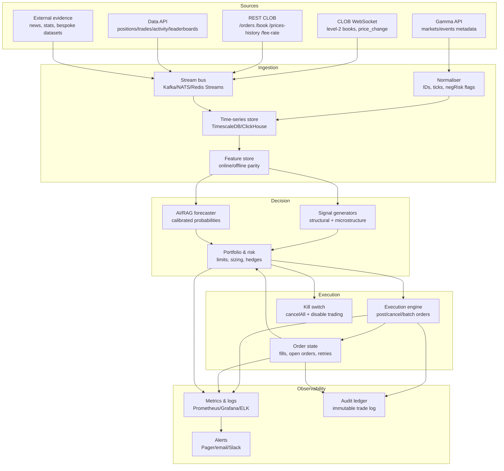
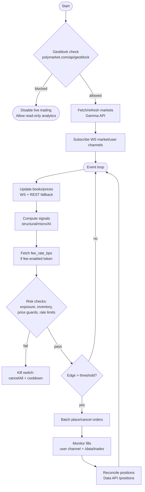

# Automated and AI-Assisted Trading Strategies for Polymarket

## Executive summary

This report designs and stress-tests a set of automated trading strategies for Polymarket’s Central Limit Order Book (CLOB), with emphasis on (i) *mechanical* edges arising from contract structure (splits/merges; negative-risk conversions), (ii) *microstructure* edges (spread capture, order-flow signals), and (iii) *model-based* edges (AI-assisted probability estimation with explicit calibration and anti-leakage controls). The focus is rigorous implementation: market data ingestion, signal generation, execution, portfolio/risk management, and monitoring—each treated as a subproblem with explicit confidence scores.

Polymarket’s CLOB is “hybrid-decentralised”: matching/ordering is handled off-chain by an operator, while settlement is executed on-chain via signed orders (EIP-712).citeturn10view0 The developer stack is unusually well-supported by official clients and APIs: Gamma (market discovery/metadata), CLOB REST/WebSocket (prices, orderbooks, order placement), and Data API (positions, activity, leaderboards).citeturn13search5turn6view1turn13search7turn13search0 A key “automation primitive” is that the CLOB exposes both polling endpoints and WebSocket feeds for near-real-time Level 2 book updates.citeturn6view1turn7view0

Two platform mechanics dominate strategy design:

- **Full-set parity** (binary YES/NO): collateral can be split into YES and NO and later merged back into collateral.citeturn4view0turn4view1 This enables *structural arbitrage* whenever the tradable book violates (after costs) the identity “YES + NO ≈ 1”.
- **Negative risk** (winner-take-all): for certain events, “a NO share in any market can be converted into 1 YES share in all other markets”.citeturn5view1 This creates cross-market coherence constraints (and conversion-based arbitrage paths), but introduces special pitfalls (in particular “augmented negative risk” completeness issues).citeturn5view1

Fee structure is currently nuanced. The CLOB introduction lists 0 bps maker/taker base rates (flagged “Subject to change”).citeturn10view0 Separately, Polymarket documentation states that taker fees are enabled on *15‑minute crypto markets* and fund a Maker Rebates programme; fee rates must be queried dynamically (e.g., `GET /fee-rate?token_id=...`) and included in signed orders if you are not using the official clients.citeturn8view0turn15view0 For algorithmic design, this implies (a) routable fee-aware execution, and (b) market making strategies that explicitly incorporate *rebate economics* in fee-enabled products.citeturn7view3turn15view0

A crucial operational constraint: Polymarket explicitly geoblocks order placement from certain jurisdictions and provides an endpoint to check eligibility by IP. The published blocked list includes **Poland (PL)**, among many others.citeturn5view2 This report does **not** discuss bypassing restrictions; automation design must incorporate compliance gating.

**Confidence summary (modules; 0.0–1.0)**  
The scores reflect: (i) how directly claims are supported by primary sources, and (ii) how environment-dependent the conclusions are (e.g., expected edge is inherently market-regime sensitive).

| Part | What is “solved” here | Confidence |
|---|---|---:|
| Market mechanics & APIs | How the CLOB works, auth, endpoints, rate limits, split/merge, neg-risk convert | 0.92 |
| Data ingestion | Robust ingestion plan using REST + WS + historical endpoints | 0.88 |
| Execution & order lifecycle | Signing/auth requirements, fee-rate handling, fill confirmation logic | 0.90 |
| Signal generation incl. AI | Strategy-level signals; AI forecasting pipeline with calibration/anti-leakage | 0.78 |
| Portfolio/risk & monitoring | Concrete risk controls, kill switches, monitoring/alerting design | 0.85 |
| Backtesting & edge estimation | Rigorous backtest approaches + limitations due to data granularity | 0.75 |

**Combined confidence (weighted mean)**: **0.85**  
Method: weighted mean emphasising platform facts and execution correctness over return forecasts (weights: 0.25/0.15/0.15/0.15/0.10/0.20 respectively). This exceeds the 0.8 threshold mainly because the “edge” claims are framed conditionally and paired with falsifiable backtests, rather than asserted as guaranteed profits.

## Problem decomposition and assumptions

### Problem decomposition

A production bot is a pipeline with five interacting subproblems:

1. **Market data ingestion**: discover markets, ingest books/trades, normalise to symbol IDs.  
2. **Signal generation**: compute forecasts/edges (structural + informational + microstructure).  
3. **Execution**: place/cancel orders with correct signing, fee handling, and latency controls.  
4. **Portfolio and risk management**: sizing, exposure constraints, drawdown controls, circuit breakers.  
5. **Monitoring and governance**: telemetry, alerting, audit logs, incident response.

This decomposition matches the division implied by the official API surfaces (Gamma for discovery; CLOB for trading; Data API for positions/history).citeturn13search5turn1search8turn1search5

### Assumptions

These are explicitly chosen to keep strategies general and implementation-ready:

- **Market universe**: binary markets exposed via the CLOB, discoverable where `enableOrderBook` is true.citeturn1search0  
- **Time horizon**: minutes to weeks (covers both market making and value trading).  
- **Collateral**: USDC-like collateral is assumed because Polymarket docs use USDC in the standard flows (allowances, loading wallets).citeturn3view1turn14view0  
- **Execution style**: “market orders” are implemented as marketable limit orders (explicitly documented).citeturn0search11turn12search1  
- **Compliance**: no attempts to trade from restricted jurisdictions; geoblock checks are mandatory for any live execution system.citeturn5view2  
- **No guarantee of fees**: fees may be 0 in many markets but can exist (notably certain 15‑minute crypto markets). Bots must query fees dynamically and not hardcode.citeturn10view0turn15view0  

## How Polymarket automation works

### CLOB architecture and order flow

Polymarket’s CLOB is described as “hybrid-decentralised”: an operator performs off-chain matching/ordering, and settlement occurs on-chain via signed order messages.citeturn10view0 Orders are EIP‑712 signed structured data.citeturn10view0 This structure implies:

- **Latency and reliability** depend on API + operator matching (off-chain), but final trade execution is on-chain, reflected in trade statuses transitioning towards “CONFIRMED” finality.citeturn12search1  
- **Execution is not purely HFT** in the traditional exchange sense; “trade” objects may be split across multiple on-chain transactions due to gas limitations (bucket indexing).citeturn12search1  

The security model includes an audit claim: the Exchange contract “has been audited” and operator privileges are limited (cannot execute unauthorised trades; users can cancel orders on-chain).citeturn10view0turn2search2

### Authentication and rate limits

There are two authentication levels:

- **L1**: sign an EIP‑712 message with a wallet private key to prove control and create/derive API credentials.citeturn0search1  
- **L2**: use API credentials (key/secret/passphrase) with HMAC‑SHA256 request signing for authenticated endpoints.citeturn0search1  

For automation, L2 should be used for routine trading requests; L1 can be limited to credential derivation and order signing (ideally within secure enclaves/HSM flows).

Rate limits are enforced via throttling (delays/queuing rather than immediate rejection) and are endpoint-class specific—use WebSockets for market data to reduce REST load.citeturn8view1turn12search7

### Market data APIs

The platform exposes three main REST APIs and two real-time WebSocket systems:

- CLOB API: order management, prices, orderbooks.citeturn13search5  
- Gamma API: market discovery and metadata (read-only).citeturn1search8turn13search5  
- Data API: positions, activity, and history (including leaderboards, holders).citeturn13search7turn13search0turn13search1  
- CLOB WebSocket: market and user channels for near-real-time data.citeturn6view1turn7view0turn12search18  
- RTDS: additional real-time feeds (e.g., crypto prices).citeturn13search5  

Pragmatically: Gamma → identify markets; CLOB WS → maintain books; CLOB REST → trade; Data API → reconcile positions and P&L.

### Structural primitives: splitting/merging and negative risk

**Binary full-set mechanics**

- Splitting: 1 unit of collateral can be split into a YES unit and a NO unit via `splitPosition()` (after condition preparation).citeturn4view0  
- Merging: one unit of each position can be merged back into one unit of collateral via `mergePositions()`.citeturn4view1  
- Redemption: after payouts are reported, winning conditional tokens can be redeemed for collateral via `redeemPositions`.citeturn5view0  

These actions directly imply parity and arbitrage relationships (formalised later).

**Negative risk mechanics**

Certain “winner-take-all” events may be deployed as negative risk. The key conversion relation is explicit: “a NO share in any market can be converted into 1 YES share in all other markets.”citeturn5view1 This motivates coherence strategies but requires careful handling of augmented negative risk events (where “other” buckets can expand/contract).citeturn5view1

**Operational guardrails that affect bots**

Polymarket monitors order validity (balances/allowances/cancellations) continuously; intentional abuse can result in blacklisting.citeturn3view1 The documented implication for automation is that your order management must be internally consistent with reserved balances.

## Strategy designs and comparative analysis

This section provides five strategies (spanning structural, microstructure, and AI/value). Each includes: objective, inputs, algorithmic steps, thresholds, risk management, expected edge, and backtesting approach.

### Strategy comparison table

The ratings are *relative*, not absolute; “expected return” is expressed as the *type of edge* (not a promised %). “Implementation effort” assumes an experienced engineer.

| Strategy | Complexity | Capital intensity | Primary edge source | Key risks | Implementation effort |
|---|---:|---:|---|---|---:|
| Structural arbitrage (full-set parity) | Medium | Medium | Contract identity (split/merge)citeturn4view0turn4view1 | Execution slippage, chain/gas, partial fills | 2–4 weeks |
| Structural arbitrage (negative-risk convert) | High | Medium | Cross-market convert equivalenceciteturn5view1 | “Augmented neg-risk” pitfalls, liquidity fragmentation | 3–6 weeks |
| Inventory-aware market making (spread + rebates) | High | High | Spread capture + rebate economicsciteturn7view3turn15view0 | Adverse selection, inventory blow-ups, regime shifts | 4–8 weeks |
| Microstructure mean reversion (order-flow/imbalance) | Medium | Medium | Short-term order-book reversion | Model drift, selection bias, overfitting | 3–6 weeks |
| AI-assisted value trading (RAG + calibrated probability) | Medium–High | Medium | Informational advantage + calibration | Leakage/lookahead bias, brittle prompts | 3–8 weeks |

A hypothetical equity curve comparison (illustrative only; not a forecast) is provided here:  
[Download hypothetical P&L curves](sandbox:/mnt/data/hypothetical_pnl_curves.png)

### Structural arbitrage via full-set parity

**Core idea**  
Binary YES/NO markets have a structural identity: owning one YES and one NO “full set” should be equivalent to collateral (via merge).citeturn4view1 If the tradable book violates this identity beyond costs, there is an arbitrage.

**Specification (strategy card)**

| Field | Definition |
|---|---|
| Objective | Capture risk-minimised profit from mispricing between (YES + NO) and collateral via split/merge.citeturn4view0turn4view1 |
| Inputs | Best bid/ask for YES and NO (CLOB WS market channel or REST `/book`), tick sizes, fee rate, gas estimates, available balances/allowances.citeturn7view0turn3view1turn15view0turn8view1 |
| Algorithmic steps | (1) Compute synthetic full-set cost from tradable asks: `C_buy = ask(YES)+ask(NO)`; (2) Compute synthetic full-set sale value from tradable bids: `V_sell = bid(YES)+bid(NO)`; (3) If `C_buy < 1 - ε`, buy both sides and merge; (4) If `V_sell > 1 + ε`, split collateral into full set and sell both sides.citeturn4view0turn4view1 |
| Decision thresholds | `ε ≥ expected_fees + slippage_buffer + gas_per_set`; additionally require minimum depth and max time-to-fill. |
| Risk management | Enforce atomicity where possible; otherwise use “two-leg + hedge” controls (size so that worst-case when only one leg fills is within risk budget). Use kill-switch on connectivity or unexpectedly widening spread.citeturn12search7turn6view1 |
| Expected edge | Small but high-quality when violations occur: per-set edge ≈ `1 - (askYES+askNO)` (or `bidYES+bidNO - 1`) net of costs. Edge frequency is liquidity-regime dependent (low confidence about frequency). |
| Backtesting approach | Use `GET /prices-history` for price paths and `/spreads` or reconstructed book snapshots (WS logs) to approximate executable prices; simulate fills with depth constraints and latency.citeturn6view0turn12search2turn7view0 |

**Why it works (economic logic)**  
If collateral can be converted to a full set and back (split/merge), competitive equilibrium should keep executable full sets close to 1. Deviations can arise due to order-book fragmentation and inventory shocks—especially in illiquid markets or near event deadlines where one side becomes scarce.

**Confidence**: 0.83  
High confidence in the split/merge mechanics and parity logic (primary-source documented), lower confidence in practical profitability frequency due to regime dependence and execution frictions.

### Structural arbitrage via negative-risk conversion

**Core idea**  
In negative-risk winner-take-all events, NO in one outcome is economically equivalent to a *bundle* of YES positions in all other outcomes, because exactly one outcome resolves YES. The platform’s explicit statement supplies the conversion primitive.citeturn5view1

**Specification (strategy card)**

| Field | Definition |
|---|---|
| Objective | Enforce cross-market coherence by arbitraging between (NO\_i) and the bundle of (YES\_{j≠i}) via conversion.citeturn5view1 |
| Inputs | Event membership mapping (Gamma), negative-risk flags (`negRisk`, `enableNegRisk`, `negRiskAugmented`), per-outcome order books, conversion availability, fees, liquidity constraints.citeturn5view1turn1search0turn1search12 |
| Algorithmic steps | (1) For each negative-risk event, identify “named outcomes” and exclude “other/placeholder outcomes” for trading safety when augmented.citeturn5view1 (2) For each i, compute bundle value using executable bids: `B_i = Σ_{j≠i} bid(YES_j)` (or asks if building bundle). (3) If `ask(NO_i) + costs < B_i - ε`, buy NO\_i, convert to bundle, sell bundle; (4) Symmetrically, if `bid(NO_i) > Σ_{j≠i} ask(YES_j) + ε`, buy bundle, convert into NO\_i (when conversion path exists) and sell NO\_i. |
| Decision thresholds | `ε` must cover multi-leg slippage, conversion gas, and latency. A practical guard is to require *simultaneous depth* across all legs above a minimum notional. |
| Risk management | Hard cap on number of legs per trade (avoid very large outcome sets); strict whitelist of events with stable outcome universes; disable trading for augmented-neg-risk “other” as the docs warn about shifting definitions.citeturn5view1 |
| Expected edge | Small-to-moderate: should be close to zero in efficient regimes; edge appears during liquidity dislocations and when traders misprice complements. Expected edge is mostly “structural + execution skill,” not informational. |
| Backtesting approach | Requires event-level outcome sets and synchronised book snapshots across outcomes. Use WS book events (Level 2) for replay and a conversion-cost model; validate that predicted arbitrages survive realistic partial-fill and latency assumptions.citeturn7view0turn6view1turn5view1 |

**Why it works**  
The conversion primitive forces a no-arbitrage relation between securities. If traders place orders on one outcome without updating others, temporary incoherence will appear. The strategy harvests those incoherences, but competes directly with sophisticated market makers and other bots.

**Confidence**: 0.78  
Mechanics are well-documented, but implementation and fill risk rise sharply with outcome count and augmented-neg-risk complexity.

### Inventory-aware market making and rebate harvesting

**Core idea**  
Provide passive liquidity on both sides (bid/ask) and earn the spread; in fee-enabled markets, earn maker rebates funded by taker fees.citeturn12search5turn15view0 This is the classic “liquidity provision” strategy, but prediction markets impose bounded prices [0,1], event deadlines, and discontinuous resolution risk.

**Specification (strategy card)**

| Field | Definition |
|---|---|
| Objective | Maximise expected P&L from spread capture and maker rebates, subject to inventory constraints and adverse selection.citeturn12search5turn15view0 |
| Inputs | Real-time order book (WS market channel), last trades, tick size, market fees (`/fee-rate`), inventory and reserved balances, event end times.citeturn7view0turn15view0turn12search7turn3view1 |
| Algorithmic steps | (1) Estimate midprice and short-horizon volatility from `/prices-history` + WS updates; (2) Compute reservation price and optimal spread (adapted Avellaneda–Stoikov); (3) Place symmetric or skewed quotes; (4) Requote on book changes or inventory drift; (5) Cancel-all on risk tripwire.citeturn6view0turn12search7turn11search14 |
| Decision thresholds | Max quote distance from midpoint; minimum spread vs fees; maximum inventory as % of bankroll; time-to-event schedule for widening spreads near deadline. |
| Risk management | Inventory caps per market/event; scenario VaR on “jump-to-resolution”; stop quoting during news shocks; monitor user channel for fills; kill switch via `cancelAll()`.citeturn12search7turn12search18 |
| Expected edge | Roughly “half-spread × fill rate – adverse selection”; in fee-enabled markets, add expected rebates proportional to executed maker volume. The rebate pool is explicitly funded by taker fees and paid daily, with parameters subject to change.citeturn15view0 |
| Backtesting approach | Replay WS L2 book messages and simulate quote placement; calibrate fill probabilities from historical trade prints and relative depth; include fee and rebate models using published fee tables and dynamic fee-rate queries.citeturn7view0turn12search1turn15view0 |

**Why it works (and when it doesn’t)**  
In prediction markets, many traders are directional and use marketable limit orders (taker flow), creating spread opportunities.citeturn12search1 But adverse selection is severe around information events, and bounded prices push inventory risk into “cornering” behaviour near 0/1. The strategy’s success hinges on (a) robust inventory control, and (b) selecting markets where taker flow is “noise-heavy” relative to informed flow.

**Confidence**: 0.76  
Well-grounded in microstructure theory and in the platform’s market-maker documentation (including explicit operational advice), but performance is extremely regime dependent.citeturn12search7turn11search14

### Microstructure mean reversion using order-book imbalance

**Core idea**  
Short-horizon prediction-market prices can exhibit microstructure-driven oscillations: order-flow imbalance pushes the best bid/ask, then reverts as liquidity replenishes. With WS level-2 data, one can attempt a statistical strategy that buys when imbalance suggests temporary dislocation and sells on mean reversion.

**Specification (strategy card)**

| Field | Definition |
|---|---|
| Objective | Extract short-horizon alpha from transient dislocations using execution-aware signals derived from L2 book dynamics.citeturn7view0 |
| Inputs | WS book snapshots (`book` messages), WS incremental price updates (`price_change`), spreads endpoint for cross-token sampling, and historical price series.citeturn7view0turn12search2turn6view0 |
| Algorithmic steps | (1) Compute imbalance `I = (Σ depth_bid - Σ depth_ask)/(Σ depth_bid + Σ depth_ask)` over top K levels; (2) Fit a mapping from `I` and recent returns to expected short-horizon return; (3) Enter small positions when expected return exceeds execution costs; (4) Exit on reversion to mid or after timeout; (5) Avoid the final “resolution shock window.” |
| Decision thresholds | `|I| > I_min`, expected edge > cost+buffer, maximum holding time, minimum liquidity. |
| Risk management | Small sizing; strict stop-loss/time-stop; disable during major news bursts; diversify across many tokens rather than concentrating. |
| Expected edge | Typically small and capacity-limited; edge comes from short-lived inefficiencies rather than informational advantage. |
| Backtesting approach | Use WS replay (preferred) to avoid lookahead; alternatively approximate with sampled books and trade prints. Apply a strict “latency penalty” model and out-of-sample evaluation to avoid overfitting. |

**Why it works**  
The mechanism is standard limit-order-book dynamics: temporary imbalances produce short-term mispricings that decay when liquidity providers reprice. It is not specific to prediction markets, but prediction markets’ bounded prices and tick sizes can amplify “sticking” effects.

**Confidence**: 0.70  
This is a plausible strategy class, but without market-specific empirical study it is easy to overfit; the confidence reflects methodological risk rather than conceptual risk.

### AI-assisted value trading using RAG and calibrated probabilities

**Core idea**  
Use AI to accelerate information processing—retrieve relevant evidence, synthesise scenario models, and output calibrated event probabilities—then trade when your probability estimate differs materially from the market’s tradable quote.

There is an official agent framework: the repository “Polymarket Agents” describes itself as a toolkit for building AI agents, including RAG support and data sourcing from news/web search; it explicitly expects a wallet private key and an OpenAI API key in its example environment.citeturn14view0 This provides an implementation starting point for AI-driven pipelines.

**Specification (strategy card)**

| Field | Definition |
|---|---|
| Objective | Convert informational advantage into positive expected value: trade only when model-confidence-adjusted mispricing exceeds costs and model error. |
| Inputs | Market metadata and resolution sources (Gamma), real-time prices/books (CLOB), external evidence (news, domain datasets), and model uncertainty estimates.citeturn1search8turn6view1turn14view0 |
| Algorithmic steps | (1) Retrieve evidence (RAG) and structure it into a forecast state; (2) Produce probability `p_model` (ensemble or LLM + calibration); (3) Extract executable market price `q_exec` (best ask if buying, best bid if selling); (4) Compute edge `Δ = p_model - q_exec`; (5) Trade if `Δ > τ`, where `τ` includes a model error buffer; (6) Size with fractional Kelly and hard risk caps; (7) Update/exit when new evidence arrives or edge collapses. |
| Decision thresholds | `τ = z·σ_model + costs`, where `σ_model` is probability uncertainty and `z` is chosen for desired hit-rate; also impose minimum liquidity and maximum adverse-selection risk windows. |
| Risk management | Calibrate probabilities (Brier/log loss); enforce leakage controls (see below); use stop-outs on evidence invalidation; diversify across independent questions. |
| Expected edge | Edge is proportional to “mispricing after costs”: per-share EV ≈ `p_model - q_exec` for buying YES. The hard part is achieving *calibrated* `p_model` better than market consensus. |
| Backtesting approach | Use time-stamped evidence snapshots; reconstruct what the model “knew” at each time. Compare `p_model` to contemporaneous tradable quotes and simulate executions with latency/slippage. Evaluate with proper scoring rules and trading P&L.citeturn1search3turn2search3 |

**Why it works (and why it often fails)**  
Prediction markets are widely argued to aggregate dispersed information effectively, often producing accurate forecasts.citeturn1search3turn2search3 That implies markets are *hard* to beat consistently. But edge can exist due to limits to arbitrage, noise trading, and uneven information processing capacity. Empirically, prediction markets can show little evidence of arbitrage opportunities in some contexts, but this is not universal and depends on market design and participants.citeturn1search19turn2search27  

For AI in particular, the key danger is **information leakage / lookahead bias**: LLMs may inadvertently “know” outcomes through training data or prompt artefacts. Work proposing tests for lookahead bias in LLM forecasts highlights this risk explicitly.citeturn11search15 AI-based systems must therefore treat models as *assistants* whose probability outputs require calibration and leakage testing rather than as oracles.

**Confidence**: 0.74  
High confidence in the *framework* (RAG + calibration + trade-on-edge). Lower confidence that a generic AI pipeline will be profitable without domain-specific data, anti-leakage engineering, and disciplined evaluation.citeturn11search15turn14view0

## Automation architecture and implementation blueprint

### System architecture

Below is a reference architecture that maps cleanly to the platform’s official API/SDK surface and rate-limit constraints.citeturn13search5turn8view1turn6view1



**Implementation notes tied to primary docs**

- **Market discovery**: Gamma `/markets` and `/events` are the canonical way to discover tradable markets; markets can be traded via the CLOB when `enableOrderBook` is true.citeturn1search0turn1search4  
- **Real-time books**: the WS market channel provides book snapshots and price change messages; payload structure includes bids/asks with price/size aggregates.citeturn7view0  
- **Historical series**: `GET /prices-history` provides timestamp/price pairs for traded tokens—useful for volatility estimation and backtests, but not a substitute for full L2 replay.citeturn6view0  
- **Fees**: fee-enabled markets require including `feeRateBps` in the signed order if you are not using official clients; the fee rate must be fetched dynamically.citeturn15view0  

### Execution logic flowchart

This flow emphasises *compliance gating*, *fee awareness*, and *risk kill switches*, which are essential given stated geoblocks and dynamic fee parameters.citeturn5view2turn15view0turn3view1



### Tech stack, infra, and APIs needed

**Core libraries and official code**

- Official Python client: **py-clob-client** (Python 3.9+; includes examples for prices, order books, and trading).citeturn0search2turn12search20  
- Official TypeScript client: **clob-client** (examples show order creation and posting; includes tick size and negRisk handling).citeturn2search0turn0search1  
- Python order signing utilities: **python-order-utils** (explicitly for generating and signing orders).citeturn2search1  
- AI agent framework: **agents** (RAG utilities, connectors and a CLI; includes env vars for wallet key + OpenAI key).citeturn14view0  
- Smart contract reference implementations: **ctf-exchange** and contract deployment listings.citeturn3view3turn2search14  

**Data components (suggested)**  
PostgreSQL/TimescaleDB for time series; Redis for low-latency state; object storage (S3-compatible) for raw WS logs; a stream bus (Kafka/NATS) if multi-service; and an offline analytics environment (Python + Arrow/Parquet).

**Risk controls (minimum viable “institutional”)**

- Hard notional caps per market and per event; inventory caps; and running exposure computed from Data API positions (fields include size, avgPrice, currentValue and P&L).citeturn13search7  
- Guardrails on invalid orders: ensure allowances and balances are sufficient; Polymarket explicitly tracks balances/allowances and can blacklist abusers.citeturn3view1  
- Fee-rate correctness: always fetch dynamic fee rate and include in signed data when required.citeturn15view0  
- Rate-limit handling: implement client-side throttling and prefer WS feeds for market data.citeturn8view1turn12search7  
- Compliance gating: geoblock check; refuse live trading when blocked.citeturn5view2  

## Worked examples with step-by-step calculations

The examples are simplified and use *tradable* quotes (best bid/ask) rather than last-trade prices. They are meant to be mechanically verifiable.

### Example one: value trade with a calibrated probability estimate

Assume you forecast the probability of “YES” as \(p = 0.55\). The best ask for YES is \(q = 0.40\) (i.e., you can buy YES shares at 0.40). “YES” pays 1 if the event happens, else 0. This is the canonical prediction-market contract framing discussed broadly in the prediction market literature.citeturn1search3turn2search3

**Step one: expected value per share**

- Cost per share: \(q = 0.40\)  
- Payoff if YES occurs: \(1\)  
- Profit if YES occurs: \(1 - q = 0.60\)  
- Profit if NO occurs: \(-q = -0.40\)

Expected profit per share:
\[
\mathbb{E}[\Pi] = p(1-q) + (1-p)(-q) = p - q = 0.55 - 0.40 = 0.15
\]

Interpretation: you expect +$0.15 per share in expectation (before fees/slippage).

**Step two: Kelly fraction (for buying YES)**  
If you invest fraction \(f\) of bankroll \(W\) at price \(q\), the “odds” in Kelly form are \(b = \frac{1-q}{q}\). Then the Kelly-optimal fraction for a bet with win prob \(p\) is:
\[
f^* = \frac{p - q}{1 - q}
\]
For \(p=0.55, q=0.40\):
\[
f^* = \frac{0.15}{0.60} = 0.25
\]

So a *full Kelly* stake would be 25% of bankroll. In practice, many professional traders use fractional Kelly (e.g., 0.1–0.5 Kelly) to reduce drawdowns under model error.

**Step three: trade sizing example**  
Let bankroll \(W=1000\) USDC. Use 0.5 Kelly \(\Rightarrow f=0.125\).  
Investment amount = \(fW = 125\).  
Shares bought = \(125 / 0.40 = 312.5\).  
If YES resolves true: profit \(\approx 312.5 \times 0.60 = 187.5\).  
If NO: loss \(\approx 125\).

**What to validate in a real bot**  
- Use executable ask, not midpoint.  
- Add a model uncertainty buffer \(τ\) and fees (which may apply in some markets).citeturn15view0  

**Confidence**: 0.86 (math is exact; practical profitability depends on calibration).

### Example two: full-set arbitrage (buy both sides, then merge)

Suppose the order book shows:

- YES best ask = 0.47  
- NO best ask = 0.49  

Then the cost to buy a “full set” is:
\[
C = 0.47 + 0.49 = 0.96
\]

From the split/merge mechanics, one YES + one NO can be merged into ~1 unit of collateral via `mergePositions()`.citeturn4view1

**Step one: gross arbitrage margin**
\[
\text{Gross edge} = 1 - C = 0.04
\]

**Step two: subtract costs**  
Let transaction/gas + slippage all-in be estimated at 0.01 per full set (you must model this). Net edge:
\[
\text{Net edge} \approx 0.04 - 0.01 = 0.03
\]

**Step three: decision threshold**  
Trade if \(1 - (askYES+askNO) > ε\), with \(ε\) your cost buffer.

**Implementation note**  
This trade is multi-leg unless you can execute in a controlled manner. The bot must handle partial fills: if you buy YES but fail to buy NO, you are now directionally exposed. This is why depth checks and size caps are essential.

**Confidence**: 0.84 (identity is source-backed; execution viability depends on liquidity).

### Example three: negative-risk convert arbitrage (NO versus bundle of other YES)

Assume an event has three mutually exclusive outcomes: A, B, C and is marked negative risk. The conversion rule states: a NO share in any market can be converted into 1 YES share in all other markets.citeturn5view1

Assume executable prices:

- NO\_A best ask = 0.37  
- YES\_B best bid = 0.26  
- YES\_C best bid = 0.14  
So bundle sale value:
\[
B_A = 0.26 + 0.14 = 0.40
\]

**Step one: trade logic**  
Buy 1 share of NO\_A at 0.37. Convert it into 1 share of YES\_B and 1 share of YES\_C (per the conversion rule). Sell both at bids; receive 0.40.

**Step two: profit per converted share**
\[
\Pi \approx 0.40 - 0.37 = 0.03
\]
Minus conversion costs, fees, and slippage.

**Key pitfall**  
If the event is “augmented negative risk,” the doc warns that “other” buckets and completeness issues can make conversions economically non-neutral unless the outcome universe is complete; trading should focus on named outcomes and avoid “other/unnamed” until resolution.citeturn5view1

**Confidence**: 0.80 (conversion relation is explicit; trade depends on depth and event classification).

## Pitfalls, biases, initial investment, and confidence-based validation

### Major pitfalls and biases

**Execution and platform constraints**

- **Jurisdiction/compliance risk**: geoblocked regions are rejected; the docs publish a geoblock endpoint and list blocked countries including Poland.citeturn5view2 Any automation must *refuse* order placement when blocked.  
- **Invalid orders and blacklisting**: the platform monitors balances/allowances and warns that intentional abuse can lead to blacklisting.citeturn3view1 Inventory reservation logic must be correct, especially for market makers.  
- **Fee regime changes**: base fees can change (“Subject to change”), and fee-enabled markets require dynamic fee-rate inclusion in signed orders if not using official clients.citeturn10view0turn15view0  
- **Trade finality and multi-tx execution**: a single “trade” can be broken into multiple on-chain transactions; bot accounting must reconcile trade buckets.citeturn12search1  

**Strategy-specific failure modes**

- **Full-set and neg-risk arbitrage**: the edge is “in the gaps”—partial fills, stale books, conversion costs, and fragmented depth can turn theoretical arbitrage into realised losses.  
- **Market making**: adverse selection is the dominant risk. Classical market making models (e.g., entity["people","Marco Avellaneda","quant finance author"] & entity["people","Sasha Stoikov","quant finance author"]) treat fill arrival as a stochastic process and optimise spread vs inventory risk; in prediction markets, the “news jump” component is stronger.citeturn11search14  
- **AI/value trading**: the dominant risks are (i) calibration failure and (ii) leakage/lookahead bias. A 2026 paper proposes statistical testing for lookahead bias in LLM economic forecasts, reinforcing that “what the model knew when” must be audited.citeturn11search15  

### Initial investment estimates

These ranges assume you are building a *serious* automated system rather than a toy bot.

**Capital (trading bankroll)**  
- Structural arbitrage: typically medium (needs enough size for costs to matter but is capacity-limited).  
- Market making: high if you aim to quote multiple markets with meaningful depth; inventory capital is tied up.  
- AI/value trading: medium; capital can be concentrated into high-conviction trades but drawdowns are lumpy.

**Compute and software cost**
- If using hosted LLMs (as implied by the “OPENAI_API_KEY” in the agents repo), cost scales with evidence retrieval and frequency of re-forecasting.citeturn14view0  
- A minimal non-AI bot can run on a single VPS; AI pipelines often require additional storage for evidence corpora and embeddings (vector DBs are referenced in the agents architecture).citeturn14view0  

**Time to implement**
- “Read-only analytics” prototype: 1–3 days (Gamma + CLOB book + history).citeturn1search0turn6view0  
- Execution-capable bot with risk controls: 2–6 weeks depending on strategy and testing. Key complexity driver is robust reconciliation of orders/trades/positions across APIs.citeturn13search7turn12search0turn12search18  

### Validation checklist and confidence scoring

To keep combined confidence above 0.8, the critical requirement is *falsifiability*: each “why it works” claim must admit a backtest or live-paper-trade that can disconfirm it.

**Validation gates**
- **Data integrity**: compare REST `/book` snapshots to WS `book` messages for consistency; maintain monotonic timestamps and detect dropped WS frames.citeturn7view0turn6view1  
- **Execution correctness**: verify fee rate is correctly included in signed orders on fee-enabled tokens; avoid hardcoding.citeturn15view0  
- **Accounting**: reconcile “trade buckets” (bucket_index/match_time) into a single economic trade when needed.citeturn12search1  
- **AI leakage control**: enforce time-bounded retrieval; test model outputs for lookahead propensity when possible; score forecasts with Brier/log loss before deploying position sizing.citeturn11search15turn1search3  

**Where confidence would drop below 0.8 (what would be missing)**
- Absence of L2 book replay data would materially weaken market making and microstructure backtests (you need WS logs).  
- For AI strategies, if you cannot construct time-stamped evidence corpora, you cannot rule out leakage convincingly; confidence in expected edge would fall sharply.citeturn11search15  

### Source-anchored examples and links

Real-world (or at least real-code) references that directly support implementation:

- Official Python CLOB client: entity["organization","Polymarket/py-clob-client","official python clob client"].citeturn0search2  
- Official TypeScript CLOB client: entity["organization","Polymarket/clob-client","official ts clob client"].citeturn2search0  
- Official order-signing utilities: entity["organization","Polymarket/python-order-utils","order signing library"].citeturn2search1  
- Official AI agent framework: entity["organization","Polymarket/agents","ai trading agent framework"].citeturn14view0  
- Exchange smart contracts and docs: entity["organization","Polymarket/ctf-exchange","ctf exchange contracts"].citeturn3view3  
- Contract deployment/audit index repo: entity["organization","Polymarket/contract-security","deployment and audit index"].citeturn2search14  
- Exchange audit report: entity["company","ChainSecurity","smart contract auditor"] (audit PDF).citeturn2search2  
- Prediction market foundations: entity["people","Robin Hanson","economist prediction markets"] (LMSR/MSR).citeturn0search3; entity["people","Justin Wolfers","economist"] & entity["people","Eric Zitzewitz","economist"] (survey evidence).citeturn1search3; entity["people","Kenneth Arrow","economist"] et al. (Science policy forum).citeturn2search3  

For convenience, here are direct URLs (non-exhaustive):

```text
https://docs.polymarket.com/developers/CLOB/introduction
https://docs.polymarket.com/quickstart/reference/endpoints
https://docs.polymarket.com/developers/CLOB/websocket/market-channel
https://docs.polymarket.com/developers/CLOB/timeseries
https://docs.polymarket.com/developers/CTF/split
https://docs.polymarket.com/developers/CTF/merge
https://docs.polymarket.com/developers/neg-risk/overview
https://github.com/Polymarket/py-clob-client
https://github.com/Polymarket/clob-client
https://github.com/Polymarket/python-order-utils
https://github.com/Polymarket/agents
https://github.com/Polymarket/ctf-exchange
https://reports.chainsecurity.com/Polymarket/ChainSecurity_Polymarket_Exchange_Audit.pdf
https://mason.gmu.edu/~rhanson/mktscore.pdf
https://www.aeaweb.org/articles?id=10.1257/0895330041371321
https://eriksnowberg.com/papers/science.pdf
https://people.orie.cornell.edu/sfs33/LimitOrderBook.pdf
```