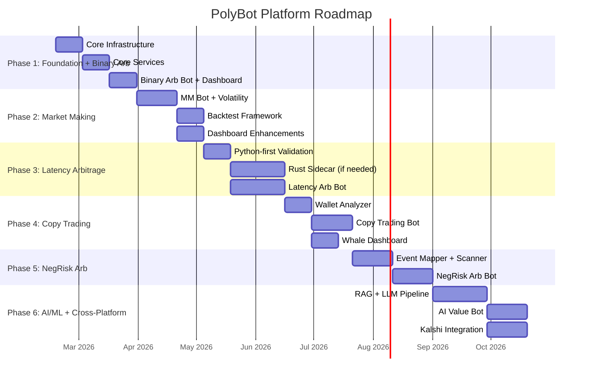

# Product Roadmap: PolyBot Platform

> Automated Trading Infrastructure for Polymarket Prediction Markets

## Vision Statement

In 24 months, PolyBot is a self-sustaining, multi-strategy trading platform that generates consistent risk-adjusted returns across all Polymarket market types, running autonomously on a single VPS with real-time monitoring and adaptive risk controls — extendable to new strategies in hours, not weeks.

---

## Strategic Pillars

1. **Infrastructure First** — The platform's value is the shared foundation (market data, execution, risk, orchestration), not any single strategy. Every strategy benefits from the same engine.
2. **Profit Velocity** — Prioritize strategies by time-to-first-profit, not theoretical maximum return. Validate the platform with real revenue before investing in complex strategies.
3. **Risk as a Feature** — Risk management is not an afterthought bolted on after losses. Circuit breakers, position limits, and emergency shutdown are Day 1 infrastructure.
4. **Observable by Default** — If it isn't logged, metricked, and alertable, it doesn't exist. Every trade, signal, and risk event is recorded and visible in the dashboard.
5. **Modular Extensibility** — Adding a new strategy means implementing a Python interface and dropping a YAML config. The framework does the rest.

---

## Wallet Architecture: Risk-Tier Isolation

Polymarket enforces **1 EOA = 1 proxy wallet** (deterministic CREATE2 derivation). Multiple isolated wallets require multiple EOA private keys. The platform uses a **3-wallet risk-tier model** with a software ledger for per-bot attribution.

### Wallet Topology

```
┌──────────────────────────────────────────────────────────────────┐
│                      Wallet Manager Service                      │
│                                                                  │
│  ┌──────────────────┐  ┌──────────────────┐  ┌───────────────┐  │
│  │  VAULT WALLET     │  │  ALPHA WALLET     │  │ SWEEP WALLET  │  │
│  │  (Low-Risk Tier)  │  │  (Med/High-Risk)  │  │ (Cold Storage)│  │
│  │                   │  │                   │  │               │  │
│  │  EOA #1 → Proxy#1 │  │  EOA #2 → Proxy#2 │  │ EOA #3 → P#3 │  │
│  │  API Key Set #1   │  │  API Key Set #2   │  │ Withdraw only │  │
│  │                   │  │                   │  │               │  │
│  │  Bots:            │  │  Bots:            │  │ Auto-sweep:   │  │
│  │  • Binary Arb     │  │  • Latency Arb    │  │ • Configurable│  │
│  │  • Market Making  │  │  • AI/ML Value    │  │   schedule    │  │
│  │  • Copy Trading   │  │  • NegRisk Arb    │  │ • Threshold-  │  │
│  │                   │  │                   │  │   based       │  │
│  │  ~70% capital     │  │  ~25% capital     │  │ ~5% buffer    │  │
│  └──────────────────┘  └──────────────────┘  └───────────────┘  │
│                                                                  │
│  ┌────────────────────────────────────────────────────────────┐  │
│  │  SOFTWARE LEDGER (PostgreSQL)                               │  │
│  │  Per-bot position attribution within shared tier wallets    │  │
│  │  • Trade → Bot mapping (order_id → bot_id)                  │  │
│  │  • Virtual balances per bot (allocated from wallet balance)  │  │
│  │  • Per-bot P&L calculation (realized + unrealized)          │  │
│  │  • Allocation enforcement (bot cannot exceed its budget)    │  │
│  └────────────────────────────────────────────────────────────┘  │
│                                                                  │
│  ┌────────────────────────────────────────────────────────────┐  │
│  │  REBALANCER                                                 │  │
│  │  • Monitors tier allocations vs. targets (70/25/5)          │  │
│  │  • Triggers USDC transfers when drift > threshold (±10%)    │  │
│  │  • Polygon gas: ~$0.01–0.05 per transfer                   │  │
│  └────────────────────────────────────────────────────────────┘  │
│                                                                  │
│  ┌────────────────────────────────────────────────────────────┐  │
│  │  PROFIT SWEEPER                                             │  │
│  │  • Calculates realized profit per wallet (above baseline)   │  │
│  │  • Sweeps excess to Sweep Wallet on schedule (daily/weekly) │  │
│  │  • Configurable: sweep %, min amount, schedule              │  │
│  │  • Sweep Wallet used for withdrawals to external accounts   │  │
│  └────────────────────────────────────────────────────────────┘  │
└──────────────────────────────────────────────────────────────────┘
```

### Phase Rollout

| Phase | Wallets Active | Configuration |
|-------|---------------|---------------|
| **Phase 1 (MVP)** | Vault only (1 wallet) | Single EOA; software ledger tracks bot attribution; Sweep wallet optional |
| **Phase 2** | Vault + Sweep (2 wallets) | Add profit sweeping; automated withdrawal scheduling |
| **Phase 3+** | Vault + Alpha + Sweep (3 wallets) | Full risk-tier isolation when higher-risk strategies deploy |

### Why Not One Wallet Per Bot?

- At 5+ bots, capital fragmentation becomes severe — idle USDC across N wallets earning nothing
- N private keys to secure and rotate multiplies the attack surface
- Rebalancing between N wallets adds latency and gas cost overhead
- Risk-tier grouping provides 80% of the isolation benefit at 20% of the operational cost

---

## Phase 1: Foundation + Binary Arbitrage MVP — Weeks 1–6

### Goals

Build the complete platform foundation and validate it with the highest-confidence, lowest-risk strategy: binary full-set parity arbitrage. By Phase 1 exit, the platform is generating real profit with real capital.

### Features

| Feature | Priority | User Story | Effort | Dependencies |
|---------|----------|------------|--------|--------------|
| **Core bot interface (BaseBot ABC)** | P0 | As a developer, I want a standard interface so every bot plugs into the platform identically | M | None |
| **Market Data Service** | P0 | As a bot, I want real-time order book data from Polymarket so I can compute signals | L | Redis, WebSocket library |
| **Execution Engine** | P0 | As a bot, I want to place/cancel orders with rate limiting and retry logic so execution is reliable | L | `py-clob-client`, Redis |
| **Risk Manager (core)** | P0 | As an operator, I want position limits and daily loss caps so I don't blow up the account | L | Redis, PostgreSQL |
| **Orchestrator (bot lifecycle)** | P0 | As an operator, I want to start/stop/pause bots and see their health status | M | Redis, Bot interface |
| **Binary Arbitrage Bot** | P0 | As a trader, I want to automatically detect and execute YES+NO < $1.00 arb opportunities | L | Market Data, Execution, Risk |
| **PostgreSQL + TimescaleDB schema** | P0 | As the platform, I want persistent storage for trades, positions, configs, and time-series data | M | Docker |
| **Redis Streams messaging** | P0 | As a service, I want to publish/subscribe market data and events across components | M | Docker |
| **Paper trading mode** | P0 | As a trader, I want to validate bot signals without risking real capital | S | Execution Engine |
| **Dashboard (shell)** | P1 | As an operator, I want a web UI showing system status, bot health, and P&L | L | FastAPI, React |
| **Prometheus + Grafana setup** | P1 | As an operator, I want system and trading metrics visualized in dashboards | M | Docker |
| **Telegram alerting** | P1 | As an operator, I want instant mobile notifications on errors, circuit breaks, and daily P&L | S | Telegram Bot API |
| **Docker Compose deployment** | P0 | As an operator, I want to deploy the entire platform with a single `docker compose up` | M | All services |
| **Structured logging (structlog)** | P0 | As a developer, I want JSON-formatted logs across all services for debugging | S | None |
| **Circuit breaker (per-bot)** | P0 | As the risk system, I want to automatically halt a bot after consecutive losses | M | Risk Manager |
| **Emergency shutdown** | P0 | As an operator, I want a button to cancel all orders and stop all bots immediately | S | Orchestrator, Execution |
| **API credential management** | P0 | As an operator, I want secure storage and rotation of Polymarket API keys | S | Docker secrets |
| **Wallet Manager Service** | P0 | As an operator, I want risk-tier wallets (Vault/Alpha/Sweep) so bot capital is isolated by risk profile | L | Polygon wallet tooling |
| **Software Ledger (per-bot attribution)** | P0 | As an operator, I want to track which positions and P&L belong to which bot within a shared wallet | M | PostgreSQL, Risk Manager |
| **Wallet configuration (multi-EOA)** | P0 | As an operator, I want to configure multiple Polymarket wallets (separate EOAs) and assign bots to tiers | M | Config loader, Docker secrets |
| **Balance monitor + low-balance alerts** | P1 | As an operator, I want alerts when any wallet's USDC balance drops below a threshold | S | Wallet Manager, Telegram |

### Sub-Phases

**Week 1–2: Core Infrastructure**
- Project scaffolding: monorepo, Docker Compose, Makefile
- PostgreSQL + TimescaleDB: schema design, Alembic migrations
- Redis 7: Streams topology, Pub/Sub channels, connection pool
- Shared models: Pydantic v2 models for OrderBook, Signal, Fill, BotConfig, Position, WalletConfig
- Structured logging: structlog with JSON output, correlation IDs
- Config loader: YAML parsing with Pydantic validation
- Wallet Manager: multi-EOA config, proxy wallet detection, API key derivation per wallet, balance/allowance caching

**Week 3–4: Core Services**
- Market Data Service: Gamma API polling (market discovery), WebSocket connection manager (CLOB), data normalization, Redis Streams publishing
- Execution Engine: `py-clob-client` wrapper, **wallet-aware order routing** (each order routed to the correct wallet/API key based on bot→tier mapping), token bucket rate limiter (3,500/10s per wallet), fee-rate cache, FOK/GTC/IOC support, order state machine, batch orders (up to 15)
- Risk Manager: position tracker with **per-wallet and per-bot software ledger**, daily P&L calculator, per-bot/per-market limits, circuit breaker FSM (CLOSED→OPEN→HALF-OPEN), pre-trade risk checks (10-step pipeline including wallet balance check, drawdown protection, per-trade max loss), emergency shutdown
- Orchestrator: dynamic bot loader (importlib), lifecycle state machine (init→start→running→pause→resume→stop→emergency_stop), health check loop (10s interval), Redis command listener

**Week 5–6: Binary Arbitrage Bot + Dashboard + Deployment**
- BinaryArbitrageBot: full-set parity scanner, FOK execution on both legs, partial fill handling, merge/split integration
- Paper trading mode: signal generation + logging without order submission
- Dashboard MVP: FastAPI + React shell with System Overview (portfolio, P&L, bot status), Bot Management (start/stop/pause), Emergency Stop button
- Prometheus metrics: order count, fill rate, P&L, latency, WebSocket reconnects
- Grafana: pre-configured trading dashboard
- Telegram: daily P&L summary, error alerts, circuit break notifications
- Docker Compose: full deployment config with resource limits, health checks, volume mounts
- VPS setup script: Ubuntu 22.04/24.04, Docker, UFW, SSH hardening

### Success Metrics

| Metric | Target | Measurement |
|--------|--------|-------------|
| Paper trade signal accuracy | >80% of signals would have been profitable | Backtested against realized prices |
| Opportunity detection rate | Detect >90% of arb opportunities where YES+NO deviates by >50bps | Compare against independent scanner |
| Execution success rate (live) | >85% fill rate on FOK orders | Execution Engine logs |
| System uptime | >99% over 7-day period | Prometheus/Grafana |
| Daily P&L (live, initial capital $500) | >$0 net of fees after 2 weeks | PostgreSQL trade history |
| Mean time to detect opportunity | <2 seconds from order book update | Market Data → Signal latency metric |
| Dashboard load time | <3 seconds | Browser measurement |
| Emergency shutdown execution | <5 seconds from trigger to all orders cancelled | End-to-end test |

### Exit Criteria

1. Binary arbitrage bot has run in paper mode for ≥7 days with positive simulated P&L
2. Live trading with $500 capital for ≥7 days with net positive P&L (even if marginal)
3. Dashboard displays real-time bot status, positions, and P&L
4. Emergency shutdown has been tested and completes in <5 seconds
5. Circuit breaker has been tested and correctly halts a bot after threshold breach
6. All 5 core services + Wallet Manager running in Docker Compose with health checks passing
7. Telegram alerts firing correctly on errors and daily summary
8. Wallet Manager operational: Vault wallet funded, software ledger tracking per-bot P&L correctly
9. Balance monitor alerting on low wallet balance

### 🔴 Devil's Advocate — Phase 1

```
Risk: Binary arbitrage edges may be too small/infrequent to cover infrastructure costs ($130–200/month)
Alternative: Could start with market making (higher daily yield) or latency arb (proven $313→$414K)
Assumption challenged: "Edges exist at $500 capital level" — minimum viable trade size may eat into edge
Scale concern: At $500 capital, even 2% daily return = $10/day = $300/month → barely covers infra
Recommendation: PROCEED — the goal is platform validation, not Phase 1 profit maximization.
  Binary arb has the lowest implementation risk. If edges prove insufficient after 30 days,
  Phase 2 market making is already designed and can be deployed within 2 weeks.
  Capital can be scaled to $5K once signal quality is validated.
```

---

## Phase 2: Market Making / Spread Farming — Weeks 7–12

### Goals

Deploy inventory-aware market making (adapted Avellaneda-Stoikov) to generate consistent spread income. Market making provides steady daily revenue that complements the opportunistic binary arbitrage strategy. Target: $700–$800/day on $10K capital (matching documented `poly-maker` performance).

### Features

| Feature | Priority | User Story | Effort | Dependencies |
|---------|----------|------------|--------|--------------|
| **MarketMakingBot** | P0 | As a trader, I want to provide liquidity and earn the bid-ask spread + rebates | XL | Market Data, Execution, Risk |
| **Avellaneda-Stoikov spread model** | P0 | As the MM bot, I want optimal quote widths based on volatility and inventory | L | Volatility calculator |
| **Volatility calculator** | P0 | As the MM bot, I want realized volatility estimates across 3hr/24hr/7day windows | M | TimescaleDB historical data |
| **Inventory management** | P0 | As the MM bot, I want to skew quotes to reduce directional exposure | M | Position tracker |
| **Market selection heuristics** | P1 | As an operator, I want auto-selection of markets with good MM economics (volume, spread, volatility) | M | Gamma API, historical analysis |
| **Backtest framework** | P1 | As a developer, I want to replay historical data through any strategy to estimate performance | L | TimescaleDB, `/prices-history` |
| **Rebate tracking** | P1 | As a trader, I want to see maker rebate income separately from spread income | S | Execution Engine, Dashboard |
| **Enhanced dashboard: order book visualization** | P1 | As an operator, I want to see live order book depth and my quotes' position in it | M | Dashboard, WebSocket |
| **Enhanced dashboard: inventory charts** | P1 | As an operator, I want to see my inventory skew and exposure per market | M | Dashboard, Risk Manager |
| **Post-only order support** | P0 | As the MM bot, I want orders that only rest on the book (never take) to guarantee maker status | S | Execution Engine |
| **Automated profit sweep** | P1 | As an operator, I want realized profits automatically transferred to the Sweep wallet on a configurable schedule | M | Wallet Manager |
| **Inter-wallet rebalancer** | P1 | As an operator, I want to move USDC between tier wallets when allocation drifts beyond thresholds | M | Wallet Manager |
| **Wallet dashboard view** | P1 | As an operator, I want to see per-wallet balances, allocations, and P&L in the dashboard | M | Dashboard, Wallet Manager |

### Success Metrics

| Metric | Target | Measurement |
|--------|--------|-------------|
| Daily spread income | >$50/day on $5K capital (scaling to $10K) | P&L tracker |
| Inventory skew | <60% in either direction | Risk Manager |
| Fill rate (maker orders) | >40% of posted quotes filled per day | Execution logs |
| Adverse selection loss rate | <15% of total fills | Trade analysis |
| Market uptime (quotes posted) | >95% of market open hours | Bot metrics |

### Exit Criteria

1. Market making bot profitable for ≥14 consecutive days (net of all fees)
2. Inventory management keeps skew below 60% threshold
3. Backtest framework produces results within ±20% of live performance
4. Automatic market selection identifies and ranks ≥20 viable markets
5. Combined strategy portfolio (arb + MM) shows improved Sharpe ratio vs. arb alone

### 🔴 Devil's Advocate — Phase 2

```
Risk: Adverse selection is severe in prediction markets — informed traders pick off stale quotes
Alternative: Focus exclusively on fee-enabled markets where rebates offset adverse selection losses
Assumption challenged: "$700–800/day on $10K" was achieved by poly-maker during high-volume election period;
  baseline daily volume is 70-80% lower now → expect $150-300/day as realistic non-event baseline
Scale concern: More capital = bigger quotes = larger adverse selection losses; non-linear scaling
Recommendation: PROCEED with conservative parameters — start with wide spreads (>5% width),
  small size ($20-50/quote), on low-volatility stable markets. Tighten only after 2 weeks of data.
```

---

## Phase 3: Temporal/Latency Arbitrage — Weeks 13–20

### Goals

Exploit the documented price lag between spot exchanges (Binance, Coinbase) and Polymarket's 15-minute crypto markets (BTC, ETH, SOL, XRP). This strategy has the highest documented single-account return ($313 → $414K) but requires sub-100ms execution, necessitating a Rust sidecar for order signing.

### Features

| Feature | Priority | User Story | Effort | Dependencies |
|---------|----------|------------|--------|--------------|
| **Rust execution sidecar** | P0 | As the platform, I want <100ms order signing for latency-sensitive strategies | XL | Rust toolchain, `rs-clob-client` |
| **External exchange WebSocket feeds** | P0 | As the latency arb bot, I want real-time BTC/ETH/SOL prices from Binance and Coinbase | L | WebSocket library |
| **LatencyArbBot** | P0 | As a trader, I want to detect confirmed spot momentum and trade Polymarket before it adjusts | XL | Rust sidecar, exchange feeds |
| **Cross-feed latency detector** | P0 | As the bot, I want to measure and compensate for latency differences between data sources | M | Market Data Service |
| **Dynamic fee calculator** | P0 | As the bot, I want to compute net profitability including 15-min market taker fees (up to 3.15%) | S | Execution Engine |
| **Momentum confirmation engine** | P0 | As the bot, I want to distinguish genuine directional moves from noise using multiple timeframe confirmation | L | Exchange feeds, statistical models |
| **Rust-Python bridge** | P0 | As the platform, I want the Rust sidecar to receive signals from Python and return fill confirmations | M | gRPC or Unix socket |

### Success Metrics

| Metric | Target | Measurement |
|--------|--------|-------------|
| Signal-to-execution latency | <200ms end-to-end | Timestamp tracking |
| Win rate (paper) | >90% of detected opportunities | Paper trade log |
| Daily opportunities detected | >20 per day across BTC/ETH/SOL | Signal log |
| Net profit per trade | >$2 after fees (at $100/trade size) | P&L calculator |

### Exit Criteria

1. Rust sidecar operational with <50ms signing latency
2. Latency arb bot achieves >90% fill rate on detected opportunities (paper mode)
3. Live trading profitable for ≥14 days on 15-minute crypto markets
4. Combined 3-strategy portfolio shows meaningful alpha improvement

### 🔴 Devil's Advocate — Phase 3

```
Risk: The "$313→$414K" result is a single outlier; Polymarket may have patched the specific lag exploited
Alternative: Skip Rust entirely — use Python with pre-signed order templates for faster execution
Assumption challenged: "Sub-100ms is required" — actual required latency depends on competitor density;
  if few bots compete on these markets, 500ms Python execution may suffice
Scale concern: 15-minute crypto markets have limited liquidity; $4K-5K per trade is near the ceiling
Recommendation: PROCEED but validate with Python-only first (2 weeks). Build the Rust sidecar
  only if Python execution proves too slow. This saves 4-6 weeks if Python is sufficient.
```

---

## Phase 4: Copy Trading / Whale Tracking — Weeks 21–26

### Goals

Identify consistently profitable Polymarket wallets and replicate their trades with configurable sizing. Leverages the transparent on-chain nature of Polymarket to "follow the smart money."

### Features

| Feature | Priority | User Story | Effort | Dependencies |
|---------|----------|------------|--------|--------------|
| **Wallet performance analyzer** | P0 | As a trader, I want to identify wallets with >60% win rate and >$10K total profit | L | Data API, PostgreSQL |
| **CopyTradingBot** | P0 | As a trader, I want to automatically replicate profitable wallets' trades | L | Wallet analyzer, Execution |
| **On-chain activity monitor** | P0 | As the bot, I want real-time notification when tracked wallets place trades | L | Data API polling, Polygon |
| **Sizing engine** | P1 | As a trader, I want configurable position sizing relative to the whale's trade size | M | Risk Manager |
| **Whale scorecard dashboard** | P1 | As an operator, I want to see tracked wallets' performance and my copy P&L | M | Dashboard |
| **Latency-aware execution** | P0 | As the bot, I want to execute within 4-10 seconds of detecting a whale trade | M | Execution Engine |

### Success Metrics

| Metric | Target | Measurement |
|--------|--------|-------------|
| Whale identification accuracy | Track ≥10 wallets with >60% historical win rate | Wallet analyzer |
| Replication latency | <10 seconds from whale trade to our execution | Timestamp comparison |
| Copy P&L correlation | >0.6 correlation with tracked whale P&L | Statistical analysis |

### Exit Criteria

1. ≥10 profitable wallets identified and tracked
2. Copy trading bot replicating trades with <10s latency
3. Positive P&L after 30 days of live copy trading

### 🔴 Devil's Advocate — Phase 4

```
Risk: Whales know they're being watched; may front-run copy traders or use decoy wallets
Alternative: Use whale activity as a signal input to other strategies, not as a standalone strategy
Assumption challenged: "Past whale performance predicts future performance" — survivorship bias
  is extreme; the 0.51% who profited may simply be lucky at scale
Scale concern: If many bots copy the same whales, fills deteriorate and edge collapses
Recommendation: PROCEED as supplementary strategy with strict risk limits.
  Cap at 10% of portfolio. Use as a signal overlay, not the primary alpha source.
```

---

## Phase 5: NegRisk / Multi-Outcome Arbitrage — Weeks 27–32

### Goals

Exploit cross-outcome coherence violations in multi-outcome (negative risk) markets. These markets have richer arbitrage opportunities due to the conversion primitive (NO_i → YES_all_others), but higher implementation complexity due to multi-leg execution.

### Features

| Feature | Priority | User Story | Effort | Dependencies |
|---------|----------|------------|--------|--------------|
| **NegRisk event mapper** | P0 | As the bot, I want to discover multi-outcome events and build outcome graphs | L | Gamma API, NegRisk flags |
| **Cross-outcome coherence scanner** | P0 | As the bot, I want to detect when outcome prices violate no-arbitrage constraints | L | Market Data, mathematical model |
| **NegRiskArbBot** | P0 | As a trader, I want to profit from coherence violations using the conversion primitive | XL | Event mapper, scanner, Execution |
| **Multi-leg execution manager** | P0 | As the bot, I want to execute 3-8 leg trades with partial fill management | L | Execution Engine |
| **Augmented NegRisk safety checks** | P0 | As the risk system, I want to block trading on "other" outcomes in augmented events | S | Risk Manager |
| **Conversion cost model** | P1 | As the bot, I want accurate gas + fee estimates for conversion operations | M | On-chain integration |

### Success Metrics

| Metric | Target | Measurement |
|--------|--------|-------------|
| Coherence violations detected/day | >5 across monitored events | Signal log |
| Multi-leg fill rate | >70% (all legs filled) | Execution logs |
| Net profit per completed arb | >$5 after all fees and gas | P&L calculator |

### Exit Criteria

1. NegRisk arb bot identifies and logs coherence violations across ≥50 events
2. Multi-leg execution succeeds with >70% full-fill rate
3. Positive P&L after 30 days (accounting for partial fill losses)

### 🔴 Devil's Advocate — Phase 5

```
Risk: 62% failure rate documented for combinatorial arbitrage due to liquidity mismatches
Alternative: Focus on 3-outcome events only (lowest leg count, highest fill probability)
Assumption challenged: "Conversion primitive is reliable" — gas costs and on-chain latency may
  eat the edge in volatile markets
Scale concern: Multi-outcome markets are fewer in number; limited opportunity set
Recommendation: PROCEED with strict leg-count limits (≤4 outcomes initially).
  Skip augmented NegRisk events entirely. Focus on election/politics multi-outcome markets
  which have the deepest liquidity.
```

---

## Phase 6: AI/ML Ensemble + Cross-Platform — Weeks 33–44

### Goals

Deploy AI-assisted value trading using ensemble LLM models with calibrated probabilities, and extend the platform to cross-platform arbitrage (Polymarket ↔ Kalshi).

### Features

| Feature | Priority | User Story | Effort | Dependencies |
|---------|----------|------------|--------|--------------|
| **RAG pipeline** | P0 | As the AI bot, I want to ingest and embed news/data for evidence-based probability estimation | XL | ChromaDB, news APIs |
| **LLM probability estimator** | P0 | As the AI bot, I want ensemble model outputs with calibration and uncertainty estimates | XL | OpenAI/Claude APIs |
| **Anti-leakage framework** | P0 | As the AI system, I want to prevent lookahead bias in model training and inference | L | Time-bounded evidence retrieval |
| **Calibration monitor** | P0 | As the AI system, I want to track Brier scores and log loss to detect model degradation | M | Statistical analysis |
| **AIValueBot** | P0 | As a trader, I want to bet on mispricings detected by AI probability models | XL | RAG, LLM estimator, Execution |
| **Kelly criterion sizing** | P1 | As the AI bot, I want position sizing proportional to edge and model confidence | M | Risk Manager |
| **Kalshi API client** | P1 | As the platform, I want to read prices and execute trades on Kalshi | L | Kalshi API |
| **CrossPlatformArbBot** | P1 | As a trader, I want to exploit price differences between Polymarket and Kalshi | L | Kalshi client, Execution |
| **Model retraining pipeline** | P2 | As the AI system, I want automated weekly model retraining on fresh data | L | ML infrastructure |

### Success Metrics

| Metric | Target | Measurement |
|--------|--------|-------------|
| Model Brier score | <0.15 (better than LLM baseline of ~0.18) | Calibration monitor |
| AI bot win rate | >55% on directional trades | Trade history |
| Cross-platform opportunity detection | >3/day with >2% spread | Signal log |
| Anti-leakage test pass rate | 100% of test scenarios | Leakage detection suite |

### Exit Criteria

1. AI ensemble model achieves Brier score <0.15 on held-out test set
2. AI value bot profitable for ≥30 days (even marginally)
3. Cross-platform arb bot executes ≥10 profitable round-trips
4. Anti-leakage framework passes all validation scenarios

### 🔴 Devil's Advocate — Phase 6

```
Risk: LLMs "significantly underperform superforecasters" (Brier 0.13 vs 0.02) — AI edge is marginal
  against an efficient market. API costs ($100-200/month for GPT-4) may exceed alpha generated.
Alternative: Skip AI/ML entirely and focus on scaling mechanical strategies (arb, MM) with more capital
Assumption challenged: "$2.2M in 2 months" (ilovecircle) is likely unreproducible and may involve
  undisclosed information advantages, not just model quality
Scale concern: LLM inference latency (2-5 seconds) means AI trades are never time-sensitive;
  only works for medium-term positions (hours to days)
Recommendation: PROCEED with LOW capital allocation (5% of portfolio max) and strict calibration
  monitoring. Kill the strategy if Brier score doesn't improve after 60 days of live data.
  Cross-platform arb is lower risk and should be prioritized within this phase.
```

---

## Technical Debt Budget

| Phase | Debt Allocation | Focus Areas |
|-------|----------------|-------------|
| Phase 1 | 10% of effort | Minimal — build it right the first time. Core interfaces must be stable. |
| Phase 2 | 15% of effort | Refactor shared models based on Phase 1 learnings; improve test coverage |
| Phase 3 | 20% of effort | Python/Rust integration patterns; optimize hot paths; improve WebSocket resilience |
| Phase 4 | 15% of effort | Database query optimization (TimescaleDB continuous aggregates); dashboard performance |
| Phase 5 | 20% of effort | Multi-leg execution reliability; error handling hardening; monitoring gaps |
| Phase 6 | 25% of effort | AI pipeline reliability; model versioning; full integration test suite |

**Continuous debt items (every phase):**
- Dependency updates and security patches (monthly)
- Test coverage must stay above 70% for core services
- Documentation must stay current with implementation
- Grafana dashboards must be updated for new metrics

---

## Risk Registry (Cross-Phase)

| Risk | Phases Affected | Probability | Impact | Mitigation | Owner |
|------|----------------|-------------|--------|------------|-------|
| Oracle manipulation resolves market incorrectly | All | Medium | Critical | Per-market exposure caps; avoid long-duration high-value markets; monitor UMA proposals | Risk Manager |
| Polymarket API breaking change | All | Low-Medium | High | Version-pin SDK; abstract behind interface; maintain backward compat layer | Execution Engine |
| VPS outage during active trading | All | Low | High | Emergency shutdown on disconnect; order expiry (GTD); position reconciliation on restart | Orchestrator |
| Edge compression across all strategies | 3+ | High | Medium | Multi-strategy diversification; continuous strategy research; move to new market types | Operator |
| Fee structure change (maker fees added) | 2+ | Medium | Medium | Dynamic fee handling in Execution Engine; strategy profit thresholds recalculated per fee regime | Execution Engine |
| Private key theft | All | Low | Critical | Encrypted storage; dedicated trading wallet; limited balance; audit access logs | Security |
| Wallet balance race conditions | All | Medium | Medium | Per-wallet mutex in Execution Engine; balance caching with pessimistic locking; Polymarket enforces server-side limits | Wallet Manager |
| Capital fragmentation across wallets | 2+ | Medium | Low | Automated rebalancer; configurable allocation thresholds; sweep schedule | Wallet Manager |
| Python GIL bottleneck at scale | 3+ | Medium | Medium | Asyncio for I/O; multiprocessing for CPU; Rust sidecar for hot paths | Architecture |

---

## Decision Log

| Date | Decision | Rationale | Alternatives Considered |
|------|----------|-----------|------------------------|
| 2026-02-15 | Python 3.11+ as primary language | Mature SDK (`py-clob-client` v0.34.5), richest quant ecosystem, fastest dev velocity | TypeScript (weaker quant ecosystem), Rust (too slow to develop MVP), Go (no official SDK) |
| 2026-02-15 | Binary Arbitrage as MVP strategy | Confidence 0.92, lowest complexity, near risk-free, exercises full infrastructure | Market Making (higher daily yield but more complex), Latency Arb (needs Rust from day 1) |
| 2026-02-15 | PostgreSQL + TimescaleDB | Time-series + relational in one engine, compression for VPS storage | ClickHouse (overkill), SQLite (concurrent write issues), MongoDB (not ideal for financial data) |
| 2026-02-15 | Redis 7 Streams for messaging | Messaging + caching in one process; <512MB RAM on VPS | Kafka (too heavy for VPS), RabbitMQ (additional process), NATS (doesn't also serve as cache) |
| 2026-02-15 | Docker Compose over Kubernetes | Single VPS deployment; no auto-scaling needed; simpler operations | Kubernetes (massive overhead), systemd units (no containerization benefits), Podman (less ecosystem) |
| 2026-02-15 | FastAPI + React for dashboard | Same language as bots (shared models), native async, proven component library (shadcn/ui) | Grafana-only (can't manage bots), Streamlit (single-threaded), Next.js (separate Node.js process) |
| 2026-02-15 | Rust sidecar deferred to Phase 3 | Not needed for MVP strategies; saves 4-6 weeks | Rust from Day 1 (delays MVP by months), Node.js sidecar (slower than Rust for signing) |
| 2026-02-15 | Risk-tier wallets (Vault/Alpha/Sweep) over single wallet or per-bot wallets | Balances risk isolation with operational simplicity; Polymarket enforces 1 EOA = 1 proxy wallet (CREATE2), so multi-wallet requires multi-EOA; 3 wallets is the sweet spot for solo→small team | Single shared wallet (race conditions, commingled risk, accounting nightmare), One wallet per bot (capital fragmentation, N private keys to manage, overkill at MVP) |
| 2026-02-15 | Software ledger for per-bot P&L within shared wallets | On-chain positions are per-wallet not per-bot; software ledger in PostgreSQL attributes trades/positions to bots without requiring N wallets | Rely purely on wallet isolation (too many wallets), Manual tracking (error-prone, unscalable) |
| 2026-02-15 | Automated profit sweep to cold Sweep wallet | Keeps operational wallets lean; reduces exposure to key compromise; sweep wallet can use separate EOA with restricted access | Manual withdrawals (operational burden, easy to forget), Keep all profits in trading wallets (higher exposure to compromise) |
| 2026-02-15 | Telegram for alerting | Zero cost, instant mobile push, simple bot API | Slack (corporate feel, unnecessary), PagerDuty (cost), Discord (gaming audience) |

---

## Milestone Summary



---

## Budget Estimates

### Infrastructure Costs (Monthly)

| Item | Phase 1 | Phase 2 | Phase 3+ |
|------|---------|---------|----------|
| VPS (8 cores, 16–32 GB RAM, SSD) | $60–100 | $60–100 | $80–150 |
| Polymarket WebSocket Premium | $99 | $99 | $99 |
| Domain + SSL (optional) | $5 | $5 | $5 |
| External data feeds | $0 | $0 | $0–50 |
| LLM APIs (Phase 6 only) | — | — | $100–200 |
| **Total monthly** | **$164–204** | **$164–204** | **$284–504** |

### Trading Capital (Recommended)

| Phase | Minimum | Recommended | Strategy |
|-------|---------|-------------|----------|
| Phase 1 | $500 | $2,000 | Binary Arb |
| Phase 2 | $5,000 | $10,000 | Market Making |
| Phase 3 | $1,000 | $5,000 | Latency Arb |
| Phase 4 | $2,000 | $5,000 | Copy Trading |
| Phase 5 | $2,000 | $5,000 | NegRisk Arb |
| Phase 6 | $5,000 | $10,000 | AI + Cross-Platform |

*Capital can be shared across strategies via portfolio allocation in the Risk Manager.*
