# Technical Specification: PolyBot Platform

## Architecture Overview

### System Context Diagram

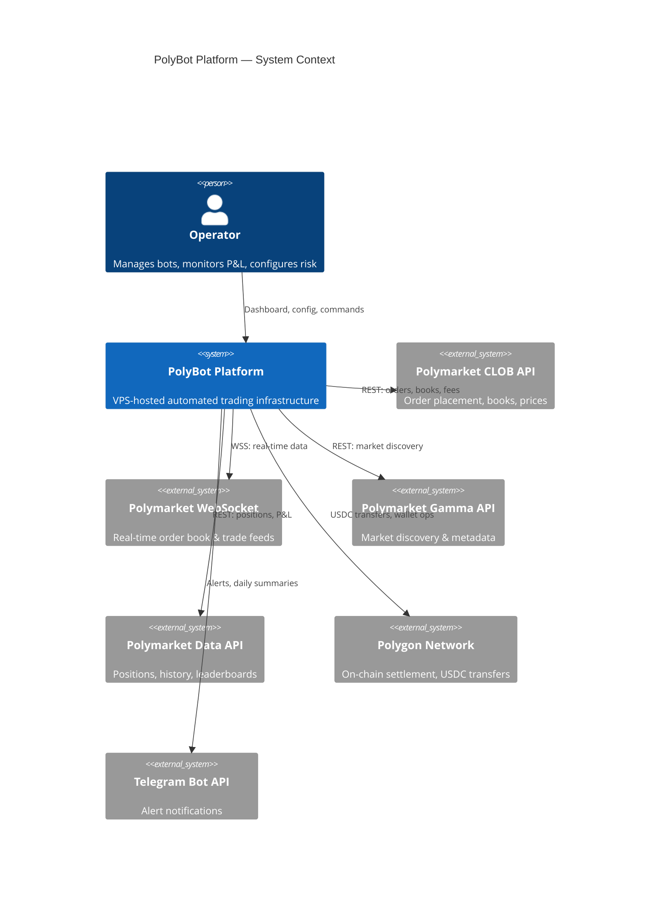

### High-Level Architecture

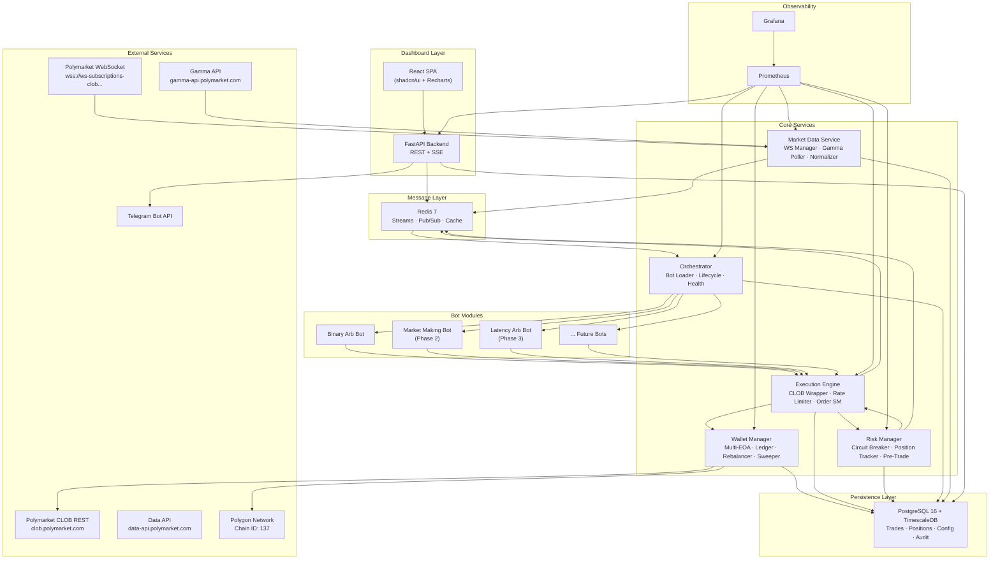

### Architecture Decision Records (ADRs)

#### ADR-001: Python 3.11+ as Primary Language

- **Status**: Accepted
- **Context**: Need a language with mature Polymarket SDK, rich quant ecosystem, and fast development velocity for a solo dev → small team.
- **Decision**: Python 3.11+ using asyncio for concurrent I/O operations.
- **Alternatives Considered**: TypeScript (weaker quant ecosystem, no NumPy/pandas), Rust (6x longer development time, unnecessary for MVP latency), Go (no official Polymarket SDK).
- **Consequences**: Accept ~1s order signing latency (adequate for binary arb and MM). GIL constrains CPU-bound parallelism — mitigated by asyncio for I/O-bound work and multiprocessing for CPU-intensive signal computation. Rust sidecar reserved for Phase 3.

#### ADR-002: PostgreSQL 16 + TimescaleDB over Specialized Databases

- **Status**: Accepted
- **Context**: Need both relational storage (configs, audit, bot state) and time-series storage (trade history, order book snapshots, price data) on a VPS with limited resources.
- **Decision**: Single PostgreSQL 16 instance with TimescaleDB extension. Hypertables for time-series data, regular tables for relational data.
- **Alternatives Considered**: ClickHouse (superior analytics at scale, but overkill for single-VPS and no transactional guarantees for config data), SQLite (can't handle concurrent writes from 5+ services), MongoDB (schema-less is a liability for financial data requiring strict consistency).
- **Consequences**: TimescaleDB compression policies reduce storage footprint (~10x for historical data). Continuous aggregates pre-compute KPI rollups. Single connection pool shared across services via SQLAlchemy async engine.

#### ADR-003: Redis 7 Streams for Inter-Service Messaging

- **Status**: Accepted
- **Context**: Services need to communicate market data, fill events, risk events, and bot commands with low latency and optional durability.
- **Decision**: Redis 7 Streams for durable ordered messages, Pub/Sub for ephemeral notifications, Hash/String for caching.
- **Alternatives Considered**: Kafka (enterprise-grade but requires JVM + 2GB minimum RAM), RabbitMQ (additional process, doesn't serve as cache), NATS (lighter but doesn't cover caching use case).
- **Consequences**: Redis Streams provide consumer groups for fan-out. AOF persistence prevents data loss on crash. Single Redis process serves messaging + caching + rate limit counters = ~512MB RAM total.

#### ADR-004: Risk-Tier Wallet Architecture

- **Status**: Accepted
- **Context**: Polymarket enforces 1 EOA = 1 proxy wallet (CREATE2 deterministic). Need to balance risk isolation with operational simplicity. Multiple bots sharing capital need clear P&L attribution.
- **Decision**: 3-wallet risk-tier model (Vault/Alpha/Sweep) with software ledger for per-bot attribution. Phase 1 starts with 1 wallet, scaling to 3 by Phase 3.
- **Alternatives Considered**: Single shared wallet (race conditions on concurrent orders, commingled positions make P&L attribution impossible on-chain), one wallet per bot (capital fragmentation — idle USDC across N wallets, N private keys to secure).
- **Consequences**: Software ledger adds complexity but provides clean per-bot P&L without N wallets. Per-wallet mutex prevents order race conditions. Rebalancer handles capital drift between tiers. Sweep wallet reduces exposure to key compromise on trading wallets.

#### ADR-005: FastAPI + React SPA for Dashboard

- **Status**: Accepted
- **Context**: Need an admin dashboard for bot management, P&L monitoring, and risk controls. Must be lightweight enough to share VPS resources with trading services.
- **Decision**: FastAPI backend (REST + SSE), React 18 frontend with shadcn/ui components. SPA served as static files by FastAPI — no separate Node.js process in production.
- **Alternatives Considered**: Grafana-only (excellent for metrics visualization, but cannot manage bot lifecycle — start/stop/configure), Streamlit (single-threaded, poor for production multi-user), Next.js (requires separate Node.js server process on VPS).
- **Consequences**: Shared Python codebase between bots and dashboard (Pydantic models, database access). SSE is simpler than WebSocket for one-way streaming (auto-reconnects in browsers). Dashboard consumes ~100MB RAM + <5% CPU.

#### ADR-006: BaseBot ABC Plugin Interface

- **Status**: Accepted
- **Context**: Need a standard contract that all trading strategies implement, enabling the orchestrator to manage any bot identically. Must support lifecycle management, market data callbacks, and metric reporting.
- **Decision**: Python Abstract Base Class (ABC) with 10 required methods: on_init, on_start, on_market_data, on_fill, on_pause, on_resume, on_stop, on_emergency_stop, get_metrics, get_health.
- **Alternatives Considered**: Protocol-based (structural typing — harder to enforce at load time), message-passing only (lose the benefits of direct method calls for latency-sensitive hot paths), gRPC service per bot (massive overhead for in-process communication).
- **Consequences**: ABC is enforced at load time — malformed bots fail fast. BotContext dependency injection decouples bots from infrastructure. Bots run as async tasks within the orchestrator process (shared event loop), avoiding IPC overhead.

---

## Technology Stack

| Layer | Technology | Version | Rationale |
|-------|-----------|---------|-----------|
| **Language** | Python | 3.11+ | `py-clob-client` maturity, asyncio, quant ecosystem |
| **Async Runtime** | asyncio + uvloop | Latest | 2-4x faster event loop than default |
| **Web Framework** | FastAPI | 0.115+ | Native async, WebSocket/SSE, OpenAPI docs |
| **ORM / DB Toolkit** | SQLAlchemy | 2.0+ (async) | Async engine, type-safe models, Alembic migrations |
| **Data Validation** | Pydantic | 2.0+ | Fast validation, JSON serialization, config parsing |
| **Database** | PostgreSQL + TimescaleDB | 16 + latest | Time-series hypertables + relational |
| **Migrations** | Alembic | Latest | Schema versioning |
| **Message Broker** | Redis | 7+ | Streams, Pub/Sub, caching |
| **Redis Client** | redis-py (async) | 5.0+ | Native async support, Streams API |
| **Polymarket SDK** | py-clob-client | 0.34.5 | Official Python CLOB client |
| **WebSocket Client** | websockets | 12+ | Async WebSocket connections |
| **HTTP Client** | httpx | 0.27+ | Async HTTP for Gamma/Data API |
| **Logging** | structlog | 24+ | Structured JSON logging, correlation IDs |
| **Metrics** | prometheus-client | Latest | Prometheus exposition format |
| **Frontend Framework** | React | 18+ | Component-based SPA |
| **UI Components** | shadcn/ui | v4 | Production-quality, Tailwind-based |
| **Charts** | Recharts | 2+ | Composable React chart library |
| **Containerization** | Docker + Compose | 24+ / 2.x | Service orchestration |
| **Monitoring** | Prometheus + Grafana | Latest | Metrics collection + visualization |
| **Alerting** | python-telegram-bot | 21+ | Telegram Bot API wrapper |

---

## Data Model

### Entity Relationship Diagram

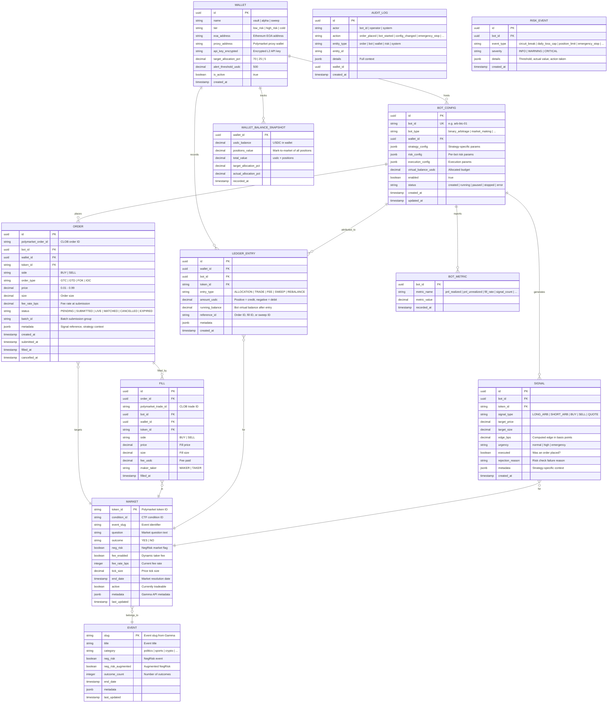

### Key Tables — TimescaleDB Hypertables

The following tables use TimescaleDB hypertables for efficient time-series storage with automatic partitioning and compression:

| Table | Partition Key | Chunk Interval | Compression After | Retention |
|-------|--------------|----------------|-------------------|-----------|
| `order_book_snapshot` | `recorded_at` | 1 day | 7 days | 90 days |
| `price_history` | `timestamp` | 1 day | 7 days | 365 days |
| `fill` | `filled_at` | 1 week | 30 days | Indefinite |
| `signal` | `created_at` | 1 week | 30 days | 180 days |
| `bot_metric` | `recorded_at` | 1 day | 7 days | 90 days |
| `wallet_balance_snapshot` | `recorded_at` | 1 day | 7 days | 365 days |

### TimescaleDB Continuous Aggregates

Pre-computed rollups for dashboard performance:

```sql
-- Hourly P&L per bot
CREATE MATERIALIZED VIEW bot_pnl_hourly
WITH (timescaledb.continuous) AS
SELECT
    bot_id,
    time_bucket('1 hour', filled_at) AS bucket,
    SUM(CASE WHEN side = 'SELL' THEN price * size - fee_usdc
             WHEN side = 'BUY' THEN -(price * size + fee_usdc) END) AS pnl_usdc,
    COUNT(*) AS trade_count
FROM fill
GROUP BY bot_id, bucket;

-- Daily wallet balance
CREATE MATERIALIZED VIEW wallet_balance_daily
WITH (timescaledb.continuous) AS
SELECT
    wallet_id,
    time_bucket('1 day', recorded_at) AS bucket,
    last(total_value, recorded_at) AS eod_value,
    max(total_value) AS peak_value,
    min(total_value) AS trough_value
FROM wallet_balance_snapshot
GROUP BY wallet_id, bucket;
```

---

## Service Architecture — Detailed Design

### Service 1: Market Data Service

**Responsibility**: Ingests all market data from Polymarket, normalizes it, and distributes to consumers via Redis.

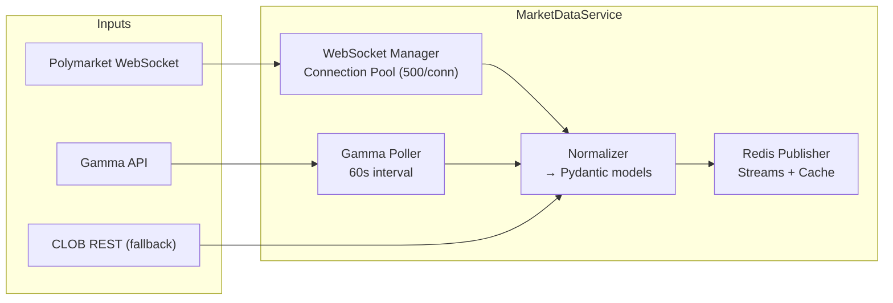

**Key Components**:

| Component | File | Responsibility |
|-----------|------|---------------|
| `WebSocketManager` | `websocket_manager.py` | Connection pool, 500-instrument limit enforcement, reconnection with exponential backoff (1s→30s, max 10 retries), heartbeat monitoring |
| `GammaPoller` | `gamma_client.py` | Polls `/markets` and `/events` every 60s, discovers new markets, updates metadata, detects resolution |
| `Normalizer` | `normalizer.py` | Converts raw API payloads into `OrderBookSnapshot`, `PriceUpdate`, `MarketMetadata` Pydantic models |
| `RedisPublisher` | `publisher.py` | Publishes to Redis Stream `market_data:{token_id}`, updates Redis Hash `orderbook:{token_id}` cache |

**WebSocket Subscription Channels**:

| Channel | Data | Usage |
|---------|------|-------|
| `market` → `book` | Full order book snapshots | Primary data for all strategies |
| `market` → `price_change` | Mid/last price updates | Dashboard, P&L calculation |
| `market` → `last_trade_price` | Last trade data | Volume tracking, signal confirmation |

**Failure Modes**:
- WebSocket disconnect: exponential backoff reconnect, REST polling fallback during gap
- Gamma API down: use cached market metadata, alert operator
- Redis down: buffer in-memory (bounded queue, 10K messages max), alert immediately

### Service 2: Orchestrator (Strategy Engine)

**Responsibility**: Loads, manages, and monitors all bot instances. The central control plane.

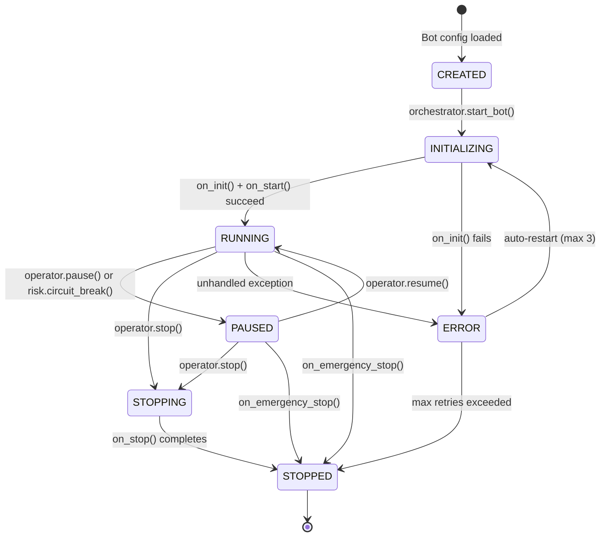

**Key Components**:

| Component | File | Responsibility |
|-----------|------|---------------|
| `BotLoader` | `bot_loader.py` | Scans `config/bots/*.yaml`, resolves `bot_type` → `src/bots/{type}/bot.py`, validates ABC compliance, instantiates |
| `LifecycleManager` | `lifecycle.py` | State machine per bot, transition validation, hooks invocation |
| `HealthChecker` | `health_checker.py` | 10s health check loop, 3 consecutive failures = ERROR, auto-restart up to 3 times with 30s backoff |
| `CommandListener` | `commands.py` | Subscribes to Redis Pub/Sub `bot_commands`, dispatches start/stop/pause/resume/emergency_stop |

**Bot Loading Sequence**:

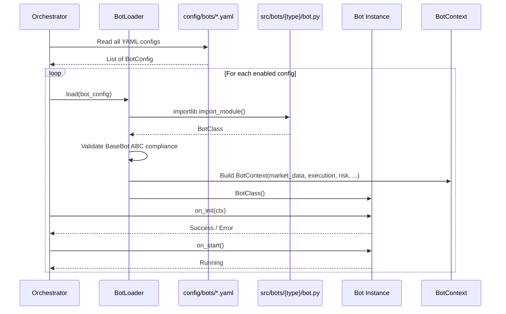

#### Simulation-First Policy

All new bots **MUST** start in paper trading mode. The Orchestrator enforces this policy at startup:

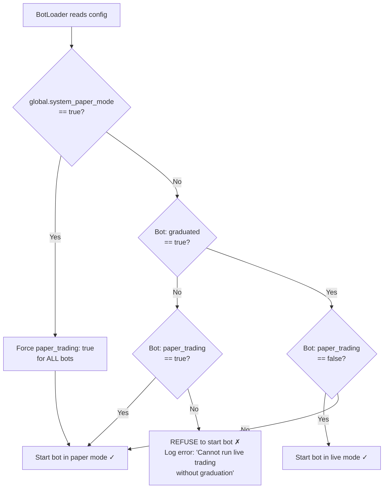

**Enforcement rules**:

| Condition | `paper_trading` | `graduated` | Orchestrator Action |
|-----------|:-:|:-:|-----|
| New bot (default) | `true` | `false` | ✅ Starts in paper mode |
| Bot under evaluation | `true` | `true` | ✅ Starts in paper mode (operator chose to keep testing) |
| Graduated bot going live | `false` | `true` | ✅ Starts in live mode |
| **Safety violation** | `false` | `false` | ❌ **Refuses to start** — logs error, sends Telegram alert |
| System paper mode active | any | any | ✅ Forced to paper mode regardless of per-bot settings |

**Paper mode behavior** (handled by Execution Engine):
- Orders are **not submitted** to the CLOB API
- Fills are **simulated** based on `paper_fill_probability` (default 0.85) and current order book state
- Simulated fill prices use the current best bid/ask ± `paper_fill_delay_ms` worth of price drift
- P&L is tracked identically to live mode in the software ledger (separate `paper_` ledger prefix)
- All metrics, logging, and dashboard data operate identically — the operator sees the bot as if it were live

**Global override** (`system_paper_mode: true` in `config/risk.yaml`):
- Useful during system-wide testing, incident response, or initial deployment
- When activated, every bot is forced to paper mode on next health check cycle (≤ 10s)
- When deactivated, bots revert to their per-bot `paper_trading` setting
- State change is logged and triggers a Telegram alert

**Graduation requirements** (see [Testing Strategy](./11-testing-strategy.md) → Paper Trading Graduation for the full checklist):
1. Bot passes all paper trading validation criteria (≥ 48 hours)
2. Operator reviews paper trading report
3. Operator manually sets `graduated: true` in bot config YAML
4. Operator sets `paper_trading: false` to enable live trading
5. Bot enters staging with minimal capital before full production ramp

### Service 3: Execution Engine

**Responsibility**: Single point of contact for all order operations. Wraps `py-clob-client` with rate limiting, wallet routing, fee handling, and order lifecycle tracking.

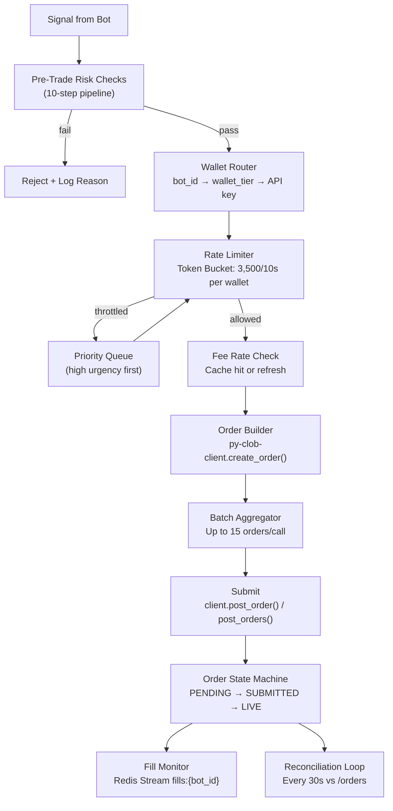

**Rate Limiter Design** (Token Bucket per Wallet):

```
Capacity: 3,500 tokens
Refill rate: 350 tokens/second (3,500 per 10s)
Per order: consumes 1 token
Per batch (N orders): consumes 1 token (single API call)
On depletion: queue with priority (high urgency signals skip queue head)
```

**Order State Machine**:

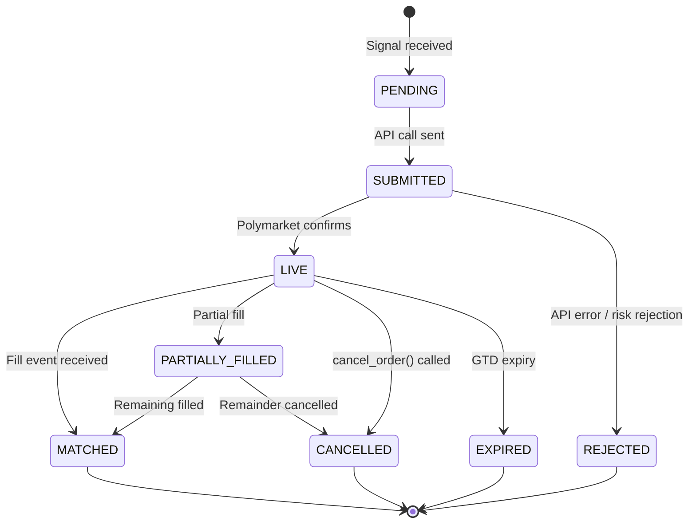

**Decimal Precision Validation (FOK Orders)**:

```python
# Enforced before order submission
def validate_fok_precision(side: str, size: float, price: float):
    if side == "SELL":
        assert round(size, 2) == size, "Sell maker amount ≤ 2 decimals"
    assert round(size * price, 2) == size * price, "size × price ≤ 2 decimals"
    taker_amount = size * price
    assert round(taker_amount, 4) == taker_amount, "Taker amount ≤ 4 decimals"
```

### Service 4: Risk Manager

**Responsibility**: Enforces risk constraints across all bots. Prevents catastrophic losses through position limits, circuit breakers, and emergency shutdown.

**Pre-Trade Risk Pipeline** (10 checks, executed sequentially):

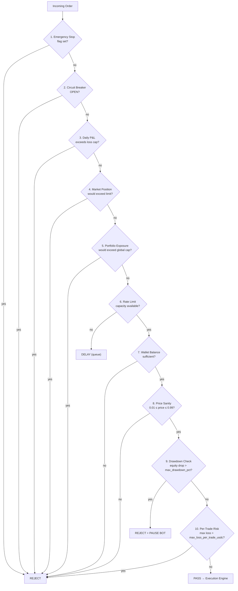

**Step 9 — Drawdown Protection**: Compares current bot equity (virtual balance + unrealized P&L) against peak equity recorded since bot start. If `(peak - current) / peak > max_drawdown_pct`, the order is rejected AND the bot is automatically paused via circuit breaker. Requires manual operator resume. Default: 15%.

**Step 10 — Per-Trade Max Loss**: Calculates worst-case loss for the proposed trade: `size × (entry_price - worst_exit_price)`. For FOK orders, worst case is full loss of position value. If max loss exceeds `max_loss_per_trade_usdc`, the order is rejected. Default: $50.

**Circuit Breaker FSM**:

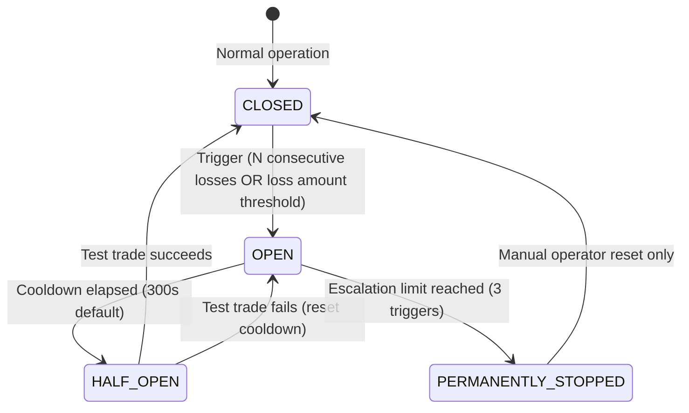

**Risk Parameter Hierarchy**:

```yaml
# Enforcement order: Global > Strategy > Bot > Market
global:
  max_portfolio_value_usdc: 50000
  max_daily_loss_usdc: 1000
  max_daily_loss_percent: 5.0
  max_open_orders: 200
  emergency_api_error_threshold: 10
  system_paper_mode: false            # When true, ALL bots forced to paper mode regardless of per-bot setting
  require_paper_graduation: true      # New bots must pass paper trading validation before going live

per_strategy:
  binary_arbitrage:
    max_capital_allocation_pct: 30.0
    max_concurrent_positions: 20
  market_making:
    max_capital_allocation_pct: 40.0
    max_inventory_skew_pct: 60.0

per_bot:                              # Defined in each bot's YAML
  max_position_per_market_usdc: 500
  max_daily_loss_usdc: 200
  max_daily_trades: 200
  max_drawdown_pct: 15.0              # Stop bot if P&L drops 15% from peak equity
  max_loss_per_trade_usdc: 50         # Reject trade where max possible loss exceeds $50
  circuit_breaker:
    consecutive_losses_trigger: 5
    loss_amount_trigger_usdc: 100
    cooldown_seconds: 300
    escalation_limit: 3
  debug:
    debug_mode: false                 # Enable verbose decision logging (see Observability → Bot Debug Mode)
    log_market_data_ticks: false      # Log every market data evaluation (very high volume)
  execution:
    paper_trading: true               # New bots MUST start in paper mode
    graduated: false                  # Set to true by operator after paper trading validation
    paper_fill_probability: 0.85      # Simulated fill rate in paper mode
    paper_fill_delay_ms: 200          # Simulated network delay in paper mode
```

### Service 5: Wallet Manager

**Responsibility**: Manages multi-EOA wallet lifecycle, API key derivation, software ledger, inter-wallet rebalancing, and profit sweeping.

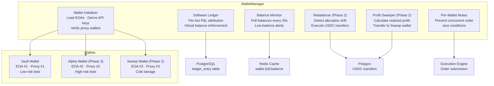

**Software Ledger Flow**:

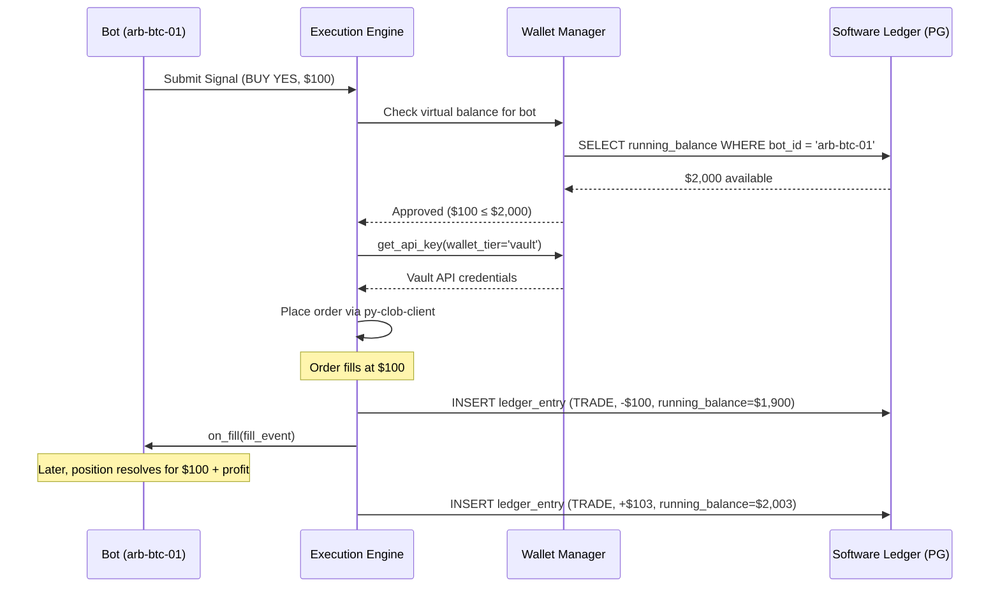

**Wallet Configuration Schema**:

```yaml
# config/wallets.yaml
wallets:
  vault:
    name: "Vault"
    tier: "low_risk"
    target_allocation_pct: 70
    alert_threshold_usdc: 500
    env_key: "VAULT_PRIVATE_KEY"       # References .env variable
    bots:
      - binary_arbitrage
      - market_making
      - copy_trading

  alpha:
    name: "Alpha"
    tier: "high_risk"
    target_allocation_pct: 25
    alert_threshold_usdc: 300
    env_key: "ALPHA_PRIVATE_KEY"
    enabled: false                      # Enabled in Phase 3
    bots:
      - latency_arbitrage
      - negrisk_arbitrage
      - ai_value

  sweep:
    name: "Sweep"
    tier: "cold"
    target_allocation_pct: 5
    env_key: "SWEEP_PRIVATE_KEY"
    enabled: false                      # Enabled in Phase 2

rebalancer:
  enabled: false                        # Phase 2
  drift_threshold_pct: 10
  min_transfer_usdc: 50
  check_interval_seconds: 3600

sweeper:
  enabled: false                        # Phase 2
  schedule: "daily"                     # daily | weekly | threshold
  sweep_threshold_usdc: 100
  sweep_percentage: 50                  # Sweep 50% of realized profit
  min_sweep_usdc: 20
```

### Service 6: Dashboard API

**Responsibility**: Serves the admin dashboard (REST + SSE) and provides bot management controls.

**API Route Groups**:

| Route Group | Endpoints | Auth | Description |
|-------------|-----------|------|-------------|
| `/api/system` | GET /health, GET /status, POST /emergency-stop | Required | System-wide operations |
| `/api/bots` | GET /, GET /{id}, POST /, PATCH /{id}, POST /{id}/start, POST /{id}/stop, POST /{id}/pause, POST /{id}/resume | Required | Bot CRUD + lifecycle |
| `/api/trades` | GET /, GET /bot/{id} | Required | Trade history with filters |
| `/api/positions` | GET /, GET /bot/{id} | Required | Open positions |
| `/api/risk` | GET /overview, GET /circuit-breakers, GET /events | Required | Risk dashboard data |
| `/api/wallets` | GET /, GET /{id}, GET /{id}/ledger | Required | Wallet balances, ledger |
| `/api/markets` | GET /, GET /{token_id}/orderbook | Required | Market data |
| `/api/settings` | GET /, PATCH / | Required | Global settings CRUD |
| `/api/stream` | GET /events (SSE) | Required | Real-time event stream |

**SSE Event Stream Design**:

```
GET /api/stream/events
Accept: text/event-stream

→ event: portfolio_update
  data: {"total_value": 12500.50, "daily_pnl": 45.20, "daily_pnl_pct": 0.36}

→ event: bot_status
  data: {"bot_id": "arb-btc-01", "status": "running", "pnl_today": 12.50}

→ event: fill
  data: {"bot_id": "arb-btc-01", "market": "BTC 15m Up", "side": "BUY", "price": 0.52, "size": 100}

→ event: risk_event
  data: {"bot_id": "mm-politics-01", "type": "circuit_break", "severity": "WARNING"}

→ event: alert
  data: {"message": "Vault wallet balance below threshold: $450", "severity": "WARNING"}
```

Publish intervals:
- `portfolio_update`: every 5 seconds
- `bot_status`: every 10 seconds (or on state change)
- `fill`: immediately on fill
- `risk_event`: immediately on event
- `alert`: immediately

---

## Integration Architecture

### Polymarket API Integration Map

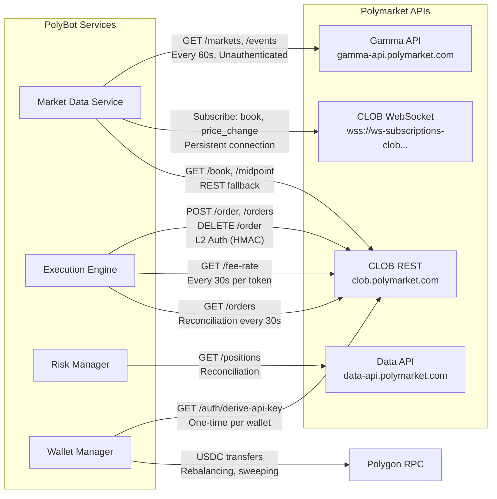

### Authentication Flow

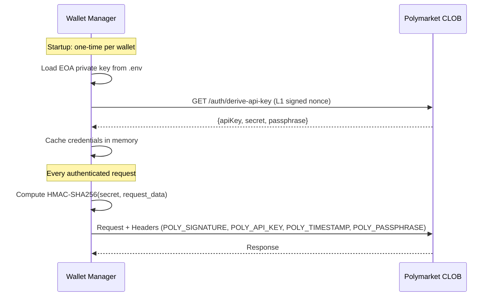

### Redis Topology

```
Redis Streams (durable, ordered):
  market_data:{token_id}     — Order book updates per token
  fills:{bot_id}             — Fill events per bot
  risk_events                — Risk events (circuit breaks, limit breaches)
  audit_events               — Audit log entries

Redis Pub/Sub (ephemeral, real-time):
  bot_commands               — Start/stop/pause/resume commands from dashboard
  dashboard_events           — Live events for SSE streaming
  health_pings               — Bot heartbeat responses

Redis Hash (cached state):
  orderbook:{token_id}       — Latest order book snapshot
  fee_rate:{token_id}        — Cached fee rate (TTL: 60s)
  wallet:{wallet_id}:balance — Latest wallet balance
  rate_limit:{wallet_id}     — Token bucket counter

Redis String (flags):
  emergency_stop             — Global emergency stop flag (0/1)
  bot:{bot_id}:state         — Current bot state enum
```

---

## Scalability Design

### Horizontal Scaling Path (Future)

The MVP runs on a single VPS. The architecture supports future scaling:

| Component | Single VPS (MVP) | Scaled (Future) |
|-----------|-----------------|-----------------|
| Market Data Service | Single process, multiple WS connections | Dedicated VPS, sharded by market category |
| Orchestrator + Bots | Single process, async tasks | Multiple processes via multiprocessing, one per bot |
| Execution Engine | Single process | Per-wallet processes for full isolation |
| Risk Manager | Single process | Remains centralized (must see full portfolio) |
| PostgreSQL | Single instance | Read replicas for dashboard queries |
| Redis | Single instance | Redis Sentinel or Cluster |

### VPS Resource Budget

| Service | CPU Limit | RAM Limit | Actual Expected |
|---------|-----------|-----------|-----------------|
| PostgreSQL + TimescaleDB | 1.0 cores | 2 GB | ~1.5 GB steady |
| Redis 7 | 0.5 cores | 512 MB | ~200 MB steady |
| Market Data Service | 1.0 cores | 1 GB | ~400 MB steady |
| Orchestrator (all bots) | 2.0 cores | 4 GB | ~1-2 GB (bot dependent) |
| Execution Engine | 0.5 cores | 512 MB | ~200 MB steady |
| Risk Manager | 0.5 cores | 512 MB | ~200 MB steady |
| Wallet Manager | 0.25 cores | 256 MB | ~100 MB steady |
| Dashboard (FastAPI + static) | 0.5 cores | 512 MB | ~200 MB steady |
| Prometheus + Grafana | 0.5 cores | 512 MB | ~400 MB steady |
| OS + Docker overhead | 1.25 cores | 2 GB | ~1.5 GB |
| **TOTAL** | **8.0 cores** | **~12.3 GB** | **~6-8 GB actual** |

**Conclusion**: Fits comfortably on an 8-core / 16 GB VPS. A 32 GB VPS provides headroom for Phase 3+ additional bots and the Rust sidecar.

---

## Error Handling & Resilience

### Failure Mode Analysis

| Failure | Detection | Recovery | Impact |
|---------|-----------|----------|--------|
| WebSocket disconnect | `on_close` callback, heartbeat timeout | Exponential backoff reconnect (1s→30s), REST fallback | Market data delayed 1-30s; bots operate on stale data |
| Polymarket API 429 (rate limited) | HTTP status code | Client-side rate limiter already prevents this; if hit, exponential backoff | Order delayed, not lost |
| Polymarket API 5xx | HTTP status code | Retry with backoff (3 attempts); if persistent, trigger emergency_api_error_threshold | Orders may fail; 10 consecutive errors trigger emergency stop |
| PostgreSQL down | Connection error | Retry with backoff; buffer critical writes in Redis; alert | Dashboard history unavailable; trading can continue short-term |
| Redis down | Connection error | Services retry connection; buffer in-memory (bounded); alert immediately | Trading stops — Redis is critical path for market data distribution |
| Bot crash (unhandled exception) | Orchestrator catches exception | Auto-restart up to 3 times with 30s backoff | Bot offline 30-90s; positions managed by risk manager |
| Partial fill (one leg of arb) | Fill event for one order, rejection for other | Bot's partial fill handler: limit sell to close, or queue second leg | Temporary directional exposure, bounded by per-market position limit |
| Private key invalid | API key derivation fails | Alert operator; disable wallet; do not attempt trading | Wallet offline until operator provides correct key |
| Disk full | PostgreSQL write error | TimescaleDB compression + retention policies prevent this; if hit, alert + emergency stop | Data loss risk; trading must stop |

### Retry Policies

| Operation | Max Retries | Backoff | Timeout |
|-----------|-------------|---------|---------|
| WebSocket reconnect | 10 | Exponential: 1s, 2s, 4s... max 30s | 5 minutes total |
| Order submission | 2 | Fixed: 500ms | 10s per attempt |
| Gamma API poll | 3 | Exponential: 5s, 10s, 20s | 30s per attempt |
| Fee rate refresh | 2 | Fixed: 1s | 5s per attempt |
| Order reconciliation | 3 | Fixed: 5s | 30s per attempt |
| Database write | 3 | Exponential: 1s, 2s, 4s | 10s per attempt |

---

## Observability

### Logging Strategy

**Framework**: structlog with JSON output, one logger per service.

**Log Levels**:
- `ERROR`: Unhandled exceptions, API failures, risk violations
- `WARNING`: Circuit breaker state changes, partial fills, rate limit near capacity
- `INFO`: Order placed/filled/cancelled, bot lifecycle transitions, daily P&L summary
- `DEBUG`: Market data updates, signal computations, risk check details

**Correlation ID**: Every request/signal flow gets a UUID that propagates across services via Redis message headers. Enables tracing a trade from signal → risk check → order → fill.

### Bot Debug Mode

Each bot supports a `debug_mode` flag in its YAML config. When enabled, the bot logs every decision step at DEBUG level, creating a complete audit trail for post-trade analysis and algorithm improvement.

**Config**:
```yaml
# config/bots/binary-arb-default.yaml
debug:
  debug_mode: false          # When true, logs every decision step (100x more volume)
  log_market_data_ticks: false  # When true + debug_mode, logs every market data tick evaluation
```

**Debug events logged** (all at DEBUG level, tagged with `bot_id` and `correlation_id`):

| Event | Logged Data | When |
|-------|-------------|------|
| `market_data_eval` | token_id, bid/ask, spread, computed metrics (e.g., parity sum), `interesting: true/false` | Every `on_market_data()` call (if `log_market_data_ticks: true`) |
| `signal_computation` | Inputs (orderbook, edge, fees), calculation steps, result (SIGNAL/NO_SIGNAL), reason | Every time strategy evaluates whether to generate a signal |
| `risk_check_trace` | For each of 10 checks: check_name, input_value, threshold, PASS/FAIL. Overall result. | Every signal that enters pre-trade risk pipeline |
| `order_decision` | Signal details, wallet selected (and why), order params (side, price, size, type), expected P&L | Every order constructed |
| `fill_processing` | Fill details (price, size, fees), realized P&L delta, position state after fill, ledger entry | Every fill received |
| `position_update` | Position opened/closed, unrealized P&L, running totals | Every position change |

**Implementation**:
- Debug logger is injected via `BotContext.debug_logger`
- When `debug_mode: false`, the debug logger is a no-op (zero overhead)
- Debug logs are written to a separate file per bot: `logs/{bot_id}_debug.jsonl`
- Rotation: 100MB per file, 5 rotations (500MB max per bot)
- **Warning**: Debug mode on a high-frequency bot can generate 1GB+/day. Enable only for specific bots during analysis, not in steady-state production.

**Log Schema** (JSON):
```json
{
  "timestamp": "2026-02-15T14:30:00.123Z",
  "level": "INFO",
  "service": "execution_engine",
  "correlation_id": "a1b2c3d4-...",
  "bot_id": "arb-btc-01",
  "wallet_id": "vault",
  "event": "order_submitted",
  "data": {
    "order_id": "...",
    "token_id": "...",
    "side": "BUY",
    "price": 0.48,
    "size": 100,
    "order_type": "FOK"
  }
}
```

### Metrics (Prometheus)

**Trading Metrics**:
- `polybot_orders_total{bot_id, wallet_id, side, order_type, status}` — Counter
- `polybot_fills_total{bot_id, wallet_id, side, maker_taker}` — Counter
- `polybot_pnl_realized_usdc{bot_id}` — Gauge
- `polybot_pnl_unrealized_usdc{bot_id}` — Gauge
- `polybot_positions_count{bot_id, wallet_id}` — Gauge
- `polybot_signal_count{bot_id, signal_type}` — Counter
- `polybot_edge_bps{bot_id}` — Histogram (distribution of detected edges)
- `polybot_fill_latency_seconds{bot_id}` — Histogram (signal → fill)

**Infrastructure Metrics**:
- `polybot_websocket_connections{status}` — Gauge (connected/reconnecting/failed)
- `polybot_websocket_messages_total` — Counter
- `polybot_redis_stream_lag{stream}` — Gauge (consumer lag)
- `polybot_rate_limit_tokens{wallet_id}` — Gauge (remaining tokens)
- `polybot_wallet_balance_usdc{wallet_id}` — Gauge

**Risk Metrics**:
- `polybot_circuit_breaker_state{bot_id}` — Gauge (0=closed, 1=open, 2=half_open)
- `polybot_daily_loss_usdc{bot_id}` — Gauge
- `polybot_risk_rejections_total{bot_id, reason}` — Counter
- `polybot_emergency_stop_total` — Counter

### Alerting Thresholds

| Alert | Condition | Severity | Channel |
|-------|-----------|----------|---------|
| Bot ERROR state | bot_state == ERROR for >60s | CRITICAL | Telegram |
| Circuit breaker OPEN | circuit_breaker_state == 1 | WARNING | Telegram |
| Daily loss >80% of cap | daily_loss / daily_loss_cap > 0.8 | WARNING | Telegram |
| Emergency stop triggered | emergency_stop_total increases | CRITICAL | Telegram |
| WebSocket disconnected >60s | websocket_connections{status=failed} > 0 for 60s | CRITICAL | Telegram |
| Wallet balance low | wallet_balance_usdc < alert_threshold | WARNING | Telegram |
| API error rate >5/min | rate(orders_total{status=error}[1m]) > 5 | WARNING | Telegram |
| Redis unreachable | redis connection errors | CRITICAL | Telegram |

---

## Binary Arbitrage Strategy — Technical Design

### Algorithm Flowchart

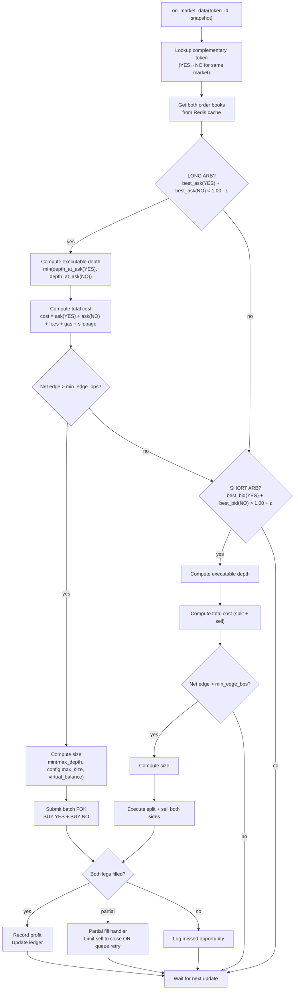

### Market Pair Discovery

```python
# Pseudocode: discover YES/NO pairs for binary markets
async def discover_binary_pairs(gamma_client):
    events = await gamma_client.get_events(active=True, closed=False)
    pairs = {}
    for event in events:
        markets = event.get("markets", [])
        if len(markets) == 2:  # Binary market
            yes_market = next((m for m in markets if m["outcome"] == "Yes"), None)
            no_market = next((m for m in markets if m["outcome"] == "No"), None)
            if yes_market and no_market:
                if yes_market.get("enableOrderBook") and no_market.get("enableOrderBook"):
                    pairs[event["slug"]] = {
                        "yes_token_id": yes_market["clobTokenIds"][0],
                        "no_token_id": no_market["clobTokenIds"][0],
                        "event_slug": event["slug"],
                        "question": event["title"],
                        "end_date": event.get("endDate"),
                        "neg_risk": event.get("negRisk", False),
                    }
    return pairs
```

---

## Cross-References

| Topic | Document | Section |
|-------|----------|---------|
| Market research, competitor analysis | [01-product-research.md](./01-product-research.md) | Full document |
| Roadmap phases, milestones, exit criteria | [02-product-roadmap.md](./02-product-roadmap.md) | Phase 1–6 |
| User stories, acceptance criteria | [03-prd.md](./03-prd.md) | Epics 1–9 |
| Repository structure, Git workflow | [05-development-guidelines.md](./05-development-guidelines.md) | Repository Structure |
| Security threat model, key management | [08-security-spec.md](./08-security-spec.md) | Full document |
| Docker Compose, VPS setup | [09-infrastructure-spec.md](./09-infrastructure-spec.md) | Deployment Architecture |
| API endpoint specifications | [10-api-specification.md](./10-api-specification.md) | Full API spec |
| Testing strategy per service | [11-testing-strategy.md](./11-testing-strategy.md) | Per-service test plans |
