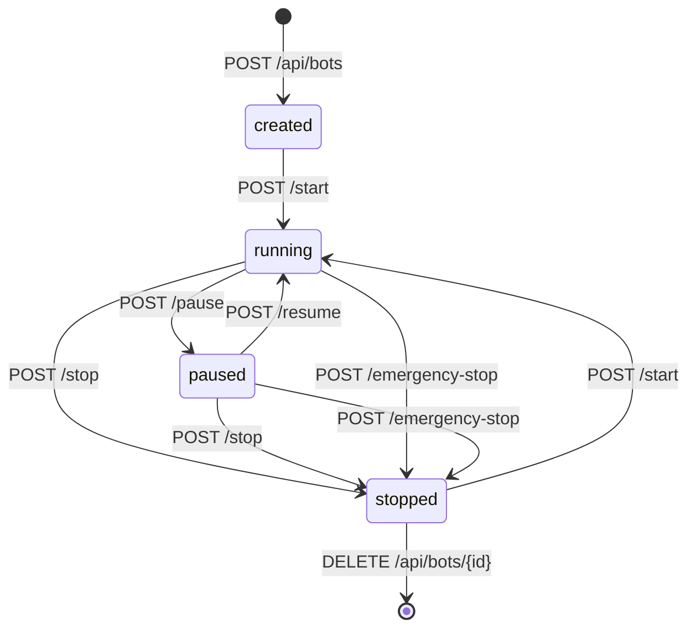
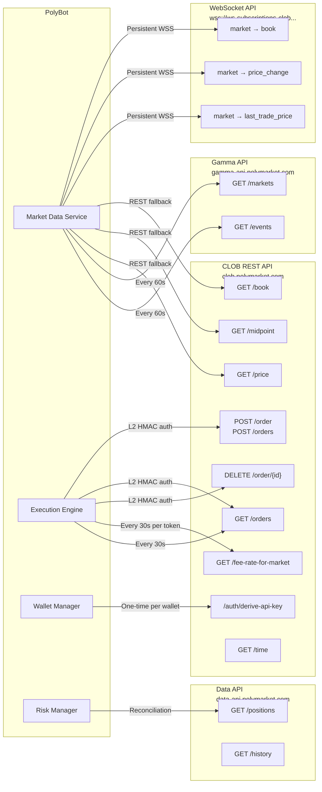

# API Specification: PolyBot Platform

## Overview

This document defines two API surfaces:

1. **Internal Dashboard API** — REST + SSE endpoints served by the Dashboard service (FastAPI) for the operator's browser-based admin interface
2. **Polymarket API Integration** — How PolyBot consumes Polymarket's external APIs (CLOB REST, WebSocket, Gamma, Data)

All internal APIs follow REST conventions. Authentication is required for every endpoint. Responses use JSON. Errors follow a consistent structure.

---

## Common Conventions

### Base URL

```
Production: https://{DOMAIN}/api
Development: http://localhost:8080/api
```

### Authentication

All endpoints require the `Authorization` header:

```
Authorization: Bearer <DASHBOARD_API_KEY>
```

Phase 2+ will add JWT session tokens. The Bearer API key remains supported for programmatic access.

### Response Envelope

All API responses follow a consistent structure:

**Success**:
```json
{
    "status": "ok",
    "data": { ... },
    "meta": {
        "timestamp": "2026-02-15T14:30:00.123Z",
        "request_id": "a1b2c3d4-e5f6-..."
    }
}
```

**List responses** (paginated):
```json
{
    "status": "ok",
    "data": [ ... ],
    "meta": {
        "timestamp": "2026-02-15T14:30:00.123Z",
        "request_id": "a1b2c3d4-e5f6-...",
        "pagination": {
            "page": 1,
            "page_size": 50,
            "total_items": 234,
            "total_pages": 5
        }
    }
}
```

**Error**:
```json
{
    "status": "error",
    "error": {
        "code": "VALIDATION_ERROR",
        "message": "Invalid bot configuration: max_position_size must be positive",
        "details": { ... }
    },
    "meta": {
        "timestamp": "2026-02-15T14:30:00.123Z",
        "request_id": "a1b2c3d4-e5f6-..."
    }
}
```

### Error Codes

| HTTP Status | Error Code | Description |
|------------|------------|-------------|
| 400 | `VALIDATION_ERROR` | Request body failed Pydantic validation |
| 400 | `INVALID_STATE_TRANSITION` | Bot cannot transition to requested state |
| 401 | `UNAUTHORIZED` | Missing or invalid API key |
| 404 | `NOT_FOUND` | Resource does not exist |
| 409 | `CONFLICT` | Resource already exists or state conflict |
| 422 | `UNPROCESSABLE_ENTITY` | Semantically invalid request |
| 429 | `RATE_LIMITED` | Too many requests (Caddy rate limit) |
| 500 | `INTERNAL_ERROR` | Unexpected server error |
| 503 | `SERVICE_UNAVAILABLE` | Dependent service (Redis/PostgreSQL) down |

### Pagination Parameters

| Parameter | Type | Default | Description |
|-----------|------|---------|-------------|
| `page` | int | 1 | Page number (1-indexed) |
| `page_size` | int | 50 | Items per page (max 200) |
| `sort_by` | string | `created_at` | Sort field |
| `sort_order` | string | `desc` | `asc` or `desc` |

### Filtering Conventions

Date ranges use ISO 8601 format:
```
?from=2026-02-01T00:00:00Z&to=2026-02-15T23:59:59Z
```

---

## Dashboard API — System Endpoints

### `GET /api/system/health`

Returns overall system health status. **Lightweight** — designed for monitoring probes.

**Response** `200 OK`:
```json
{
    "status": "ok",
    "data": {
        "status": "healthy",
        "uptime_seconds": 86412,
        "services": {
            "postgres": "ok",
            "redis": "ok",
            "market_data": "healthy",
            "orchestrator": "healthy",
            "execution": "healthy",
            "risk": "healthy",
            "wallet": "healthy"
        },
        "emergency_stop": false,
        "version": "0.1.0"
    }
}
```

**Degraded response** (one service unhealthy):
```json
{
    "status": "ok",
    "data": {
        "status": "degraded",
        "services": {
            "market_data": "unhealthy"
        },
        "emergency_stop": false
    }
}
```

---

### `GET /api/system/status`

Returns detailed system status including resource usage and portfolio summary.

**Response** `200 OK`:
```json
{
    "status": "ok",
    "data": {
        "system": {
            "uptime_seconds": 86412,
            "emergency_stop": false,
            "active_bots": 3,
            "total_bots": 5,
            "websocket_connections": 4,
            "redis_memory_mb": 145,
            "postgres_connections": 32
        },
        "portfolio": {
            "total_value_usdc": 12500.50,
            "usdc_balance": 8200.00,
            "positions_value": 4300.50,
            "daily_pnl_usdc": 45.20,
            "daily_pnl_pct": 0.36,
            "weekly_pnl_usdc": 210.50,
            "total_positions": 12
        },
        "wallets": [
            {
                "wallet_id": "vault",
                "tier": "low_risk",
                "balance_usdc": 8750.00,
                "target_allocation_pct": 70,
                "actual_allocation_pct": 72.3,
                "active_bots": 2
            }
        ]
    }
}
```

---

### `POST /api/system/emergency-stop`

Triggers platform-wide emergency stop. Cancels all open orders, stops all bots, halts all trading.

**Response** `200 OK`:
```json
{
    "status": "ok",
    "data": {
        "emergency_stop": true,
        "orders_cancelled": 15,
        "bots_stopped": 3,
        "elapsed_ms": 3200,
        "timestamp": "2026-02-15T14:30:00.123Z"
    }
}
```

**Latency target**: <5 seconds to cancel all orders across all wallets.

---

### `POST /api/system/resume`

Clears the emergency stop flag. Bots must be restarted individually.

**Response** `200 OK`:
```json
{
    "status": "ok",
    "data": {
        "emergency_stop": false,
        "message": "Emergency stop cleared. Restart bots individually."
    }
}
```

---

## Dashboard API — Bot Management

### `GET /api/bots`

Lists all configured bots with current status.

**Query Parameters**:
| Parameter | Type | Default | Description |
|-----------|------|---------|-------------|
| `status` | string | — | Filter: `running`, `paused`, `stopped`, `error`, `created` |
| `wallet_id` | string | — | Filter by wallet |
| `bot_type` | string | — | Filter by strategy type |

**Response** `200 OK`:
```json
{
    "status": "ok",
    "data": [
        {
            "bot_id": "arb-btc-01",
            "bot_type": "binary_arbitrage",
            "status": "running",
            "wallet_id": "vault",
            "enabled": true,
            "virtual_balance_usdc": 2000.00,
            "pnl_today_usdc": 12.50,
            "pnl_total_usdc": 245.80,
            "open_positions": 4,
            "signals_today": 142,
            "fills_today": 38,
            "win_rate_7d": 0.85,
            "circuit_breaker_state": "CLOSED",
            "last_activity": "2026-02-15T14:29:55.000Z",
            "uptime_seconds": 43200,
            "created_at": "2026-02-01T00:00:00.000Z"
        }
    ],
    "meta": {
        "pagination": {
            "page": 1,
            "page_size": 50,
            "total_items": 3,
            "total_pages": 1
        }
    }
}
```

---

### `GET /api/bots/{bot_id}`

Returns detailed information for a specific bot.

**Response** `200 OK`:
```json
{
    "status": "ok",
    "data": {
        "bot_id": "arb-btc-01",
        "bot_type": "binary_arbitrage",
        "status": "running",
        "wallet_id": "vault",
        "enabled": true,
        "config": {
            "strategy": {
                "min_edge_bps": 50,
                "max_position_size": 500,
                "max_markets": 20,
                "scan_interval_ms": 1000
            },
            "risk": {
                "max_daily_loss_usdc": 100,
                "max_position_per_market": 200,
                "circuit_breaker_threshold": 5,
                "circuit_breaker_cooldown_seconds": 300
            },
            "execution": {
                "order_type": "FOK",
                "batch_size": 2,
                "slippage_tolerance_bps": 10
            }
        },
        "metrics": {
            "pnl_realized_usdc": 245.80,
            "pnl_unrealized_usdc": -12.30,
            "pnl_today_usdc": 12.50,
            "total_trades": 1420,
            "win_rate": 0.85,
            "avg_edge_bps": 65.3,
            "max_drawdown_usdc": 45.20,
            "sharpe_ratio_7d": 2.1,
            "signals_today": 142,
            "fills_today": 38,
            "fill_rate": 0.27
        },
        "positions": [
            {
                "token_id": "token_abc123",
                "market_question": "Will BTC exceed $100k by March?",
                "outcome": "YES",
                "side": "BUY",
                "size": 100,
                "avg_entry_price": 0.52,
                "current_price": 0.54,
                "unrealized_pnl_usdc": 2.00,
                "opened_at": "2026-02-15T12:00:00.000Z"
            }
        ],
        "circuit_breaker": {
            "state": "CLOSED",
            "consecutive_losses": 1,
            "threshold": 5,
            "last_state_change": "2026-02-15T10:00:00.000Z"
        },
        "virtual_balance_usdc": 2000.00,
        "subscribed_markets": 15,
        "uptime_seconds": 43200,
        "last_activity": "2026-02-15T14:29:55.000Z",
        "created_at": "2026-02-01T00:00:00.000Z",
        "updated_at": "2026-02-15T14:00:00.000Z"
    }
}
```

---

### `POST /api/bots`

Creates a new bot configuration. Does NOT start the bot — call `POST /api/bots/{bot_id}/start` after creation.

**Request Body**:
```json
{
    "bot_id": "arb-eth-02",
    "bot_type": "binary_arbitrage",
    "wallet_id": "vault",
    "virtual_balance_usdc": 1500.00,
    "enabled": true,
    "config": {
        "strategy": {
            "min_edge_bps": 50,
            "max_position_size": 300,
            "max_markets": 10,
            "scan_interval_ms": 1000,
            "market_filter": {
                "categories": ["crypto"],
                "min_volume_24h": 10000
            }
        },
        "risk": {
            "max_daily_loss_usdc": 75,
            "max_position_per_market": 150,
            "circuit_breaker_threshold": 5,
            "circuit_breaker_cooldown_seconds": 300
        }
    }
}
```

**Validation Rules**:
- `bot_id`: unique, alphanumeric + hyphens, 3-50 characters
- `bot_type`: must match an installed bot module in `src/bots/`
- `wallet_id`: must reference an active wallet
- `virtual_balance_usdc`: must not exceed wallet's available capacity
- `config.risk.max_daily_loss_usdc`: must be > 0 and ≤ global daily loss cap

**Response** `201 Created`:
```json
{
    "status": "ok",
    "data": {
        "bot_id": "arb-eth-02",
        "status": "created",
        "message": "Bot created. Call POST /api/bots/arb-eth-02/start to begin trading."
    }
}
```

---

### `PATCH /api/bots/{bot_id}`

Updates bot configuration. Bot must be paused or stopped to update strategy/risk config. Non-critical fields (enabled, virtual_balance) can be updated while running.

**Request Body** (partial update):
```json
{
    "config": {
        "strategy": {
            "min_edge_bps": 60
        }
    }
}
```

**Response** `200 OK`:
```json
{
    "status": "ok",
    "data": {
        "bot_id": "arb-btc-01",
        "updated_fields": ["config.strategy.min_edge_bps"],
        "requires_restart": true,
        "message": "Strategy config updated. Restart bot to apply."
    }
}
```

---

### `DELETE /api/bots/{bot_id}`

Deletes a bot configuration. Bot must be in `stopped` state.

**Response** `200 OK`:
```json
{
    "status": "ok",
    "data": {
        "bot_id": "arb-eth-02",
        "deleted": true,
        "message": "Bot configuration deleted. Historical data retained."
    }
}
```

---

### Bot Lifecycle Endpoints

#### `POST /api/bots/{bot_id}/start`

Starts a bot. Transitions from `created` or `stopped` → `running`.

**Response** `200 OK`:
```json
{
    "status": "ok",
    "data": {
        "bot_id": "arb-btc-01",
        "status": "running",
        "message": "Bot started successfully.",
        "subscribed_markets": 15
    }
}
```

#### `POST /api/bots/{bot_id}/stop`

Gracefully stops a bot. Cancels open orders, calls `on_stop()`.

**Response** `200 OK`:
```json
{
    "status": "ok",
    "data": {
        "bot_id": "arb-btc-01",
        "status": "stopped",
        "orders_cancelled": 2,
        "message": "Bot stopped gracefully."
    }
}
```

#### `POST /api/bots/{bot_id}/pause`

Pauses a bot. Cancels open orders, stops generating signals. Resumes from current state.

**Response** `200 OK`:
```json
{
    "status": "ok",
    "data": {
        "bot_id": "arb-btc-01",
        "status": "paused",
        "orders_cancelled": 2,
        "message": "Bot paused. Market data subscriptions maintained."
    }
}
```

#### `POST /api/bots/{bot_id}/resume`

Resumes a paused bot.

**Response** `200 OK`:
```json
{
    "status": "ok",
    "data": {
        "bot_id": "arb-btc-01",
        "status": "running",
        "message": "Bot resumed."
    }
}
```

### Bot State Machine (API Perspective)



---

## Dashboard API — Trade History

### `GET /api/trades`

Returns trade (fill) history with filtering and pagination.

**Query Parameters**:
| Parameter | Type | Default | Description |
|-----------|------|---------|-------------|
| `bot_id` | string | — | Filter by bot |
| `wallet_id` | string | — | Filter by wallet |
| `token_id` | string | — | Filter by market token |
| `side` | string | — | `BUY` or `SELL` |
| `from` | ISO 8601 | — | Start date |
| `to` | ISO 8601 | — | End date |
| `page` | int | 1 | Page number |
| `page_size` | int | 50 | Items per page |

**Response** `200 OK`:
```json
{
    "status": "ok",
    "data": [
        {
            "id": "fill-uuid-123",
            "order_id": "order-uuid-456",
            "polymarket_trade_id": "pm-trade-789",
            "bot_id": "arb-btc-01",
            "wallet_id": "vault",
            "token_id": "token_abc123",
            "market_question": "Will BTC exceed $100k by March?",
            "outcome": "YES",
            "side": "BUY",
            "price": 0.52,
            "size": 100,
            "notional_usdc": 52.00,
            "fee_usdc": 0.52,
            "fee_rate_bps": 100,
            "maker_taker": "TAKER",
            "filled_at": "2026-02-15T14:25:00.000Z"
        }
    ],
    "meta": {
        "pagination": {
            "page": 1,
            "page_size": 50,
            "total_items": 1420,
            "total_pages": 29
        }
    }
}
```

---

### `GET /api/trades/summary`

Returns aggregated trade statistics.

**Query Parameters**: `from`, `to`, `bot_id`, `wallet_id`

**Response** `200 OK`:
```json
{
    "status": "ok",
    "data": {
        "period": {
            "from": "2026-02-01T00:00:00Z",
            "to": "2026-02-15T23:59:59Z"
        },
        "total_trades": 1420,
        "buy_trades": 720,
        "sell_trades": 700,
        "total_volume_usdc": 85000.00,
        "total_fees_usdc": 850.00,
        "realized_pnl_usdc": 245.80,
        "win_rate": 0.85,
        "avg_trade_size_usdc": 59.86,
        "largest_trade_usdc": 500.00,
        "by_bot": [
            {
                "bot_id": "arb-btc-01",
                "trades": 800,
                "volume_usdc": 48000.00,
                "pnl_usdc": 180.50
            }
        ]
    }
}
```

---

## Dashboard API — Positions

### `GET /api/positions`

Returns all open positions across all bots.

**Query Parameters**: `bot_id`, `wallet_id`, `token_id`

**Response** `200 OK`:
```json
{
    "status": "ok",
    "data": [
        {
            "bot_id": "arb-btc-01",
            "wallet_id": "vault",
            "token_id": "token_abc123",
            "market_question": "Will BTC exceed $100k by March?",
            "outcome": "YES",
            "size": 100,
            "avg_entry_price": 0.52,
            "current_price": 0.54,
            "mark_to_market_usdc": 54.00,
            "cost_basis_usdc": 52.00,
            "unrealized_pnl_usdc": 2.00,
            "unrealized_pnl_pct": 3.85,
            "fees_paid_usdc": 0.52,
            "opened_at": "2026-02-15T12:00:00.000Z",
            "market_end_date": "2026-03-31T00:00:00.000Z"
        }
    ]
}
```

---

## Dashboard API — Risk

### `GET /api/risk/overview`

Returns portfolio-level risk metrics.

**Response** `200 OK`:
```json
{
    "status": "ok",
    "data": {
        "emergency_stop": false,
        "portfolio": {
            "total_exposure_usdc": 4300.50,
            "max_exposure_usdc": 10000.00,
            "exposure_utilization_pct": 43.0,
            "daily_loss_usdc": 12.50,
            "daily_loss_cap_usdc": 500.00,
            "daily_loss_utilization_pct": 2.5
        },
        "bots": [
            {
                "bot_id": "arb-btc-01",
                "circuit_breaker_state": "CLOSED",
                "daily_loss_usdc": 5.00,
                "daily_loss_cap_usdc": 100.00,
                "open_positions": 4,
                "position_limit": 20,
                "consecutive_losses": 1
            }
        ],
        "recent_risk_events": [
            {
                "id": "event-uuid",
                "bot_id": "mm-politics-01",
                "event_type": "circuit_break",
                "severity": "WARNING",
                "details": {
                    "reason": "5 consecutive losses",
                    "cooldown_seconds": 300
                },
                "created_at": "2026-02-15T13:00:00.000Z"
            }
        ]
    }
}
```

---

### `GET /api/risk/circuit-breakers`

Returns circuit breaker state for all bots.

**Response** `200 OK`:
```json
{
    "status": "ok",
    "data": [
        {
            "bot_id": "arb-btc-01",
            "state": "CLOSED",
            "consecutive_losses": 1,
            "threshold": 5,
            "cooldown_seconds": 300,
            "last_state_change": "2026-02-15T10:00:00.000Z",
            "total_trips_today": 0
        }
    ]
}
```

---

### `GET /api/risk/events`

Returns risk event log with filtering.

**Query Parameters**: `bot_id`, `event_type`, `severity`, `from`, `to`, `page`, `page_size`

**Response** `200 OK`:
```json
{
    "status": "ok",
    "data": [
        {
            "id": "event-uuid",
            "bot_id": "arb-btc-01",
            "event_type": "daily_loss_cap",
            "severity": "WARNING",
            "details": {
                "current_loss_usdc": 82.50,
                "cap_usdc": 100.00,
                "utilization_pct": 82.5,
                "action": "alert_only"
            },
            "created_at": "2026-02-15T14:00:00.000Z"
        }
    ]
}
```

---

## Dashboard API — Wallets

### `GET /api/wallets`

Returns all wallet balances and allocation status.

**Response** `200 OK`:
```json
{
    "status": "ok",
    "data": [
        {
            "wallet_id": "vault",
            "name": "Vault",
            "tier": "low_risk",
            "eoa_address": "0x1234...abcd",
            "proxy_address": "0x5678...efgh",
            "usdc_balance": 8750.00,
            "positions_value": 3500.00,
            "total_value": 12250.00,
            "target_allocation_pct": 70,
            "actual_allocation_pct": 72.3,
            "drift_pct": 2.3,
            "alert_threshold_usdc": 500,
            "is_active": true,
            "assigned_bots": ["arb-btc-01", "arb-eth-02"],
            "last_balance_check": "2026-02-15T14:29:30.000Z"
        }
    ]
}
```

---

### `GET /api/wallets/{wallet_id}/ledger`

Returns software ledger entries for a wallet (per-bot P&L attribution).

**Query Parameters**: `bot_id`, `entry_type`, `from`, `to`, `page`, `page_size`

**Response** `200 OK`:
```json
{
    "status": "ok",
    "data": [
        {
            "id": "ledger-uuid",
            "wallet_id": "vault",
            "bot_id": "arb-btc-01",
            "token_id": "token_abc123",
            "entry_type": "TRADE",
            "amount_usdc": 12.50,
            "running_balance": 2012.50,
            "reference_id": "fill-uuid-123",
            "metadata": {
                "side": "SELL",
                "price": 0.54,
                "size": 100
            },
            "created_at": "2026-02-15T14:25:00.000Z"
        }
    ]
}
```

---

## Dashboard API — Markets

### `GET /api/markets`

Returns tracked markets with pricing and metadata.

**Query Parameters**:
| Parameter | Type | Default | Description |
|-----------|------|---------|-------------|
| `category` | string | — | Filter: `politics`, `sports`, `crypto`, `entertainment` |
| `active` | boolean | `true` | Only active (tradeable) markets |
| `has_positions` | boolean | — | Only markets where we hold positions |
| `search` | string | — | Text search on market question |

**Response** `200 OK`:
```json
{
    "status": "ok",
    "data": [
        {
            "token_id": "token_abc123",
            "condition_id": "cond_xyz",
            "event_slug": "btc-100k-march-2026",
            "question": "Will BTC exceed $100k by March 2026?",
            "outcome": "YES",
            "category": "crypto",
            "complement_token_id": "token_def456",
            "current_price": 0.54,
            "best_bid": 0.53,
            "best_ask": 0.55,
            "spread_bps": 370,
            "volume_24h": 150000,
            "tick_size": 0.01,
            "fee_enabled": true,
            "fee_rate_bps": 100,
            "neg_risk": false,
            "end_date": "2026-03-31T00:00:00.000Z",
            "active": true,
            "our_positions": {
                "size": 100,
                "avg_entry_price": 0.52,
                "unrealized_pnl_usdc": 2.00
            },
            "last_updated": "2026-02-15T14:29:55.000Z"
        }
    ]
}
```

---

### `GET /api/markets/{token_id}/orderbook`

Returns the current order book snapshot from Redis cache.

**Response** `200 OK`:
```json
{
    "status": "ok",
    "data": {
        "token_id": "token_abc123",
        "timestamp": "2026-02-15T14:29:55.000Z",
        "bids": [
            {"price": 0.53, "size": 500},
            {"price": 0.52, "size": 1000},
            {"price": 0.51, "size": 2000},
            {"price": 0.50, "size": 5000},
            {"price": 0.49, "size": 3000}
        ],
        "asks": [
            {"price": 0.55, "size": 500},
            {"price": 0.56, "size": 1000},
            {"price": 0.57, "size": 2000},
            {"price": 0.58, "size": 5000},
            {"price": 0.60, "size": 3000}
        ],
        "midpoint": 0.54,
        "spread_bps": 370,
        "total_bid_depth": 11500,
        "total_ask_depth": 11500
    }
}
```

---

## Dashboard API — Settings

### `GET /api/settings`

Returns global platform settings (risk params, alert config, feature flags).

**Response** `200 OK`:
```json
{
    "status": "ok",
    "data": {
        "risk": {
            "max_daily_loss_pct": 5.0,
            "max_portfolio_exposure_usdc": 10000,
            "emergency_api_error_threshold": 10,
            "default_circuit_breaker_threshold": 5,
            "default_circuit_breaker_cooldown_seconds": 300
        },
        "alerts": {
            "telegram_enabled": true,
            "telegram_chat_id": "123456789",
            "alert_on_circuit_break": true,
            "alert_on_daily_loss_80pct": true,
            "alert_on_low_balance": true,
            "daily_summary_enabled": true,
            "daily_summary_time_utc": "18:00"
        },
        "execution": {
            "paper_trading_mode": false,
            "default_order_type": "FOK",
            "max_batch_size": 15,
            "rate_limit_per_wallet": 3500
        },
        "market_data": {
            "gamma_poll_interval_seconds": 60,
            "max_ws_instruments_per_connection": 500,
            "ws_reconnect_max_retries": 10
        }
    }
}
```

---

### `PATCH /api/settings`

Updates global settings. Validated by Pydantic schema. Changes logged in audit trail.

**Request Body** (partial update):
```json
{
    "risk": {
        "max_daily_loss_pct": 3.0
    },
    "alerts": {
        "daily_summary_time_utc": "20:00"
    }
}
```

**Validation Rules**:
- `risk.max_daily_loss_pct`: 0.5 – 20.0 (cannot set to 0)
- `risk.max_portfolio_exposure_usdc`: > 0
- `risk.emergency_api_error_threshold`: 3 – 50
- `risk.default_circuit_breaker_threshold`: 2 – 20
- `execution.paper_trading_mode`: boolean (no validation needed)
- `alerts.daily_summary_time_utc`: valid HH:MM format

**Response** `200 OK`:
```json
{
    "status": "ok",
    "data": {
        "updated_fields": ["risk.max_daily_loss_pct", "alerts.daily_summary_time_utc"],
        "audit_log_id": "audit-uuid",
        "message": "Settings updated. Risk parameter changes take effect immediately."
    }
}
```

---

## Dashboard API — Signals

### `GET /api/signals`

Returns signal log (opportunities detected by bots, whether executed or not).

**Query Parameters**: `bot_id`, `signal_type`, `executed`, `from`, `to`, `page`, `page_size`

**Response** `200 OK`:
```json
{
    "status": "ok",
    "data": [
        {
            "id": "signal-uuid",
            "bot_id": "arb-btc-01",
            "token_id": "token_abc123",
            "signal_type": "LONG_ARB",
            "target_price": 0.48,
            "target_size": 200,
            "edge_bps": 65,
            "urgency": "normal",
            "executed": true,
            "rejection_reason": null,
            "metadata": {
                "yes_ask": 0.48,
                "no_ask": 0.50,
                "total_cost": 0.98,
                "expected_profit_bps": 200,
                "fees_bps": 135
            },
            "created_at": "2026-02-15T14:25:00.000Z"
        }
    ]
}
```

---

## Dashboard API — Audit Log

### `GET /api/audit`

Returns audit trail of all operator actions and system events.

**Query Parameters**: `actor`, `action`, `entity_type`, `from`, `to`, `page`, `page_size`

**Response** `200 OK`:
```json
{
    "status": "ok",
    "data": [
        {
            "id": "audit-uuid",
            "actor": "operator",
            "action": "config_changed",
            "entity_type": "bot",
            "entity_id": "arb-btc-01",
            "details": {
                "field": "config.strategy.min_edge_bps",
                "old_value": 50,
                "new_value": 60
            },
            "wallet_id": null,
            "created_at": "2026-02-15T14:00:00.000Z"
        }
    ]
}
```

---

## Dashboard API — SSE Event Stream

### `GET /api/stream/events`

Server-Sent Events (SSE) endpoint for real-time dashboard updates.

**Headers**:
```
Accept: text/event-stream
Authorization: Bearer <DASHBOARD_API_KEY>
```

**Connection behavior**:
- Auto-reconnects on disconnect (browser SSE standard behavior)
- Heartbeat ping every 15 seconds to prevent timeout
- Events published to Redis Pub/Sub `dashboard_events`, relayed to SSE clients

### Event Types

#### `portfolio_update` (every 5 seconds)
```
event: portfolio_update
data: {"total_value_usdc": 12500.50, "daily_pnl_usdc": 45.20, "daily_pnl_pct": 0.36, "usdc_balance": 8200.00}
```

#### `bot_status` (every 10 seconds or on state change)
```
event: bot_status
data: {"bot_id": "arb-btc-01", "status": "running", "pnl_today_usdc": 12.50, "signals": 142, "fills": 38}
```

#### `fill` (immediately on fill)
```
event: fill
data: {"bot_id": "arb-btc-01", "token_id": "token_abc123", "question": "BTC $100k March?", "side": "BUY", "price": 0.52, "size": 100, "fee_usdc": 0.52, "filled_at": "2026-02-15T14:25:00.000Z"}
```

#### `risk_event` (immediately)
```
event: risk_event
data: {"bot_id": "mm-politics-01", "event_type": "circuit_break", "severity": "WARNING", "details": {"reason": "5 consecutive losses", "cooldown_seconds": 300}}
```

#### `alert` (immediately)
```
event: alert
data: {"message": "Vault wallet balance below threshold: $450", "severity": "WARNING", "timestamp": "2026-02-15T14:30:00.000Z"}
```

#### `orderbook_update` (every 2 seconds for subscribed markets)
```
event: orderbook_update
data: {"token_id": "token_abc123", "best_bid": 0.53, "best_ask": 0.55, "spread_bps": 370, "mid": 0.54}
```

#### `heartbeat` (every 15 seconds)
```
event: heartbeat
data: {"timestamp": "2026-02-15T14:30:15.000Z"}
```

### SSE Client Implementation (React)

```typescript
// frontend/src/hooks/useSSE.ts
import { useEffect, useRef, useCallback } from 'react';

type SSEEventHandler = (data: unknown) => void;

export function useSSE(eventHandlers: Record<string, SSEEventHandler>) {
    const sourceRef = useRef<EventSource | null>(null);

    const connect = useCallback(() => {
        const apiKey = localStorage.getItem('dashboard_api_key');
        const source = new EventSource(`/api/stream/events?token=${apiKey}`);

        Object.entries(eventHandlers).forEach(([event, handler]) => {
            source.addEventListener(event, (e: MessageEvent) => {
                handler(JSON.parse(e.data));
            });
        });

        source.onerror = () => {
            source.close();
            // Auto-reconnect after 3 seconds
            setTimeout(connect, 3000);
        };

        sourceRef.current = source;
    }, [eventHandlers]);

    useEffect(() => {
        connect();
        return () => sourceRef.current?.close();
    }, [connect]);
}
```

---

## Polymarket API Integration

### API Endpoints Consumed



### CLOB REST API — Authenticated Endpoints

#### Authentication Headers

Every authenticated request includes:

| Header | Value | Description |
|--------|-------|-------------|
| `POLY_API_KEY` | API key UUID | From `create_or_derive_api_creds()` |
| `POLY_SIGNATURE` | HMAC-SHA256 signature | `HMAC(secret, timestamp + method + path + body)` |
| `POLY_TIMESTAMP` | Unix timestamp (seconds) | Must be within 5 seconds of server time |
| `POLY_PASSPHRASE` | Passphrase string | From `create_or_derive_api_creds()` |

**HMAC computation**:
```python
import hmac
import hashlib
import time

def sign_request(secret: str, method: str, path: str, body: str = "") -> dict:
    timestamp = str(int(time.time()))
    message = timestamp + method.upper() + path + body
    signature = hmac.new(
        secret.encode("utf-8"),
        message.encode("utf-8"),
        hashlib.sha256
    ).hexdigest()
    return {
        "POLY_SIGNATURE": signature,
        "POLY_TIMESTAMP": timestamp,
    }
```

#### `POST /order` — Submit Single Order

```python
# py-clob-client usage
order = client.create_order(
    OrderArgs(
        token_id="token_abc123",
        price=0.52,
        size=100,
        side=BUY,
        fee_rate_bps=100,       # MUST be included
        nonce=None,             # Auto-generated
        expiration=0,           # 0 = GTC
    ),
    OrderType.FOK,
)
response = client.post_order(order)
```

**Response**:
```json
{
    "success": true,
    "orderID": "0xabc123...",
    "transactionsHashes": null
}
```

#### `POST /orders` — Submit Batch Orders (up to 15)

```python
orders = [client.create_order(...) for _ in range(n)]  # n ≤ 15
responses = client.post_orders(orders)
```

**Rate limit**: Each batch call consumes 1 API call against the 3,500/10s limit.

#### `DELETE /order/{orderID}` — Cancel Order

```python
client.cancel(order_id="0xabc123...")
```

#### `GET /orders` — Query Orders (Reconciliation)

```python
# Used every 30s for order state reconciliation
open_orders = client.get_orders(
    params=OpenOrderParams(market="condition_id_xyz")
)
```

#### `GET /fee-rate-for-market` — Dynamic Fee Rate

```
GET /fee-rate-for-market?tokenID={token_id}
```

**Response**: Fee rate in basis points. Some markets (e.g., 15-min crypto) have taker fees up to 315 bps.

**Caching**: Cached in Redis Hash `fee_rate:{token_id}` with 60s TTL.

### CLOB WebSocket API

#### Connection

```python
# Market data subscription
ws_url = "wss://ws-subscriptions-clob.polymarket.com/ws/market"

# Subscribe message format
subscribe_msg = {
    "auth": {},           # No auth required for market data
    "type": "subscribe",
    "channel": "market",
    "markets": ["condition_id_1", "condition_id_2"],
    "assets_id": ["token_id_1", "token_id_2"]
}
```

#### Constraints

| Constraint | Limit | Handling |
|------------|-------|---------|
| Max instruments per connection | 500 | `WebSocketManager` spawns additional connections |
| Unsubscribe support | None | New connection required for subscription changes |
| Heartbeat | Ping/pong every 30s | Auto-handled by `websockets` library |
| Reconnection | Required on disconnect | Exponential backoff: 1s, 2s, 4s... max 30s, 10 retries |

#### Event Payloads

**Order Book Update** (`book` channel):
```json
{
    "event_type": "book",
    "asset_id": "token_abc123",
    "market": "condition_id_xyz",
    "timestamp": "1708012345",
    "bids": [
        {"price": "0.53", "size": "500"},
        {"price": "0.52", "size": "1000"}
    ],
    "asks": [
        {"price": "0.55", "size": "500"},
        {"price": "0.56", "size": "1000"}
    ]
}
```

**Price Change** (`price_change` channel):
```json
{
    "event_type": "price_change",
    "asset_id": "token_abc123",
    "market": "condition_id_xyz",
    "price": "0.54",
    "timestamp": "1708012345"
}
```

### Gamma API — Market Discovery

#### `GET /markets`

```
GET https://gamma-api.polymarket.com/markets?active=true&closed=false&limit=100&offset=0
```

**Polling frequency**: Every 60 seconds.

**Key fields used**:
| Field | Usage |
|-------|-------|
| `clobTokenIds` | Token IDs for order book subscription and trading |
| `conditionId` | Condition ID for WebSocket subscription |
| `question` | Market question text (display) |
| `outcomes` | YES/NO (or multi-outcome names) |
| `endDate` | Market resolution date (skip markets expiring soon) |
| `enableOrderBook` | Whether CLOB trading is enabled |
| `volume24hr` | 24-hour volume (filter low-liquidity markets) |
| `negRisk` | NegRisk market flag |
| `feePercent` | Fee configuration |

#### `GET /events`

```
GET https://gamma-api.polymarket.com/events?active=true&closed=false&limit=100
```

**Usage**: Discover binary events (events with exactly 2 markets) for the Binary Arbitrage strategy. Group markets by event slug.

### Data API — Position Reconciliation

#### `GET /positions`

```
GET https://data-api.polymarket.com/positions?address={proxy_address}
```

**Usage**: Reconcile internal position tracker with on-chain positions. Run every 5 minutes by the Risk Manager.

### Rate Limits Summary

| API | Limit | Scope | Client-Side Enforcement |
|-----|-------|-------|------------------------|
| CLOB REST (authenticated) | 3,500 / 10s | Per wallet | Token bucket in `rate_limiter.py` |
| CLOB REST (public) | 100 / min | Per IP | Counter with backoff |
| Gamma API | ~60 / min (estimated) | Per IP | Counter with backoff |
| Data API | ~100 / min (estimated) | Per IP | Counter with backoff |
| WebSocket | No message rate limit | Per connection | Connection count limit (500 instruments) |

### Error Handling — Polymarket API

| HTTP Status | Meaning | PolyBot Handling |
|-------------|---------|-----------------|
| 200 | Success | Process response |
| 400 | Bad request (invalid order) | Log + reject signal, do NOT retry |
| 401 | Invalid credentials | Re-derive API key, alert operator |
| 403 | Forbidden (geoblocked, blacklisted) | Emergency stop + alert |
| 404 | Order/market not found | Log, remove from tracking |
| 429 | Rate limited | Client-side limiter should prevent; if hit, exponential backoff |
| 500-503 | Server error | Retry with backoff (3 attempts); if persistent, emergency API error threshold |

---

## Inter-Service Communication (Redis)

### Redis Streams (Durable Messages)

| Stream | Producer | Consumer(s) | Message Schema |
|--------|----------|-------------|----------------|
| `market_data:{token_id}` | Market Data | Orchestrator → Bots | `{type, token_id, timestamp, bids, asks, mid, spread}` |
| `fills:{bot_id}` | Execution | Orchestrator → Bot | `{order_id, fill_id, token_id, side, price, size, fee, filled_at}` |
| `risk_events` | Risk Manager | Dashboard, Orchestrator | `{bot_id, event_type, severity, details, created_at}` |
| `audit_events` | All services | Dashboard | `{actor, action, entity_type, entity_id, details, created_at}` |

**Consumer Groups**: Each service creates a consumer group for reliable delivery:
```python
# Consumer group: ensures at-least-once delivery
await redis.xgroup_create("market_data:token_123", "orchestrator", mkstream=True)
# Read new messages
messages = await redis.xreadgroup("orchestrator", "consumer-1", {"market_data:token_123": ">"})
# Acknowledge after processing
await redis.xack("market_data:token_123", "orchestrator", message_id)
```

### Redis Pub/Sub (Ephemeral Commands)

| Channel | Publisher | Subscriber(s) | Message Schema |
|---------|----------|---------------|----------------|
| `bot_commands` | Dashboard | Orchestrator | `{bot_id, command: start/stop/pause/resume/emergency_stop}` |
| `dashboard_events` | All services | Dashboard SSE | `{event_type, data}` |
| `health_pings` | Orchestrator | All services | `{bot_id, status, timestamp}` |

### Redis Cache (State)

| Key Pattern | Type | TTL | Usage |
|-------------|------|-----|-------|
| `orderbook:{token_id}` | Hash | None (overwritten) | Latest order book snapshot |
| `fee_rate:{token_id}` | String | 60s | Cached fee rate for market |
| `wallet:{wallet_id}:balance` | String | None (overwritten) | Latest wallet USDC balance |
| `rate_limit:{wallet_id}` | String | 10s | Token bucket counter |
| `emergency_stop` | String | None | Global emergency stop flag (`0`/`1`) |
| `bot:{bot_id}:state` | String | None | Current bot state enum |

---

## Pydantic Models — API Contracts

### Key Request/Response Models

```python
# src/core/models.py — Shared across all services and the API

class OrderBookSnapshot(BaseModel):
    token_id: str
    bids: list[tuple[float, float]]     # (price, size)
    asks: list[tuple[float, float]]     # (price, size)
    timestamp: datetime
    midpoint: float | None = None
    spread_bps: float | None = None

class Signal(BaseModel):
    id: UUID
    bot_id: str
    token_id: str
    signal_type: SignalType              # LONG_ARB, SHORT_ARB, BUY, SELL, QUOTE
    target_price: Decimal
    target_size: Decimal
    edge_bps: float
    urgency: Urgency                    # normal, high, emergency
    metadata: dict = {}

class OrderRequest(BaseModel):
    bot_id: str
    wallet_id: str
    token_id: str
    side: Side                          # BUY, SELL
    order_type: OrderType               # GTC, GTD, FOK, IOC
    price: Decimal = Field(ge=0.01, le=0.99)
    size: Decimal = Field(gt=0)
    fee_rate_bps: int                   # Required — never hardcode

class FillEvent(BaseModel):
    id: UUID
    order_id: UUID
    bot_id: str
    wallet_id: str
    token_id: str
    side: Side
    price: Decimal
    size: Decimal
    fee_usdc: Decimal
    maker_taker: MakerTaker
    filled_at: datetime

class RiskCheckResult(BaseModel):
    passed: bool
    check_name: str                     # Which of the 8 checks
    reason: str | None = None           # Rejection reason if failed
    details: dict = {}

class HealthStatus(BaseModel):
    status: Literal["healthy", "degraded", "unhealthy"]
    service: str
    uptime_seconds: int
    checks: dict[str, str]
    version: str
```

---

## OpenAPI Documentation

FastAPI auto-generates OpenAPI 3.0 documentation at:

- **Swagger UI**: `https://{DOMAIN}/docs`
- **ReDoc**: `https://{DOMAIN}/redoc`
- **OpenAPI JSON**: `https://{DOMAIN}/openapi.json`

These are exposed only in development mode or behind authentication in production.

---

## Cross-References

| Topic | Document |
|-------|----------|
| Architecture diagrams, service details | [04-technical-specification.md](./04-technical-specification.md) |
| Data model (ER diagram, table definitions) | [04-technical-specification.md](./04-technical-specification.md) — Data Model section |
| Security (authentication, CORS, rate limiting) | [08-security-spec.md](./08-security-spec.md) |
| Infrastructure (Docker networking, Caddy config) | [09-infrastructure-spec.md](./09-infrastructure-spec.md) |
| User stories these APIs implement | [03-prd.md](./03-prd.md) |
| Frontend API client implementation | [05-development-guidelines.md](./05-development-guidelines.md) — Frontend section |
| Dashboard screens consuming these APIs | [04-technical-specification.md](./04-technical-specification.md) — Service 6 |
