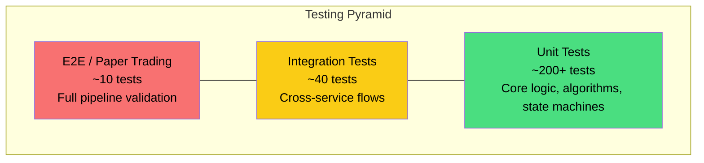
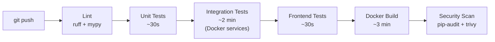
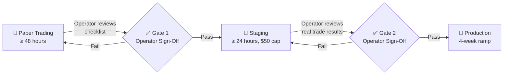

# Testing Strategy: PolyBot Platform

## Overview

PolyBot is a financial trading system where bugs directly translate to monetary loss. The testing strategy prioritizes **correctness of financial logic** above all else — risk management, order execution, P&L calculation, and wallet routing must be provably correct before any code reaches production.

### Testing Pyramid



---

## Test Categories

### Unit Tests

**Scope**: Single function, class, or module. No external dependencies (database, Redis, network). Fast (<5 seconds total).

**Framework**: `pytest` + `pytest-asyncio` (async test support)

**Coverage target**: 80% for `core/`, `risk/`, `execution/`; 60% for other services

**Mocking strategy**: `unittest.mock` + `fakeredis-py` (async Redis mock)

#### Critical Unit Test Suites

| Test Suite | File | What It Validates | Priority |
|-----------|------|------------------|----------|
| Circuit Breaker FSM | `test_circuit_breaker.py` | All state transitions (CLOSED→OPEN→HALF_OPEN→CLOSED), timing, threshold enforcement | P0 |
| Pre-Trade Risk Pipeline | `test_pre_trade_checks.py` | All 8 checks individually + combined pipeline; pass and reject scenarios for each | P0 |
| Rate Limiter | `test_rate_limiter.py` | Token bucket fill/drain, capacity limits, batch costing, priority queuing | P0 |
| Order State Machine | `test_order_state_machine.py` | All valid transitions, rejection of invalid transitions, timeout handling | P0 |
| Software Ledger | `test_software_ledger.py` | Credit/debit accuracy, virtual balance enforcement, running balance calculation | P0 |
| P&L Calculator | `test_pnl_calculator.py` | Realized P&L on fills, unrealized P&L with mark-to-market, fee accounting | P0 |
| Binary Arb Strategy | `test_binary_arb_strategy.py` | Edge detection, depth calculation, cost computation, partial fill handling | P0 |
| FOK Decimal Precision | `test_fok_precision.py` | Sell ≤2 decimals, taker ≤4 decimals, size×price ≤2 decimals | P0 |
| Wallet Router | `test_wallet_router.py` | Bot→tier→wallet mapping, mutex enforcement, API key selection | P1 |
| Config Loader | `test_config_loader.py` | YAML parsing, Pydantic validation, default values, error handling | P1 |
| Fee Cache | `test_fee_cache.py` | Cache hit/miss, TTL expiry, refresh on miss, dynamic rates | P1 |
| Normalizer | `test_normalizer.py` | Raw Polymarket payloads → Pydantic models, edge cases | P1 |
| Bot Lifecycle | `test_lifecycle.py` | State machine transitions, hook invocations, error recovery | P1 |
| Position Tracker | `test_position_tracker.py` | Open/close positions, size tracking, multi-market, per-bot isolation | P1 |

#### Unit Test Examples

```python
# tests/unit/test_circuit_breaker.py

import pytest
from src.services.risk.circuit_breaker import CircuitBreaker, CircuitBreakerState

class TestCircuitBreaker:
    """Circuit breaker: CLOSED → OPEN → HALF_OPEN → CLOSED."""

    def setup_method(self):
        self.cb = CircuitBreaker(
            threshold=3,
            cooldown_seconds=300,
            half_open_max_passes=2,
        )

    def test_initial_state_is_closed(self):
        assert self.cb.state == CircuitBreakerState.CLOSED

    def test_opens_after_threshold_losses(self):
        for _ in range(3):
            self.cb.record_loss()
        assert self.cb.state == CircuitBreakerState.OPEN

    def test_does_not_open_before_threshold(self):
        for _ in range(2):
            self.cb.record_loss()
        assert self.cb.state == CircuitBreakerState.CLOSED

    def test_win_resets_consecutive_losses(self):
        self.cb.record_loss()
        self.cb.record_loss()
        self.cb.record_win()
        assert self.cb.consecutive_losses == 0
        assert self.cb.state == CircuitBreakerState.CLOSED

    def test_transitions_to_half_open_after_cooldown(self, freezer):
        for _ in range(3):
            self.cb.record_loss()
        assert self.cb.state == CircuitBreakerState.OPEN

        freezer.move_to(timedelta(seconds=300))
        assert self.cb.state == CircuitBreakerState.HALF_OPEN

    def test_half_open_returns_to_closed_on_success(self, freezer):
        for _ in range(3):
            self.cb.record_loss()
        freezer.move_to(timedelta(seconds=300))

        self.cb.record_win()
        self.cb.record_win()
        assert self.cb.state == CircuitBreakerState.CLOSED

    def test_half_open_returns_to_open_on_failure(self, freezer):
        for _ in range(3):
            self.cb.record_loss()
        freezer.move_to(timedelta(seconds=300))

        self.cb.record_loss()
        assert self.cb.state == CircuitBreakerState.OPEN

    def test_allows_trading_when_closed(self):
        assert self.cb.can_trade() is True

    def test_blocks_trading_when_open(self):
        for _ in range(3):
            self.cb.record_loss()
        assert self.cb.can_trade() is False
```

```python
# tests/unit/test_pre_trade_checks.py

import pytest
from decimal import Decimal
from src.services.risk.pre_trade_checks import PreTradeRiskPipeline
from src.core.models import OrderRequest

class TestPreTradeRiskPipeline:
    """10-step pre-trade risk pipeline — every check must be tested."""

    async def test_rejects_when_emergency_stop_active(self, risk_pipeline, mock_redis):
        mock_redis.set("emergency_stop", "1")
        order = make_order(price=0.50, size=100)
        result = await risk_pipeline.check(order)
        assert result.passed is False
        assert result.check_name == "emergency_stop"

    async def test_rejects_when_circuit_breaker_open(self, risk_pipeline):
        risk_pipeline.circuit_breakers["arb-btc-01"].force_open()
        order = make_order(bot_id="arb-btc-01")
        result = await risk_pipeline.check(order)
        assert result.passed is False
        assert result.check_name == "circuit_breaker"

    async def test_rejects_when_daily_loss_exceeded(self, risk_pipeline):
        risk_pipeline.daily_loss["arb-btc-01"] = Decimal("100.00")
        risk_pipeline.daily_loss_cap["arb-btc-01"] = Decimal("100.00")
        order = make_order(bot_id="arb-btc-01")
        result = await risk_pipeline.check(order)
        assert result.passed is False
        assert result.check_name == "daily_pnl"

    async def test_rejects_when_position_limit_exceeded(self, risk_pipeline):
        risk_pipeline.positions["token_abc"] = Decimal("200")
        order = make_order(token_id="token_abc", size=100)
        result = await risk_pipeline.check(order)
        assert result.passed is False
        assert result.check_name == "market_position"

    async def test_rejects_insane_price(self, risk_pipeline):
        order = make_order(price=Decimal("1.50"))
        result = await risk_pipeline.check(order)
        assert result.passed is False
        assert result.check_name == "price_sanity"

    async def test_passes_all_checks(self, risk_pipeline):
        order = make_order(price=0.50, size=50)
        result = await risk_pipeline.check(order)
        assert result.passed is True

    async def test_checks_execute_in_order(self, risk_pipeline):
        """Emergency stop should be checked BEFORE circuit breaker."""
        mock_redis.set("emergency_stop", "1")
        risk_pipeline.circuit_breakers["arb-btc-01"].force_open()
        order = make_order(bot_id="arb-btc-01")
        result = await risk_pipeline.check(order)
        assert result.check_name == "emergency_stop"  # First check wins
```

```python
# tests/unit/test_binary_arb_strategy.py

import pytest
from decimal import Decimal
from src.bots.binary_arbitrage.strategy import BinaryArbStrategy

class TestBinaryArbStrategy:
    """Binary arbitrage: detect full-set parity violations."""

    def test_detects_long_arb_opportunity(self):
        """YES ask + NO ask < 1.00 → long arb."""
        strategy = BinaryArbStrategy(min_edge_bps=50)
        yes_book = make_orderbook(best_ask=0.47)
        no_book = make_orderbook(best_ask=0.50)
        signal = strategy.evaluate(yes_book, no_book)
        assert signal is not None
        assert signal.signal_type == "LONG_ARB"
        assert signal.edge_bps > 50

    def test_detects_short_arb_opportunity(self):
        """YES bid + NO bid > 1.00 → short arb."""
        strategy = BinaryArbStrategy(min_edge_bps=50)
        yes_book = make_orderbook(best_bid=0.53)
        no_book = make_orderbook(best_bid=0.50)
        signal = strategy.evaluate(yes_book, no_book)
        assert signal is not None
        assert signal.signal_type == "SHORT_ARB"

    def test_no_signal_when_edge_below_minimum(self):
        """Total cost = 0.98 → edge < min_edge_bps of 300."""
        strategy = BinaryArbStrategy(min_edge_bps=300)
        yes_book = make_orderbook(best_ask=0.49)
        no_book = make_orderbook(best_ask=0.49)
        signal = strategy.evaluate(yes_book, no_book)
        assert signal is None

    def test_accounts_for_fees_in_edge_calculation(self):
        """Edge must be net of taker fees."""
        strategy = BinaryArbStrategy(min_edge_bps=50, fee_rate_bps=100)
        yes_book = make_orderbook(best_ask=0.48)
        no_book = make_orderbook(best_ask=0.50)
        signal = strategy.evaluate(yes_book, no_book)
        # Gross edge = 200 bps, fees = 200 bps (2 × 100), net edge = 0
        assert signal is None

    def test_size_limited_by_depth(self):
        """Order size limited by minimum depth at best ask."""
        strategy = BinaryArbStrategy(min_edge_bps=50, max_size=1000)
        yes_book = make_orderbook(best_ask=0.47, depth_at_ask=200)
        no_book = make_orderbook(best_ask=0.48, depth_at_ask=500)
        signal = strategy.evaluate(yes_book, no_book)
        assert signal.target_size == 200  # Limited by YES depth

    def test_size_limited_by_virtual_balance(self):
        """Order size limited by bot's virtual USDC balance."""
        strategy = BinaryArbStrategy(min_edge_bps=50, max_size=1000)
        strategy.virtual_balance = Decimal("100")
        yes_book = make_orderbook(best_ask=0.47, depth_at_ask=500)
        no_book = make_orderbook(best_ask=0.48, depth_at_ask=500)
        signal = strategy.evaluate(yes_book, no_book)
        # Max affordable: $100 / (0.47 + 0.48) ≈ 105 shares
        assert signal.target_size <= 106
```

---

### Integration Tests

**Scope**: Cross-service flows using real database and Redis (via Docker containers). Validates end-to-end data flows within the backend.

**Framework**: `pytest` + `testcontainers-python` (ephemeral PostgreSQL + Redis)

**Run requirement**: Docker must be running

**Coverage target**: All critical paths (signal → order → fill, bot lifecycle, wallet routing)

#### Critical Integration Test Suites

| Test Suite | File | What It Validates |
|-----------|------|------------------|
| Execution Flow | `test_execution_flow.py` | Signal → risk check → wallet route → order build → submit → fill → ledger entry |
| Bot Lifecycle | `test_bot_lifecycle.py` | Create → init → start → pause → resume → stop; state persisted in DB |
| Wallet Routing | `test_wallet_routing.py` | Bot config → wallet tier → correct API key; per-wallet mutex |
| Emergency Stop | `test_emergency_stop.py` | Flag set → all orders cancelled → all bots stopped → dashboard notified |
| Circuit Breaker Integration | `test_circuit_breaker_integration.py` | Losses trigger break → bot paused → cooldown → bot resumed |
| Redis Streams | `test_redis_streams.py` | Market data published → consumer group reads → bot receives callback |
| Dashboard API | `test_dashboard_api.py` | All REST endpoints return correct data; auth enforced; SSE delivers events |
| Software Ledger | `test_ledger_integration.py` | Allocate → trade → fee → running balance correct; multi-bot in same wallet |
| Position Reconciliation | `test_reconciliation.py` | Internal positions match after simulated fill sequence |

#### Integration Test Example

```python
# tests/integration/test_execution_flow.py

import pytest
from decimal import Decimal

@pytest.mark.integration
class TestExecutionFlow:
    """End-to-end: Signal → Risk → Execute → Fill → Ledger."""

    async def test_full_order_lifecycle(self, execution_engine, risk_manager, wallet_manager, db):
        """A valid signal produces an order, gets filled, and updates the ledger."""
        # Setup: bot with virtual balance
        bot = await create_bot(db, bot_id="arb-btc-01", wallet_id="vault", balance=2000)

        # Signal
        signal = Signal(
            bot_id="arb-btc-01",
            token_id="token_abc",
            signal_type="LONG_ARB",
            target_price=Decimal("0.48"),
            target_size=Decimal("100"),
            edge_bps=65,
            urgency="normal",
        )

        # Execute
        result = await execution_engine.process_signal(signal)
        assert result.status == "SUBMITTED"

        # Simulate fill event from Polymarket
        fill = FillEvent(
            order_id=result.order_id,
            bot_id="arb-btc-01",
            wallet_id="vault",
            token_id="token_abc",
            side="BUY",
            price=Decimal("0.48"),
            size=Decimal("100"),
            fee_usdc=Decimal("0.48"),
            maker_taker="TAKER",
            filled_at=datetime.utcnow(),
        )
        await execution_engine.handle_fill(fill)

        # Verify: fill recorded in DB
        fills = await db.query(Fill).filter_by(order_id=result.order_id).all()
        assert len(fills) == 1
        assert fills[0].price == Decimal("0.48")

        # Verify: ledger entry created
        entries = await db.query(LedgerEntry).filter_by(bot_id="arb-btc-01").all()
        assert len(entries) == 1
        assert entries[0].amount_usdc == Decimal("-48.48")  # 100 * 0.48 + 0.48 fee

    async def test_risk_rejection_does_not_create_order(self, execution_engine, risk_manager):
        """A signal rejected by risk checks should not result in an order."""
        # Set daily loss to cap
        risk_manager.daily_loss["arb-btc-01"] = Decimal("100")
        risk_manager.daily_loss_cap["arb-btc-01"] = Decimal("100")

        signal = Signal(
            bot_id="arb-btc-01",
            token_id="token_abc",
            signal_type="LONG_ARB",
            target_price=Decimal("0.48"),
            target_size=Decimal("100"),
            edge_bps=65,
            urgency="normal",
        )

        result = await execution_engine.process_signal(signal)
        assert result.status == "REJECTED"
        assert "daily_pnl" in result.rejection_reason
```

---

### End-to-End Tests

**Scope**: Full system pipeline using Docker Compose. Validates that the complete system functions as a user would experience it.

**Framework**: `pytest` + Docker Compose

**Run requirement**: Full Docker Compose stack running

#### E2E Test Suites

| Test Suite | File | What It Validates |
|-----------|------|------------------|
| Paper Trading Pipeline | `test_paper_trading.py` | Bot starts → receives market data → generates signal → order simulated → P&L updated |
| Emergency Stop E2E | `test_emergency_stop_e2e.py` | Dashboard button → all orders cancelled → all bots stopped → <5s total |
| Dashboard Rendering | `test_dashboard_e2e.py` | All 6 pages load; data displayed correctly; SSE updates arrive |
| Config Change E2E | `test_config_change_e2e.py` | Change risk param via API → risk manager picks up → audited |
| Recovery E2E | `test_recovery_e2e.py` | Kill service → auto-restart → state recovered → trading resumes |

---

### Paper Trading Tests

Paper trading is **the most important E2E validation** for a trading system. It runs the full pipeline with real market data but simulated order execution.

#### Paper Trading Mode Design

```python
# Paper trading flag in bot config
# config/bots/binary-arb-default.yaml
execution:
    paper_trading: true          # No real orders; simulate fills at market price
    paper_fill_probability: 0.85 # Simulate 85% fill rate (realistic for FOK)
    paper_fill_delay_ms: 200     # Simulate network + matching delay
```

#### Paper Trading Validation Checklist

| Check | Validation | Pass Criteria |
|-------|-----------|---------------|
| Signal generation | Bot produces LONG_ARB/SHORT_ARB signals | >10 signals per hour with realistic market data |
| Edge accuracy | Detected edges match manual calculation | Edge within ±5 bps of manual calculation on 10 samples |
| Risk pipeline | All 8 checks execute on every signal | Every signal log entry shows 8 check results |
| Order construction | Orders have valid precision, fees included | No "invalid order" errors in paper mode |
| P&L calculation | Realized P&L matches manual calculation | <$0.01 deviation on 50+ simulated trades |
| Circuit breaker | Triggers after N losses, resets after cooldown | Observed state transitions match FSM spec |
| Position tracking | Positions open/close correctly | Position count matches expected after N fills |
| Wallet routing | Orders routed to correct wallet | Wallet ID in order matches bot→tier config |
| Dashboard data | Dashboard shows real-time data | SSE events arrive within 1 second |
| Metrics | Prometheus metrics update correctly | Metric values match expected after known operations |

---

### Frontend Tests

**Framework**: `Vitest` + `React Testing Library`

**Coverage target**: Component rendering, API integration hooks, critical user flows

| Test Suite | What It Validates |
|-----------|------------------|
| Component rendering | All shadcn/ui components render without crashes |
| API client | `lib/api.ts` calls correct endpoints with auth headers |
| SSE hook | `useSSE.ts` connects, receives events, reconnects on error |
| Bot controls | Start/stop/pause/resume buttons trigger correct API calls |
| Emergency stop | Emergency stop button requires confirmation, calls API, shows banner |
| Settings form | Validation matches API constraints; prevents invalid submissions |

```typescript
// frontend/src/hooks/__tests__/useSSE.test.ts
import { renderHook, act } from '@testing-library/react-hooks';
import { useSSE } from '../useSSE';

describe('useSSE', () => {
    it('connects to SSE endpoint on mount', () => {
        const handlers = { portfolio_update: vi.fn() };
        renderHook(() => useSSE(handlers));
        expect(EventSource).toHaveBeenCalledWith(
            expect.stringContaining('/api/stream/events')
        );
    });

    it('calls handler when event received', () => {
        const handler = vi.fn();
        renderHook(() => useSSE({ fill: handler }));
        // Simulate SSE event
        fireSSEEvent('fill', { bot_id: 'arb-btc-01', price: 0.52 });
        expect(handler).toHaveBeenCalledWith({ bot_id: 'arb-btc-01', price: 0.52 });
    });

    it('reconnects after error', async () => {
        renderHook(() => useSSE({}));
        act(() => simulateSSEError());
        await vi.advanceTimersByTimeAsync(3000);
        expect(EventSource).toHaveBeenCalledTimes(2);
    });
});
```

---

## Test Infrastructure

### Test Fixtures

```python
# tests/conftest.py — Shared fixtures

import pytest
import asyncio
from testcontainers.postgres import PostgresContainer
from fakeredis.aioredis import FakeRedis

@pytest.fixture(scope="session")
def event_loop():
    """Single event loop for all async tests."""
    loop = asyncio.get_event_loop_policy().new_event_loop()
    yield loop
    loop.close()

@pytest.fixture(scope="session")
async def test_db():
    """Ephemeral PostgreSQL + TimescaleDB for integration tests."""
    with PostgresContainer("timescale/timescaledb:latest-pg16") as postgres:
        engine = create_async_engine(postgres.get_connection_url())
        async with engine.begin() as conn:
            await conn.run_sync(Base.metadata.create_all)
            # Create hypertables
            await conn.execute(text("SELECT create_hypertable('fill', 'filled_at')"))
            await conn.execute(text("SELECT create_hypertable('signal', 'created_at')"))
        yield engine
        await engine.dispose()

@pytest.fixture
async def redis_mock():
    """In-memory async Redis mock for unit tests."""
    redis = FakeRedis()
    yield redis
    await redis.flushall()

@pytest.fixture
def sample_orderbook():
    """Realistic binary market order book."""
    return OrderBookSnapshot(
        token_id="yes_token_123",
        bids=[(0.52, 500), (0.51, 1000), (0.50, 2000)],
        asks=[(0.53, 500), (0.54, 1000), (0.55, 2000)],
        timestamp=datetime.utcnow(),
    )

@pytest.fixture
def arb_market_pair():
    """YES/NO order book pair with a detectable long arb opportunity."""
    yes_book = OrderBookSnapshot(
        token_id="yes_token",
        bids=[(0.46, 500)],
        asks=[(0.47, 500), (0.48, 1000)],
        timestamp=datetime.utcnow(),
    )
    no_book = OrderBookSnapshot(
        token_id="no_token",
        bids=[(0.50, 500)],
        asks=[(0.50, 800), (0.51, 1000)],
        timestamp=datetime.utcnow(),
    )
    return yes_book, no_book  # 0.47 + 0.50 = 0.97 → 300 bps gross edge

@pytest.fixture
def bot_context(redis_mock, test_db):
    """Fully wired BotContext for integration tests."""
    return BotContext(
        market_data=MockMarketDataClient(redis_mock),
        execution=MockExecutionClient(redis_mock),
        risk=MockRiskClient(),
        config=default_bot_config(),
    )
```

### Test Data Fixtures

```json
// tests/fixtures/orderbook_snapshots.json
{
    "binary_market_balanced": {
        "yes_token": {
            "bids": [[0.52, 500], [0.51, 1000], [0.50, 2000]],
            "asks": [[0.53, 500], [0.54, 1000], [0.55, 2000]]
        },
        "no_token": {
            "bids": [[0.47, 500], [0.46, 1000], [0.45, 2000]],
            "asks": [[0.48, 500], [0.49, 1000], [0.50, 2000]]
        }
    },
    "long_arb_opportunity": {
        "yes_token": {
            "bids": [[0.46, 300]],
            "asks": [[0.47, 500], [0.48, 1000]]
        },
        "no_token": {
            "bids": [[0.50, 300]],
            "asks": [[0.50, 800], [0.51, 1000]]
        }
    },
    "short_arb_opportunity": {
        "yes_token": {
            "bids": [[0.53, 500], [0.52, 1000]],
            "asks": [[0.55, 500]]
        },
        "no_token": {
            "bids": [[0.50, 500], [0.49, 1000]],
            "asks": [[0.52, 500]]
        }
    },
    "thin_liquidity": {
        "yes_token": {
            "bids": [[0.40, 10]],
            "asks": [[0.60, 10]]
        },
        "no_token": {
            "bids": [[0.30, 10]],
            "asks": [[0.70, 10]]
        }
    }
}
```

---

## Test Execution

### Running Tests

```bash
# All tests
make test                        # pytest tests/ -v

# Unit tests only (no Docker required)
make test-unit                   # pytest tests/unit/ -v

# Integration tests (requires Docker)
make test-int                    # pytest tests/integration/ -v

# Single test file
pytest tests/unit/test_circuit_breaker.py -v --tb=long

# Single test
pytest tests/unit/test_circuit_breaker.py::TestCircuitBreaker::test_opens_after_threshold_losses -v

# With coverage report
make test-cov                    # pytest tests/ --cov=src --cov-report=html --cov-report=term-missing

# Frontend tests
cd frontend && npm run test      # vitest run
cd frontend && npm run test:watch  # vitest watch mode
```

### CI Pipeline Integration



| Stage | Tests Run | Max Duration | Failure Blocks |
|-------|-----------|-------------|----------------|
| Lint | ruff, mypy | 30s | All subsequent stages |
| Unit Tests | `tests/unit/` | 60s | Integration, build |
| Integration Tests | `tests/integration/` | 3 min | Build |
| Frontend Tests | Vitest | 30s | Build |
| Docker Build | All images | 5 min | Deploy |
| Security Scan | pip-audit, npm audit, trivy | 2 min | Deploy (critical only) |

---

## Coverage Requirements

### Coverage Targets

| Module | Minimum Coverage | Rationale |
|--------|-----------------|-----------|
| `src/core/` | 80% | Contract models and interfaces — must be correct |
| `src/services/risk/` | 80% | Financial safety — bugs = money loss |
| `src/services/execution/` | 80% | Order handling — precision and correctness critical |
| `src/services/wallet/` | 70% | Financial accounting — ledger must be accurate |
| `src/bots/binary_arbitrage/` | 75% | Strategy logic — edge detection must be reliable |
| `src/services/orchestrator/` | 60% | Lifecycle management — important but less critical |
| `src/services/market_data/` | 60% | Data ingestion — validated by integration tests |
| `src/services/dashboard/` | 50% | API layer — covered by integration tests |
| `src/shared/` | 60% | Utilities — Redis, DB, logging |

### Uncoverable / Excluded from Coverage

- Third-party library wrappers (py-clob-client calls)
- Docker entrypoints (`if __name__ == "__main__"`)
- Debug/development-only code paths
- Polymarket WebSocket connection handlers (tested via integration tests with mocks)

---

## Quality Gates

### Pre-Commit Checks (Local)

```yaml
# .pre-commit-config.yaml
repos:
  - repo: https://github.com/astral-sh/ruff-pre-commit
    hooks:
      - id: ruff
        args: [--fix]
      - id: ruff-format

  - repo: local
    hooks:
      - id: mypy
        name: mypy
        entry: mypy src/
        language: system
        pass_filenames: false

      - id: unit-tests
        name: unit tests
        entry: pytest tests/unit/ -x -q
        language: system
        pass_filenames: false
```

### PR Merge Requirements

| Gate | Required | Enforcement |
|------|----------|-------------|
| Lint clean (ruff) | Yes | CI check |
| Type check clean (mypy) | Yes | CI check |
| Unit tests pass | Yes | CI check |
| Integration tests pass | Yes | CI check |
| Coverage ≥ thresholds | Yes (new code) | CI coverage report |
| No critical security vulns | Yes | pip-audit, trivy |
| Frontend lint + tests | Yes | CI check |

---

## Specialized Testing

### Financial Precision Tests

Financial calculations must use `Decimal` (not `float`). Precision tests ensure no floating-point errors:

```python
class TestFinancialPrecision:
    """Ensure no floating-point errors in financial calculations."""

    def test_pnl_calculation_uses_decimal(self):
        """P&L must be exact — no floating-point drift."""
        buy_price = Decimal("0.48")
        sell_price = Decimal("0.52")
        size = Decimal("100")
        fee = Decimal("0.52")

        pnl = (sell_price - buy_price) * size - fee - fee
        assert pnl == Decimal("2.96")  # Exact, not 2.9599999...

    def test_fok_precision_validation(self):
        """FOK orders must meet Polymarket's decimal precision rules."""
        # Valid: sell size 100.12 (≤2 decimals)
        assert validate_fok_precision("SELL", 100.12, 0.50) is True

        # Invalid: sell size 100.123 (>2 decimals)
        with pytest.raises(PrecisionError):
            validate_fok_precision("SELL", 100.123, 0.50)

        # Valid: size × price = 50.06 (≤2 decimals)
        assert validate_fok_precision("BUY", 100.12, 0.50) is True

        # Invalid: size × price = 50.0588 (>2 decimals)
        with pytest.raises(PrecisionError):
            validate_fok_precision("BUY", 100.12, 0.4952)
```

### Concurrency Tests

Multiple bots sharing a wallet can race on order submission. Concurrency tests validate mutex enforcement:

```python
class TestWalletConcurrency:
    """Ensure per-wallet mutex prevents race conditions."""

    async def test_concurrent_orders_serialized(self, wallet_manager):
        """Two bots in the same wallet cannot submit orders simultaneously."""
        results = await asyncio.gather(
            wallet_manager.submit_order(bot_id="bot-1", wallet_id="vault", order=order_1),
            wallet_manager.submit_order(bot_id="bot-2", wallet_id="vault", order=order_2),
        )
        # Both should succeed, but execution should be serialized
        assert all(r.status == "SUBMITTED" for r in results)
        # Verify timing: second order started after first completed
        assert results[1].submitted_at >= results[0].submitted_at + timedelta(milliseconds=10)

    async def test_different_wallets_can_execute_concurrently(self, wallet_manager):
        """Orders to different wallets should not block each other."""
        start = time.monotonic()
        await asyncio.gather(
            wallet_manager.submit_order(bot_id="bot-1", wallet_id="vault", order=order_1),
            wallet_manager.submit_order(bot_id="bot-2", wallet_id="alpha", order=order_2),
        )
        elapsed = time.monotonic() - start
        # Should be roughly parallel, not serial
        assert elapsed < 0.5  # Not 2× serial time
```

### Resilience Tests

Test system behavior under failure conditions:

```python
class TestResilience:
    """System behavior under failure conditions."""

    async def test_redis_disconnection_recovery(self, system):
        """Services reconnect and resume after Redis restart."""
        # Start trading
        await system.start_bot("arb-btc-01")
        await asyncio.sleep(2)

        # Kill Redis
        await system.stop_service("redis")
        await asyncio.sleep(5)

        # Restart Redis
        await system.start_service("redis")
        await asyncio.sleep(10)

        # Verify recovery
        health = await system.get_health("market_data")
        assert health["status"] in ("healthy", "degraded")

    async def test_bot_crash_auto_restart(self, orchestrator):
        """Orchestrator auto-restarts crashed bots up to 3 times."""
        bot = await orchestrator.start_bot("crash-test-bot")

        # Simulate crash
        await bot.simulate_crash()
        await asyncio.sleep(35)  # 30s backoff + 5s buffer

        # Should have restarted
        state = await orchestrator.get_bot_state("crash-test-bot")
        assert state in ("RUNNING", "INITIALIZING")

    async def test_emergency_stop_under_load(self, system):
        """Emergency stop completes within 5 seconds under full load."""
        # Start all bots with open orders
        for bot_id in ["arb-btc-01", "mm-politics-01", "arb-eth-02"]:
            await system.start_bot(bot_id)
        await asyncio.sleep(5)  # Let them accumulate orders

        # Emergency stop
        start = time.monotonic()
        result = await system.emergency_stop()
        elapsed = time.monotonic() - start

        assert elapsed < 5.0
        assert result["orders_cancelled"] > 0
        assert all(
            await system.get_bot_state(b) == "STOPPED"
            for b in ["arb-btc-01", "mm-politics-01", "arb-eth-02"]
        )
```

### Drawdown & Per-Trade Loss Protection Tests

These tests validate the two additional pre-trade risk checks (steps 9-10):

```python
class TestDrawdownProtection:
    """Verify drawdown limits pause bots before catastrophic losses."""

    async def test_drawdown_triggers_bot_pause(self, risk_manager, bot_context):
        """Bot pauses when equity drops below max_drawdown_pct from peak."""
        config = BotConfig(max_drawdown_pct=15.0, virtual_balance_usdc=Decimal("1000"))

        # Simulate: peak equity = $1000, current equity = $840 (16% drawdown)
        risk_manager.update_peak_equity("arb-01", Decimal("1000"))
        risk_manager.update_current_equity("arb-01", Decimal("840"))

        order = make_test_order(bot_id="arb-01", size=10, price=Decimal("0.50"))
        result = await risk_manager.pre_trade_check(order, config)

        assert result.passed is False
        assert result.rejected_by == "drawdown_check"
        assert result.action == "PAUSE_BOT"
        # Verify bot was actually paused
        assert bot_context.get_state("arb-01") == "PAUSED"

    async def test_drawdown_passes_within_threshold(self, risk_manager):
        """Orders pass when drawdown is within acceptable range."""
        config = BotConfig(max_drawdown_pct=15.0, virtual_balance_usdc=Decimal("1000"))

        # 10% drawdown — below 15% threshold
        risk_manager.update_peak_equity("arb-01", Decimal("1000"))
        risk_manager.update_current_equity("arb-01", Decimal("900"))

        order = make_test_order(bot_id="arb-01", size=10, price=Decimal("0.50"))
        result = await risk_manager.pre_trade_check(order, config)

        assert result.checks["drawdown_check"].passed is True

    async def test_drawdown_requires_manual_resume(self, risk_manager, orchestrator):
        """Bot paused by drawdown cannot auto-resume — requires operator."""
        # Trigger drawdown pause
        risk_manager.update_peak_equity("arb-01", Decimal("1000"))
        risk_manager.update_current_equity("arb-01", Decimal("800"))

        order = make_test_order(bot_id="arb-01")
        await risk_manager.pre_trade_check(order, BotConfig(max_drawdown_pct=15.0))

        # Verify auto-restart is blocked
        assert orchestrator.can_auto_restart("arb-01") is False


class TestPerTradeLossLimit:
    """Verify per-trade max loss prevents oversized trades."""

    async def test_rejects_trade_exceeding_max_loss(self, risk_manager):
        """Trade rejected when worst-case loss exceeds per-trade limit."""
        config = BotConfig(max_loss_per_trade_usdc=Decimal("50"))

        # Trade: 200 shares at $0.50 → max loss = $100 (if price goes to $0)
        order = make_test_order(size=200, price=Decimal("0.50"))
        result = await risk_manager.pre_trade_check(order, config)

        assert result.passed is False
        assert result.rejected_by == "per_trade_loss_check"

    async def test_allows_trade_within_max_loss(self, risk_manager):
        """Trade passes when worst-case loss is within limit."""
        config = BotConfig(max_loss_per_trade_usdc=Decimal("50"))

        # Trade: 80 shares at $0.50 → max loss = $40 (within $50 limit)
        order = make_test_order(size=80, price=Decimal("0.50"))
        result = await risk_manager.pre_trade_check(order, config)

        assert result.checks["per_trade_loss_check"].passed is True
```

---

## Test Environments

| Environment | Purpose | Data Source | Order Execution |
|-------------|---------|-------------|-----------------|
| **Unit** | Logic correctness | Fixtures, mocks | None |
| **Integration** | Cross-service flows | Ephemeral DB + Redis, fixtures | Mock execution client |
| **Paper Trading** | Full pipeline validation | Real Polymarket market data (live WebSocket) | Simulated (no real orders) |
| **Staging** | Pre-production validation | Real market data | Paper mode + small real orders ($1-5) |
| **Production** | Live trading | Real market data | Real orders |

### Paper Trading → Production Graduation (MANDATORY)

Every new bot **MUST** follow this graduation path. The Orchestrator enforces the `graduated` flag — a bot with `paper_trading: false` and `graduated: false` will **refuse to start** (see [Tech Spec → Simulation-First Policy](./04-technical-specification.md#simulation-first-policy)).



**Stage 1: Paper Trading (≥ 48 hours) — `paper_trading: true`, `graduated: false`**

| # | Validation Criterion | How to Verify | Required |
|---|---------------------|---------------|:--------:|
| 1 | Bot generates signals at expected rate | Dashboard metrics: signals/hour within 2σ of expected range | ✅ |
| 2 | P&L tracking matches manual calculation | Export paper trades, recalculate in spreadsheet, compare | ✅ |
| 3 | All 10 risk checks trigger correctly | Enable `debug_mode: true`, review risk_check_trace logs | ✅ |
| 4 | Drawdown limit fires at correct threshold | Simulate drawdown scenario, verify bot pauses | ✅ |
| 5 | No unhandled exceptions in logs | `grep "level\":\"error" logs/{bot_id}*.jsonl` returns 0 results | ✅ |
| 6 | Memory and CPU stable (no leaks) | Grafana: `polybot_bot_memory_bytes` flat over 48h | ✅ |
| 7 | Signal-to-noise ratio acceptable | ≥ 20% of signals pass all risk checks | ✅ |

**🔒 Gate 1 — Operator Sign-Off**:
1. Operator reviews the paper trading report (dashboard export or logs)
2. All 7 criteria above must pass
3. Operator sets `graduated: true` in `config/bots/{bot_id}.yaml`
4. Operator sets `paper_trading: false` to enable staging
5. **This is a manual action** — no automated graduation

**Stage 2: Staging (≥ 24 hours, $50 capital cap) — `paper_trading: false`, `graduated: true`**

| # | Validation Criterion | How to Verify | Required |
|---|---------------------|---------------|:--------:|
| 1 | Real orders execute successfully on CLOB | Dashboard: order status = FILLED (not just SUBMITTED) | ✅ |
| 2 | Fills arrive and are processed correctly | Compare CLOB API fill events with local fill table | ✅ |
| 3 | Ledger entries match actual fills | Software ledger Σ fills = wallet balance Δ (within rounding) | ✅ |
| 4 | Wallet balance changes as expected | `polybot_wallet_balance_usdc` matches Polygonscan | ✅ |
| 5 | Rate limiter prevents API overuse | No 429 errors in execution engine logs | ✅ |
| 6 | Fee calculations are correct | Actual fees paid ≤ estimated fees × 1.05 | ✅ |

**🔒 Gate 2 — Operator Sign-Off**:
1. Operator reviews staging results (real money, small capital)
2. All 6 criteria above must pass
3. Operator increases capital allocation in bot config
4. **This is a manual action** — no automated capital increase

**Stage 3: Production Ramp — graduated, live, increasing capital**

| Week | Capital Allocation | Monitoring Focus |
|:----:|:-----------------:|-----------------|
| 1 | 10% of target | Execution quality, slippage vs. paper mode |
| 2 | 25% of target | P&L trajectory, drawdown behavior |
| 3 | 50% of target | Market impact, fill rates at larger sizes |
| 4 | 100% of target | Steady-state performance, all metrics nominal |

Each capital increase requires the operator to update the bot's YAML config. The Orchestrator hot-reloads config changes without bot restart (config file watch, 30s poll).

---

## Cross-References

| Topic | Document |
|-------|----------|
| Architecture and service details | [04-technical-specification.md](./04-technical-specification.md) |
| Code standards, CI/CD pipeline | [05-development-guidelines.md](./05-development-guidelines.md) |
| Security testing requirements | [08-security-spec.md](./08-security-spec.md) — SDL section |
| API endpoints to test | [10-api-specification.md](./10-api-specification.md) |
| Infrastructure for test environments | [09-infrastructure-spec.md](./09-infrastructure-spec.md) |
| User stories as acceptance criteria source | [03-prd.md](./03-prd.md) |
