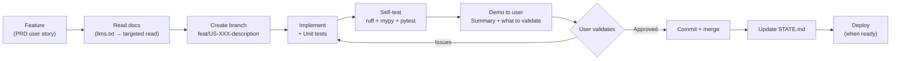
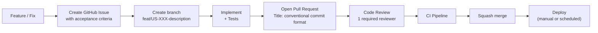
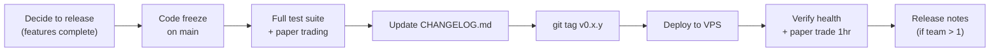
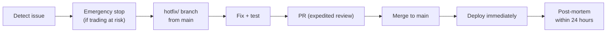
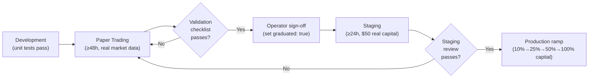

# Project Governance: PolyBot Platform

## Overview

PolyBot is a solo developer → small team (2-5) project. Governance is intentionally lightweight: enough structure to prevent mistakes (especially in a financial system), but not so much process that it slows down a single operator.

As the team grows, specific sections in this document scale up. Sections marked **(Team 2+)** activate when a second contributor joins.

---

## Decision-Making Framework

### Decision Authority

| Decision Type | Authority | Documentation | Example |
|--------------|-----------|---------------|---------|
| **Architecture** (ADR-level) | Operator / Lead Dev | ADR in tech spec | "Switch from REST to gRPC for execution" |
| **Strategy config** (risk params) | Operator | Audit log (automatic) | "Change min_edge_bps from 50 to 60" |
| **New bot strategy** | Operator | Decision log in roadmap | "Add market making bot in Phase 2" |
| **Dependency addition** | Developer | PR description | "Add pendulum for timezone handling" |
| **Infrastructure change** | Operator / DevOps | ADR if significant; commit message otherwise | "Upgrade VPS from 16GB to 32GB" |
| **Emergency action** | Anyone with access | Post-mortem within 24 hours | "Emergency stop due to oracle manipulation" |

### Architecture Decision Records (ADRs)

ADRs live in `docs/04-technical-specification.md`. New ADRs are added when:

- A technology is added, replaced, or removed
- Inter-service communication patterns change
- Data model fundamentally changes
- A security-critical design decision is made

**ADR Template**:
```markdown
#### ADR-NNN: [Decision Title]
- **Status**: Proposed | Accepted | Deprecated | Superseded by ADR-XXX
- **Context**: [Why this decision is needed]
- **Decision**: [What was decided]
- **Alternatives Considered**: [Other options evaluated]
- **Consequences**: [Tradeoffs accepted]
```

### Decision Log

Lightweight decisions that don't warrant a full ADR are logged in `docs/02-product-roadmap.md` → Decision Log table:

| Date | Decision | Rationale | Alternatives Considered |
|------|----------|-----------|------------------------|
| YYYY-MM-DD | Short description | Why | What else was considered |

---

## Contribution Workflow

### Solo Developer Workflow (Phase 1) — Agent-Assisted, Human-in-the-Loop



#### Agent Feature Delivery Protocol

Every feature follows this iterative cycle. **Agents MUST NOT skip user validation.**

| Step | Action | Who |
|------|--------|-----|
| 1 | Pick next user story from `docs/03-prd.md`. Read acceptance criteria. | Agent |
| 2 | Read relevant docs via `docs/llms.txt` → targeted section read | Agent |
| 3 | Create branch, implement code + unit tests | Agent |
| 4 | Run `make test-unit`, ruff, mypy. Fix issues. | Agent |
| 5 | **Demo to user**: summarize what was built, what tests pass, list specific things for user to validate | Agent |
| 6 | **Validate**: Run the feature, check behavior, confirm acceptance criteria | User |
| 7 | If issues found → agent fixes → back to step 5 | Both |
| 8 | If approved → agent commits, moves to next feature | Agent |
| 9 | Update `STATE.md`: mark feature complete with commit hash, advance "In Progress" to next feature, update "Up Next" | Agent |

**Demo format** (agents must follow this template):

```
FEATURE: [user story ID] — [short description]
IMPLEMENTED: [what was built, 1-3 sentences]
TESTS PASSING: [list of test files/suites that pass]
PLEASE VALIDATE:
  - [ ] [specific action for user to check, e.g., "run make dev, open http://localhost:8000/api/health"]
  - [ ] [second check]
  - [ ] [third check]
ASSUMPTIONS: [any deviations from spec, or "None"]
```

**Self-review checklist** (before demo to user):
- [ ] Code compiles (mypy clean)
- [ ] Tests pass (unit + integration)
- [ ] No sensitive data in code or logs
- [ ] If touching risk/execution: verified with paper trading
- [ ] If touching API: Pydantic models match frontend types
- [ ] Commit message follows conventional format
- [ ] Acceptance criteria from PRD addressed
- [ ] STATE.md updated (completed list, in-progress, next steps)

### Team Workflow (2+ Developers)



### Pull Request Template

```markdown
## What

[1-2 sentence summary of what changed]

## Why

[Business/technical reason for the change]

## How

[Brief description of implementation approach]

## Testing

- [ ] Unit tests added/updated
- [ ] Integration tests added/updated (if cross-service)
- [ ] Paper trading validated (if execution/risk change)
- [ ] Manual testing completed

## Risk Assessment

- [ ] No changes to risk management logic
- [ ] Risk changes reviewed and paper-trade validated
- [ ] No new external dependencies
- [ ] No changes to private key handling

## Checklist

- [ ] Code follows project conventions (ruff + mypy clean)
- [ ] Tests pass locally
- [ ] PR title follows conventional commit format
- [ ] Documentation updated (if applicable)
- [ ] No secrets in code
```

### Code Review Guidelines **(Team 2+)**

**Who reviews what**:

| Area | Required Reviewer | Additional Reviewer |
|------|------------------|---------------------|
| `src/services/risk/` | Lead Dev (mandatory) | — |
| `src/services/execution/` | Lead Dev (mandatory) | — |
| `src/services/wallet/` | Lead Dev (mandatory) | — |
| `src/core/bot_interface.py` | Lead Dev (mandatory) | Bot developers (for impact) |
| `src/bots/` | Any team member | — |
| `src/services/dashboard/` | Any team member | — |
| `frontend/` | Any team member | — |
| `docker-compose*.yml` | Lead Dev | — |
| `.env.example` | Lead Dev | Security check |

**Review standards**:
1. **Correctness**: Does it work? Are edge cases handled?
2. **Safety**: For risk/execution changes — can this lose money?
3. **Consistency**: Does it follow established patterns?
4. **Tests**: Are the right things tested? Are critical paths covered?
5. **Performance**: Will this handle expected load?

**Review timeline**: 24-hour SLA for standard PRs; 4-hour SLA for hotfixes.

---

## Release Management

### Versioning

Semantic Versioning (`MAJOR.MINOR.PATCH`):

| Component | Increment When |
|-----------|---------------|
| MAJOR | Breaking changes to BaseBot interface, config schema, or API |
| MINOR | New features, new bot strategies, new API endpoints |
| PATCH | Bug fixes, performance improvements, dependency updates |

**Pre-1.0**: All releases are `0.x.y`. Breaking changes are permitted between minor versions.

### Release Process



**Phase 1 (solo dev)**: No formal release process. Deploy from `main` when ready. Tag significant milestones.

**Phase 2+ (team)**: Weekly release cadence. Friday code freeze, Monday deploy.

### Changelog Format

```markdown
# Changelog

All notable changes to this project will be documented in this file.

## [0.2.0] - 2026-03-15

### Added
- Market making bot (Phase 2 strategy)
- Automated profit sweep to Sweep wallet
- Loki log aggregation

### Changed
- Increased WebSocket reconnection max retries from 10 to 20
- Improved circuit breaker to track per-market losses

### Fixed
- Fixed FOK precision validation for edge case: size × price = exactly 2 decimals
- Fixed dashboard SSE reconnection dropping events during reconnect

### Security
- Updated py-clob-client to 0.35.0 (security advisory fix)

## [0.1.0] - 2026-02-28

### Added
- Initial release: Binary Arbitrage MVP
- Core infrastructure: market data, orchestrator, execution, risk, wallet, dashboard
- 3-wallet risk-tier architecture (Vault/Alpha/Sweep)
- React dashboard with 6 views
- Prometheus + Grafana monitoring
```

---

## Branching Strategy

### GitHub Flow (Trunk-Based)

```
main ──────●──────────●──────────●──────────●──── (always deployable)
           │          │          │          │
           ├── feat/  ├── fix/   ├── feat/  ├── hotfix/
           │   (PR)   │   (PR)   │   (PR)   │   (PR)
           └──────────┘──────────┘──────────┘
```

**Rules**:
- `main` is always deployable
- All work happens on feature branches
- Squash merge to `main` (clean history)
- Delete branches after merge
- No long-lived branches (no `develop`, `staging`, `release/*`)

### Branch Naming

```
{type}/{ticket-id}-{short-description}

Examples:
  feat/US-101-bot-interface
  fix/arb-partial-fill-race-condition
  refactor/execution-engine-async
  infra/grafana-trading-dashboard
  test/circuit-breaker-edge-cases
  docs/api-specification-update
```

### Hotfix Process

For critical production issues (SEV-1 or SEV-2):



---

## Issue Tracking

### Issue Labels

| Label | Color | Usage |
|-------|-------|-------|
| `priority:p0` | Red | Must fix now (blocks trading) |
| `priority:p1` | Orange | Important (this sprint) |
| `priority:p2` | Yellow | Nice to have |
| `type:bug` | Red | Something is broken |
| `type:feature` | Blue | New capability |
| `type:refactor` | Purple | Code improvement, no behavior change |
| `type:security` | Dark red | Security concern |
| `type:infra` | Gray | Infrastructure/DevOps |
| `area:risk` | 🔴 | Risk management code |
| `area:execution` | 🟠 | Execution engine code |
| `area:wallet` | 🟡 | Wallet management code |
| `area:dashboard` | 🟢 | Dashboard (API + frontend) |
| `area:market-data` | 🔵 | Market data service |
| `area:bot` | 🟣 | Bot strategy code |

### Issue Template

```markdown
## Bug Report

**Service**: [market_data / orchestrator / execution / risk / wallet / dashboard]
**Severity**: [SEV-1 / SEV-2 / SEV-3 / SEV-4]

### Description
[What happened?]

### Expected Behavior
[What should have happened?]

### Steps to Reproduce
1. ...
2. ...

### Relevant Logs
```
[Paste JSON log lines]
```

### Financial Impact
[Was money lost? How much? Were positions affected?]
```

---

## Operational Governance

### Configuration Changes

All configuration changes to risk parameters, bot configs, and global settings are:

1. **Validated** by Pydantic schema before application
2. **Logged** in the `audit_log` table with old/new values
3. **Alertable** — Telegram notification for critical parameter changes

**Forbidden without paper trading validation**:
- Disabling any pre-trade risk check
- Setting `max_daily_loss` to > 10% of portfolio
- Enabling a new bot type for the first time
- Changing wallet→tier assignments

### Bot Deployment Governance

Moving a bot from paper trading to live production requires explicit operator approval at each stage. **Agents MUST NOT change a bot's `graduated` flag or `paper_trading` setting without operator instruction.**



**Stage gates** (each requires operator approval):

| Gate | From → To | Who Approves | Criteria |
|------|-----------|-------------|----------|
| G1 | Dev → Paper | Agent (automatic) | Unit + integration tests pass |
| G2 | Paper → Staging | **Operator only** | Full paper trading validation checklist (see `docs/11-testing-strategy.md`) passes. Set `graduated: true` in bot config. |
| G3 | Staging → Production | **Operator only** | Real orders execute correctly for ≥24h. P&L matches expectations. No unhandled exceptions. |

**Safety enforcement**:
- `require_paper_graduation: true` in `config/risk.yaml` — Orchestrator refuses to start a bot with `paper_trading: false` and `graduated: false`
- `system_paper_mode: true` in `config/risk.yaml` — Forces ALL bots into paper mode (use during development/debugging)

### Incident Post-Mortems

Required for:
- SEV-1 (any incident)
- SEV-2 (any incident)
- SEV-3 (if financial impact > $0)
- Any incident the operator deems educational

**Post-Mortem Template**:
```markdown
# Post-Mortem: [Incident Title]

**Date**: YYYY-MM-DD
**Severity**: SEV-X
**Duration**: Xh Ym
**Financial Impact**: $X.XX

## Summary
[2-3 sentences: what happened, what was the impact]

## Timeline
| Time (UTC) | Event |
|-----------|-------|
| HH:MM | First indicator |
| HH:MM | Detection |
| HH:MM | Response started |
| HH:MM | Mitigation applied |
| HH:MM | Resolution confirmed |

## Root Cause
[Technical root cause analysis]

## What Went Well
- [What worked in the response]

## What Went Wrong
- [What failed or was slow]

## Action Items
| Action | Owner | Deadline | Status |
|--------|-------|----------|--------|
| [Preventive action] | [Name] | [Date] | Open |

## Lessons Learned
[Key takeaways for future prevention]
```

---

## Documentation Governance

### Documentation Ownership

| Document | Owner | Update Trigger |
|----------|-------|---------------|
| `docs/01-product-research.md` | Operator | Major market change, new competitor |
| `docs/02-product-roadmap.md` | Operator | Phase completion, reprioritization |
| `docs/03-prd.md` | Operator | New epic, requirement change |
| `docs/04-technical-specification.md` | Lead Dev | ADR addition, architecture change |
| `docs/05-development-guidelines.md` | Lead Dev | Tooling change, workflow change |
| `docs/06-claude-md.md` | Lead Dev | Build command change, new gotcha discovered |
| `docs/07-agents-md.md` | Lead Dev | New agent role, new slash command |
| `docs/08-security-spec.md` | Lead Dev | Security incident, threat model update |
| `docs/09-infrastructure-spec.md` | DevOps/Lead Dev | Infra change, scaling event |
| `docs/10-api-specification.md` | Lead Dev | API endpoint added/changed |
| `docs/11-testing-strategy.md` | Lead Dev | New test category, coverage change |
| `docs/12-project-governance.md` | Operator | Process change, team scaling |
| `CLAUDE.md` | Lead Dev | Build command change, new gotcha |
| `AGENTS.md` | Lead Dev | Agent role change |
| `CHANGELOG.md` | Whoever releases | Every release |
| `STATE.md` | Agent (auto-maintained) | Every commit |

### Documentation Quality Rules

1. **Keep it current**: Outdated docs are worse than no docs. Update on every relevant code change.
2. **Code as documentation**: Pydantic models, type hints, and YAML schemas are the primary contracts. Docs supplement, not duplicate.
3. **Runbooks over wikis**: Operational procedures are step-by-step scripts, not prose.
4. **Single source of truth**: Each piece of information lives in exactly one place. Other documents cross-reference it.

---

## Security Governance

### Access Control

| Asset | Phase 1 (Solo) | Phase 2+ (Team) |
|-------|----------------|-----------------|
| VPS SSH | Operator only | Operator + Lead Dev |
| `.env` (production) | Operator only | Encrypted; operator decrypts |
| Dashboard (prod) | Operator only | API key per person |
| GitHub repo | Private; operator only | Private; team access |
| Grafana (prod) | Operator | Read-only for team |
| Docker API | Not exposed | Not exposed |
| Database (direct) | Via `make db-shell` | Restricted; via dashboard API preferred |

### Secrets Handling Rules

1. **Never** commit secrets to git (`.env` is in `.gitignore`)
2. **Never** share secrets via Slack, email, or any unencrypted channel
3. **Never** log secrets (structlog redaction processor is enforced)
4. **Always** use `.env.example` for template; document what each secret does
5. **Always** encrypt at rest (sops/age for private keys)
6. **Always** rotate on compromise (see [08-security-spec.md](./08-security-spec.md) for rotation schedule)

### Dependency Security

| Check | Frequency | Tool | Action on Finding |
|-------|-----------|------|-------------------|
| Python CVE scan | CI (every push) + weekly | `pip-audit --strict` | Block deploy on critical; fix within 7 days for high |
| Frontend CVE scan | CI (every push) + weekly | `npm audit` | Block deploy on critical |
| Docker image scan | CI (on build) | `trivy` | Block deploy on critical/high |
| Dependency freshness | Monthly | Manual review | Update if >2 minor versions behind |

---

## Team Scaling Guide

### Adding Contributor #2

When a second developer joins:

1. **Enable GitHub code review requirements** (1 approval mandatory)
2. **Separate concerns**: Assign agent roles from `AGENTS.md` (e.g., one person owns risk/execution, other owns bots/dashboard)
3. **Enable branch protection** on `main` (require CI pass + review)
4. **Create individual dashboard API keys** (per-person, for audit trail)
5. **Add VPS SSH key** for the new developer (separate from operator)
6. **Schedule weekly sync**: 30-minute standup on progress, blockers, next steps

### Adding Contributors #3-5

1. **Formalize sprint planning**: 2-week sprints with GitHub Projects board
2. **Add CODEOWNERS file**: Map directories to responsible developers
3. **Enable PR template** as a required GitHub setting
4. **Add staging environment** (separate VPS or branch-based)
5. **Create runbook documentation** for on-call rotation
6. **Consider adding Loki** for centralized log search (multiple people debugging)

### CODEOWNERS File **(Team 2+)**

```
# .github/CODEOWNERS

# Risk-critical code: Lead Dev must review
src/services/risk/          @lead-dev
src/services/execution/     @lead-dev
src/services/wallet/        @lead-dev
src/core/bot_interface.py   @lead-dev

# Infrastructure: Lead Dev or DevOps
docker-compose*.yml         @lead-dev @devops
scripts/                    @lead-dev @devops
config/                     @lead-dev

# Bot strategies: Bot dev or Lead Dev
src/bots/                   @bot-dev @lead-dev

# Dashboard: Frontend dev
frontend/                   @frontend-dev
src/services/dashboard/     @frontend-dev @lead-dev

# Documentation: Anyone can update; Lead Dev for architecture docs
docs/04-technical-specification.md  @lead-dev
docs/08-security-spec.md           @lead-dev
```

---

## Compliance & Audit

### Audit Trail

PolyBot maintains a comprehensive audit trail in the `audit_log` PostgreSQL table:

| Event | Logged Automatically | Retention |
|-------|---------------------|-----------|
| Order placed | Yes (execution engine) | Indefinite |
| Order cancelled | Yes (execution engine) | Indefinite |
| Order filled | Yes (fill processor) | Indefinite |
| Bot started/stopped/paused | Yes (orchestrator) | Indefinite |
| Config changed | Yes (dashboard API) | Indefinite |
| Emergency stop triggered | Yes (risk manager) | Indefinite |
| Risk event (circuit break, limit breach) | Yes (risk manager) | Indefinite |
| Login / API key used | Yes (dashboard auth) | 90 days |
| Wallet balance change | Yes (wallet monitor) | Indefinite |

### Polymarket Compliance

| Requirement | How PolyBot Complies | Verification |
|-------------|---------------------|--------------|
| Geoblock check | IP check at startup via Polymarket API | Startup log entry + test |
| Rate limit adherence | Client-side token bucket (3,500/10s) | Rate limiter unit tests |
| No manipulation | Strategy limited to legitimate arb/MM | Code review checklist |
| Balance/allowance | Pre-trade balance check (risk check #7) | Integration test |
| ToS compliance | No wash trading, no oracle abuse | Strategy audit |

---

## Communication

### Internal Communication

| Channel | Purpose | Phase |
|---------|---------|-------|
| GitHub Issues | Feature requests, bug reports, tasks | Phase 1+ |
| GitHub PRs | Code review, technical discussion | Phase 1+ |
| Telegram Group | Real-time alerts, quick questions | Phase 2+ |
| Weekly Sync | Progress, blockers, priorities | Phase 2+ |

### Alert Routing

| Alert Type | Channel | Recipient |
|------------|---------|-----------|
| SEV-1 (emergency) | Telegram (immediate) | All team members |
| SEV-2 (system down) | Telegram (immediate) | On-call person |
| SEV-3 (degraded) | Telegram (batched hourly) | On-call person |
| SEV-4 (minor) | Dashboard only | Checked daily |
| Daily P&L summary | Telegram (18:00 UTC) | Operator |
| Weekly performance report | Email / Telegram | Operator |

---

## Cross-References

| Topic | Document |
|-------|----------|
| Git workflow details, CI/CD pipeline | [05-development-guidelines.md](./05-development-guidelines.md) |
| Security policies and secrets management | [08-security-spec.md](./08-security-spec.md) |
| Incident response procedures | [08-security-spec.md](./08-security-spec.md) — Incident Response |
| Infrastructure operations | [09-infrastructure-spec.md](./09-infrastructure-spec.md) |
| Testing requirements and quality gates | [11-testing-strategy.md](./11-testing-strategy.md) |
| Architecture decisions (ADRs) | [04-technical-specification.md](./04-technical-specification.md) — ADR section |
| Product roadmap and decision log | [02-product-roadmap.md](./02-product-roadmap.md) |
